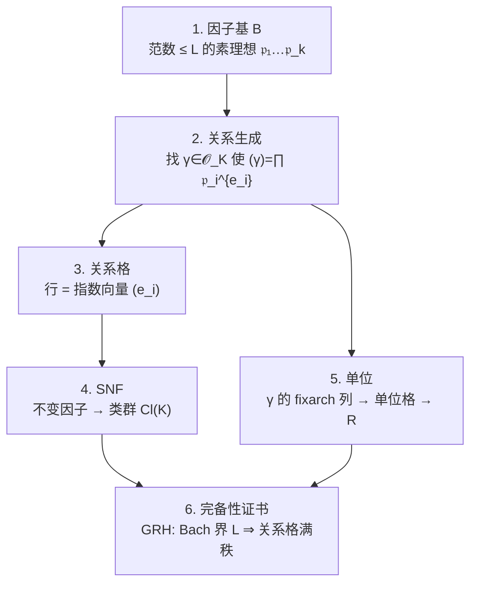
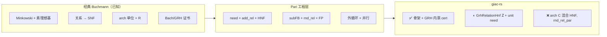

# Buchmann 经典算法 vs Pari 工程实现

**状态:** 参考文档（数学背景 + 移植对照）
**读者:** 做 `bnfinit` / GRH 路径移植的开发者
**相关:** [GIAC-p2-bnf-pari-alignment](issues/GIAC-p2-bnf-pari-alignment.md)、[giac-real-quad-analytic-class-number](giac-real-quad-analytic-class-number.md)
**代码落点:** `giac-rs/crates/giac-core/src/algebra/{class_group,bnf,grh,lattice}.rs`
**快照:** 2026-07-07（R25）

---

## 核心结论（先读这段）

Pari `bnfinit` **不是**另一套类群算法，而是在 **同一套 Buchmann 数学骨架** 上叠加了大量 **常数因子优化、增量数据结构与数值精度管理**。

| 层次 | 内容 |
|------|------|
| **经典版（教科书）** | 因子基 → 主理想关系 → 关系格 SNF → 类群；单位从 arch 对数抽；GRH 下 Bach 界保证完备 |
| **Pari `buch2.c`** | 经典版 + `subFB`/`rnd_rel`/增量 HNF/`need` 驱动/FP 枚举/并行等 |
| **giac-rs** | 经典 Buchmann 骨架已接（R13–R25）；仍缺 Pari 级整数 HNF 降格、并行 `rnd_rel` 等 |

移植难的根因：**不是不知道经典算法**，而是教科书省略了「何时够、如何高效找关系、如何同时养单位」——这些在 Pari 里写死了。

---

## 经典 Buchmann 算法（数学陈述）

设 `K` 为数域，`|D_K|` 为域判别式，`𝓞_K` 为整数环。

### 输入 / 输出

- **输入:** 数域 `K`（通常 `K = ℚ(α)` + 整基）
- **输出:** 类群结构（SNF 不变因子）、类数 `h`、单位群生成元、regulator `R`

### 五步骨架（Cohen ATCNT §6.5 / Buchmann 1990 精神）



**要点:**

1. **Minkowski 引理:** 每个理想类有范数 `≤ M_K` 的代表；故类群由「小范数素理想」生成。
2. **关系:** 主理想 `(γ)` 在因子基上的赋值向量 `(e_i)` 是关系格一行；关系格的 Smith 标准型给出类群结构（差一个单位扭点，由 torsion 单独处理）。
3. **单位:** Dirichlet 定理：`𝓞_K^×` 秩 `r = r₁ + r₂ − 1`；关系生成元 `γ` 的 archimedean 对数（Pari `fixarch`）张成单位格；regulator = 对数格 covolume。
4. **完备性:** 在 **GRH** 下，Bach (1990) 给出界 `L ≈ 12(log|D_K|)²`，使因子基上关系格 **同时** 覆盖类群与单位（index-1）。Pari 用 `compute_R` / `GRHchk` 内禀验证 `h·R·(ζ 因子) ≈ 1`。

### 复杂度（经典陈述）

对固定次数 `n`，在 GRH 下时间为 **`|D_K|` 的次指数**（Buchmann 1990）。教科书通常到此为止，不展开「每条关系怎么找、何时停」。

---

## 原始文献与标准参考

### 必引（算法本体）

| 文献 | 贡献 | 备注 |
|------|------|------|
| **Buchmann, J.** (1990). *A subexponential algorithm for the determination of class groups and regulators in algebraic number fields.* Séminaire de Théorie des Nombres, Paris (Bordeaux). | 次指数类群 + regulator 算法框架 | giac-rs 数学骨架对标此文 + Cohen 书 |
| **Buchmann, J. & Williams, H. C.** (1988). *On principal ideal testing in algebraic number fields.* J. Symbolic Computation **4**, 11–19. | 主理想判定、与类群计算耦合 | Pari 主理想搜索（FP/LLL）的理论祖先 |
| **Cohen, H.** (1993). *A Course in Computational Algebraic Number Theory.* GTM 138, Springer. **§6.5**（类群）、**§7**（单位与 regulator） | 可执行伪代码、复杂度常数 | giac deg-2 外禀交叉认证仍用其既约型 / 解析公式 |
| **Bach, E.** (1990). *Explicit bounds for primality testing and related problems.* Math. Comp. **55**, 355–380. | GRH 下素数界、**Bach 界** `≈ 12(log n)²` | `grh.rs::bach_limc`、`GRHchk` 对标 |

### 关系搜索与格方法

| 文献 | 贡献 | Pari / giac-rs |
|------|------|----------------|
| **Fincke, U. & Pohst, M.** (1985). *Improved methods for combined computations of class groups and regulators.* J. Number Theory **20**. | 理想格上短向量枚举 | `fincke_pohst_*`（R23） |
| **Lenstra, A. K., Lenstra, H. W., Lovász, L.** (1982). *Factoring polynomials with rational coefficients.* Math. Ann. **261**. | LLL | `lattice::lll`、坐标回退 |
| **Pohst, M. & Zassenhaus, H.** (1989). *Algorithmic Algebraic Number Theory.* | 理想算术、HNF | `ideal.rs` HNF 基座 |

### 整基与非 monogenic 域

| 文献 | 贡献 | giac-rs 状态 |
|------|------|-------------|
| **Buchmann, J. & Lenker, S.** (1988). *Computing maximal orders of algebraic number fields.* J. Symbolic Computation **6**. | 极大序 / Round-2 型算法 | deg≥3 `nfbasis` 未接 |
| **Zassenhaus, H.** (1969). *On Hensel factorization I.* | Round-2 传统表述 | 与 `padic` Hensel 相关 |

### 实现参考（非论文，但是工程真相）

| 来源 | 路径 | 说明 |
|------|------|------|
| **Pari/GP** | `pari/src/basemath/buch2.c` | `bnfinit` 主实现；本仓库对齐基线 |
| **Pari 文档** | `pari/doc/bnfinit`（发行版内） | 用户级语义 |
| **gp 金值** | `/home/kanli.hu/upstream/pari/gp` | 测试锚（如 `bnfinit(x^3-11)`） |

---

## 教科书版 vs Pari 版：同一数学，不同粒度

经典 Buchmann 在教材里常写成：

> 取界 `B`，枚举因子基上元素，收集足够多独立关系，做 SNF。

**故意不写死的部分**正是 Pari 的工程核心：

| 教科书省略 | Pari 做法 | giac-rs（R25） |
|-----------|----------|----------------|
| 「足够多关系」的定义 | `need = KC − rank(W) − rank(B) + 单位缺口` | `GrhRelCache::need`（mod-p 秩 + arch 单位秩） |
| 何时加一条关系 | `add_rel` → mod-p 检测 + `hnfspec`/`hnfadd` | `GrhRelationHnf` ℤ echelon（R26）+ mod-p 预筛 |
| 如何找 `(γ)` | `small_norm` + `rnd_rel` + Fincke–Pohst | `enumerate_relations_small_norm` + `rnd_rel_subfb` + FP |
| 因子基大小 | `GRHchk` 二分 `LIMC2` | `factor_base_norm_bounds` / `grh_limc2_bound` |
| 关系不够 | `goto START` + `increase_LIMC` | 多轮 `norm_bound` + `extend_relations_for_larger_fb` |
| 单位从哪来 | 同批关系 `fixarch` → `getfu` | `regulator_from_relation_arch` + `Bnf::try_from_grh_relations` |
| 完备性 | `compute_R` → `check ≈ 1` | `certify_hr_product` / `grh_hr_check` |
| 后置 saturation | Cohen Alg 7.5.4（理论可选） | **Pari 不做**；giac 也不走 |

**类比:** Dijkstra 最短路 vs 工业路由——数学同一族，工程差在堆、双向搜索、预处理；不是换了问题定义。

---

## Pari `buch2.c` 工程优化分类

以下按 **在经典骨架上的作用** 归类，便于移植时判断「数学必需 vs 可 ponytail 延后」。

### A. 正确性与证书（数学上不应省略）

| 优化 | 符号 / 行 | 作用 |
|------|----------|------|
| Bach / GRH 完备界 | `GRHchk`, `LIMC2`, `init_GRHcheck` | 启动时定因子基完备上界 |
| 联合证书 | `compute_R`, `bad_check` | `h·R·invhr ≈ 1` 一次验证类群+单位 |
| `need` 驱动停止 | `while(need)` | 关系格满秩 + 单位秩够才停 |
| 增量关系维护 | `add_rel`, `add_rel_i` | 避免重复关系、在线知秩 |
| HNF 降格 | `hnfspec`, `hnfadd` | 整数关系格 + arch 嵌入分裂（类群 / 单位列） |
| 单位秩缺口 | `RU−1−zc` 并入 `need` | 类群满秩但单位不够时继续找关系 |
| `getfu` / `fixarch` | `getfu`, `rel_embed` | 从关系生成元抽代数单位，非独立搜单位 |

### B. 关系生成吞吐（影响耗时，不改变证书谓词）

| 优化 | 符号 | 作用 |
|------|------|------|
| 子因子基 | `subFBgen`, `get_random_ideal` | 小范数 ideal 子集上 random smooth 乘积 |
| 随机关系 batch | `rnd_rel_seq`, `rnd_rel_par` | 一次 `R` 试多个 `𝔭_j`；可并行 FP worker |
| 小范数确定性搜 | `small_norm` | 低 hanging fruit，减 rnd 浪费 |
| Fincke–Pohst | `Fincke_Pohst_ideal` | 理想格枚举短元，比裸坐标枚举快 |
| `bad_subFB` | `bad_subFB` | 跳过特定 ramified 理想，子基更「密」 |
| Galois 对称 | `add_rel` 自同构复制 | 一条关系自动生成 σ-轨道 |
| `FBgen` KC trim | `FBgen` | 因子基规模 `k` 控制，非全枚举 `≤ L` |

### C. 数值与鲁棒性

| 优化 | 作用 |
|------|------|
| `be_honest` / 动态 `PREC` | arch 对数精度不足时提精度重试 |
| `RgM_solve_realimag` + `grndtoi` | 从浮点对数恢复代数单位 |
| `chinese_unit` CRT | 模素数重建 `∏γ^T`，绕过 fixarch 杀有理因子 |
| mod-p `add_rel_i` 快筛 | 整数相关检测前先 mod `p`（偶有假独立，满秩后复核） |

### D. 外循环与缓存

| 优化 | 作用 |
|------|------|
| `goto START` + `increase_LIMC` | 证书失败时扩界重跑 |
| `extend_relations` / `cache.chk` | 因子基变大时复用已有关系 |
| `fupb_RELAT` → `need=1` | 格太小但 `compute_R` 失败时补一轮关系 |
| `L_jid` 旋转 | 提高下一轮关系命中率 |

---

## giac-rs 移植定位（R25 快照）



| 经典步骤 | giac-rs | 差距性质 |
|---------|---------|---------|
| 因子基 + Bach 界 | ✅ `prime_ideals_fbgen`, `factor_base_norm_bounds` | — |
| 关系生成 | ◐ FP + subFB rnd_rel + lli 预算 | 缺并行、small_norm 仅低次数 |
| 增量 `add_rel` | ◐ `GrhRelCache` mod-p | 缺整数 HNF、自同构复制 |
| `need` + 单位秩 | ✅ R25 | arch 秩用 f64，无 `be_honest` |
| SNF + 证书 | ✅ 批量 SNF + `grh_hr_check` | 证书路径仍批量（可接受） |
| `getfu` / Bnf | ✅ R12 | — |
| deg-2 外禀 cert | ✅ forms / 解析公式 | 与 Pari 内禀路径并存（deg-2 专用） |

**锚域 ℚ(∛11):** Pari ~3 ms；giac-rs release 探针 ~50 s（R25），仍多 `None`——瓶颈在 **关系生成吞吐 + 整数格维护**，非「不懂 Buchmann」。

---

## 给移植者的阅读顺序

1. Cohen ATCNT **§6.5**（类群）+ **§7.1–7.4**（单位）—— 建立经典五步。
2. Bach (1990) 界 —— 理解 `LIMC` / `GRHchk` 为何那样取。
3. Pari `buch2.c` 总览注释 + `Buchall` 主循环（~L4000+）—— 工程真相。
4. [GIAC-p2-bnf-pari-alignment](issues/GIAC-p2-bnf-pari-alignment.md) **giac-rs 对照（R25）** 表 —— 逐符号缺口。
5. 实现: `class_group.rs::buchmann_grh_certified_data` / `GrhRelCache` / `bnf.rs::logfu_from_relations`。

---

## 参考文献（BibTeX 片段）

```bibtex
@incollection{buchmann1990subexponential,
  author    = {Buchmann, Johannes},
  title     = {A subexponential algorithm for the determination of class groups
               and regulators in algebraic number fields},
  booktitle = {S{\'e}minaire de Th{\'e}orie des Nombres, Paris},
  year      = {1990}
}

@article{buchmann1988principal,
  author  = {Buchmann, Johannes and Williams, Hugh C.},
  title   = {On principal ideal testing in algebraic number fields},
  journal = {Journal of Symbolic Computation},
  volume  = {4},
  pages   = {11--19},
  year    = {1988}
}

@book{cohen1993atcnt,
  author    = {Cohen, Henri},
  title     = {A Course in Computational Algebraic Number Theory},
  publisher = {Springer},
  series    = {Graduate Texts in Mathematics},
  volume    = {138},
  year      = {1993}
}

@article{bach1990explicit,
  author  = {Bach, Eric},
  title   = {Explicit bounds for primality testing and related problems},
  journal = {Mathematics of Computation},
  volume  = {55},
  number  = {191},
  pages   = {355--380},
  year    = {1990}
}

@article{fincke1985improved,
  author  = {Fincke, Ulrich and Pohst, Michael},
  title   = {Improved methods for combined computations of class groups
             and regulators},
  journal = {Journal of Number Theory},
  volume  = {20},
  year    = {1985}
}
```

---

## 修订记录

| 日期 | 说明 |
|------|------|
| 2026-07-07 | 初版：经典 Buchmann vs Pari 工程层；文献表；R25 giac-rs 定位 |
