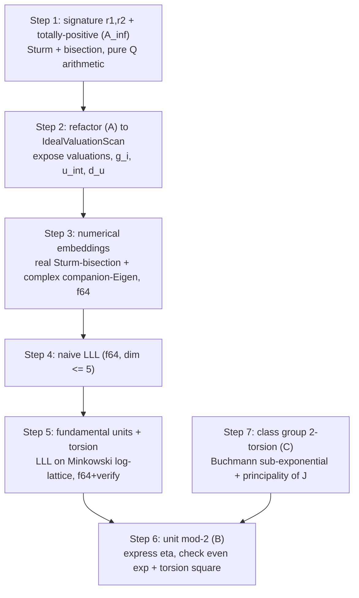

# GIAC — Hasse 平方判定：完整 Scholz 设计与实施路线

**状态:** 跟踪文档（Step 1-4 已实现；步骤 5-7 路线图）。完整 Scholz ≈ 重写 PARI `bnfinit`，按 7 步推进，每步独立可测、sound-false-pass-on-skip（与 (A) 同架构）。
**关联:** [GIAC-poly-f5-fglm-complete-square-decision](issues/GIAC-poly-f5-fglm-complete-square-decision.md)（总 issue / Phase C 优先级）、[giac-poly-f5-fglm-ideal-valuation-proof](giac-poly-f5-fglm-ideal-valuation-proof.md)（(A) 赋值公式证明）、`giac-rs/crates/giac-core/src/algebra/number_field_arith.rs` + `poly_roots.rs::sqrt_fmodule`
**快照:** 2026-06-30

---

## 0. 数学约束（完整 Scholz）

`u ∈ (K×)² ⟺` 以下四条**同时**成立：

| 条件 | 含义 | 状态 |
|---|---|---|
| **(A_fin)** | 所有有限素理想 `v_𝔭(u)` 为偶 | 部分（good/tame/wild 已落地；缺大素因子 + `p∣index` + tower） |
| **(A_inf)** | u **全正**：每个实嵌入 `σ(u) > 0` | ✅ Step 1（`archimedean::is_totally_positive`） |
| **(C)** | `J = ∏𝔭^{v_𝔭/2}` 在 `Cl(K)` 中主 | 缺（需类群 2-挠，Step 7） |
| **(B)** | `η = u/γ² ∈ (𝔬_K×)²`（γ 是 J 的生成元） | 缺（需基本单位系 + 挠群 + mod-2，Step 5-6） |

> **关键修正**：[总 issue](issues/GIAC-poly-f5-fglm-complete-square-decision.md) 原 P4 范围（"LLL + 基本单位 + mod-2"）**漏了 (C) 类群主性 + (A_inf) 全正**。完整 Scholz ≈ 重写 PARI `bnfinit`。本路线按 7 步推进，每步独立可测、sound-false-pass-on-skip（与 (A) 同架构：任一 skip → 续走 `sqrt_base_case`，ℚ 验证兜底，永不 false-reject）。

---

## 1. 接口审计（需标注的歧义 / 缺口）

| 接口 | 文件:行 | 问题 / 标注 | 状态 |
|---|---|---|---|
| `ideal_valuations_parity_ok → bool` | `number_field_arith.rs:98` | 丢弃 `(𝔭_i, v_𝔭_i(u))`、`g_i`、Hensel `G_i`、`u_int`、`d_u` —— (B)/(C) 全需要。**Step 2 重构为 `IdealValuationScan` 结构体** | 待 Step 2 |
| `generator_minpoly_low() -> Option<LowFirstQ>` | `ext_tower.rs:500` | `pub(crate)`，tower 返 `None`。**标注：仅单层 K=ℚ(α)；`None` = skip（sound false-pass），非 error；Step 2/3 key off 此 `None` bail tower** | ✅ 已标注 |
| `FieldEmbedding` | `ext_tower.rs:1044` | **命名冲突**：这是子域 ℚ-线性嵌入，**非** archimedean `σ_i:K→ℂ`。后者尚未实现（Step 3，`archimedean.rs`）；doc 注明勿混淆 | ✅ 已标注 |
| `field_arith::generator_coords(n)` vs `ExtensionField::generator_coords()` | `field_arith.rs:162` / `ext_tower.rs:466` | 同名不同物不同序：free fn 返 low-first `CoordsQ` 幂基单位向量（建乘阵用）；method 返 high-first `HighFirstQ` 字段生成元 α。两侧 doc 互指 + 显式转换路径 `LowFirstQ::from_high`/`HighFirstQ::new` | ✅ 已标注 |
| `krylov_minpoly_coords -> CoordsQ` | `poly_roots.rs:1103` | 输入 high-first `HighFirstQ`，输出 low-first monic `CoordsQ`；无标签 `CoordsQ` 隐藏方向翻转（foot-gun）。doc 注明 + 显式转换路径 | ✅ 已标注 |
| `clear_denoms_low` (private) | `number_field_arith.rs:371` | (B) 需 `u_int = d_u·u ∈ ℤ[α]`；私有，Step 2 一并暴露 | 待 Step 2 |
| **缺失** | — | 高精度 log / 类群 —— Step 5–7 缺（archimedean 嵌入 Step 3、LLL Step 4 已落地） | Step 5–7 |

---

## Step 1 —— signature (r₁, r₂) + 全正 (A_inf)【✅ 已实现】

**位置**：`number_field_arith.rs` 旁新子模块 `algebra/archimedean.rs`（注册 `pub(crate) mod archimedean;` 于 `algebra/mod.rs`）。纯 ℚ 算术，**不依赖** LLL/f64/嵌入/类群。

### 函数

**`field_signature(field: &Arc<ExtensionField>) -> Option<(usize, usize)>`**
- tower（`generator_minpoly_low() = None`）→ `None`（调用方 skip，sound）。
- `m_α` → `poly_from_low` → `giac_poly::Poly`。Cauchy 根界 `B = 1 + max|a_i|/|lc|`（新增 ~10 行）。
- `r1 = sturmab_count_rational_poly(m_α_poly, &x, &(-B), &B)?`（已存在，`poly_alg_sturm.rs:89`）。
- `r2 = (d_k - r1) / 2`。

**`is_totally_positive(field: &Arc<ExtensionField>, u_high: &HighFirstQ) -> bool`**
- tower → `true`（skip，sound）。
- `(r1, r2) = field_signature(field)`；`r1 == 0`（复域）→ `true`（复嵌入恒平方，无全正约束）。
- 否则：Sturm **二分隔离** m_α 的 r1 个实根到互不相交区间（~80 行，纯 `Ratio<BigInt>` 递归用 `sturmab_count_rational_poly` 计数二分）；每个区间细化到 `u_poly`（u 作 ℚ[t]，`LowFirstQ::from_high`）在两端点同号且非零（精确有理 Horner）；任一实根处 `sign(u(ρ)) ≤ 0` → 返 `false`。

### 接线（`poly_roots.rs:~2055`，紧接 `ideal_valuations_parity_ok` 之后、`if d_f == d_k` 之前）

```rust
if !super::super::number_field_arith::archimedean::is_totally_positive(field, u_coords) {
    return None;
}
```

**Soundness**：`u = δ²` 的每个实嵌入 `σ(δ²) = σ(δ)² ≥ 0`；若 `σ(δ) = 0` 则 `σ(u) = 0` → `N(u) = 0`，已被早先 `norm.is_zero` 拦截。故 `δ²` 全正 ⟹ **永不误拒真平方**。

### 测试（PARI `/home/kanli.hu/upstream/pari/gp` 交叉验证，serial `--test-threads=1`）

- **signature**：`ℚ(√2)` → (2,0)；`m=t³+t+1`（1 实根）→ (1,1)；`m=t⁴+t+1`（0 实根, 2 复对）→ (0,2)。PARI `nf.r1`/`nf.r2`。
- **全正拒**：`ℚ(√2)`，`u=-1` → N=1（norm 过）、(A_fin) 过（无素数整除 1），但 `σ₁(-1)=-1<0` → (A_inf) **拒**。PARI `nfeltissquare(bnfinit(t^2-2), -1)=0`。**严格强于 norm+(A_fin)**。
- **不误拒**：`u=(1+√2)²=3+2√2`（全正真平方）→ 过；`u=2`（`σ₁(2)=σ₂(2)=2>0`）→ 过。
- **复域**：`m=t³+t+1`，`u=-1` → 无实嵌入 → 全正返 `true`（不约束）。

### 验证
`cargo test -p giac-core --lib algebra::number_field_arith -- --test-threads=1` + clippy。

---

## 步骤 2–7（路线图）

### Step 2 —— 重构 (A) 为 `IdealValuationScan`【✅ 已实现】

- **做什么**：`ideal_valuations_parity_ok` 拆成 `compute_ideal_valuations(field, u_high, norm) -> IdealValuationScan`，返回结构体：
  ```
  IdealValuationScan {
      u_int_low: Vec<BigInt>, d_u: BigInt,
      signature: (usize, usize), totally_positive: bool,
      entries: Vec<IdealValEntry>,  // { p, g_i: PolyMod, e_i, f_i, v_p_u: i64, status: Processed|Skipped }
      parity_ok: bool,
  }
  ```
  `ideal_valuations_parity_ok` 保留为薄包装（向后兼容）。
- **约束**：skip 语义保留（sound false-pass）；Skipped 素数标记 —— (C)/(B) 仅在所有素数 Processed 时才有意义，否则 skip。
- **实现偏离**：`signature`/`totally_positive` **未并入** scan —— 留在 `archimedean`（Step 1）解耦，避免 `sqrt_fmodule` 热路径双重计算 (A_inf)。完整 pre-(B)/(C) bundle 在 Step 5+ 组装。`all_processed` 含义标注为"所有*被检*素数 Processed"（`v_p(N)=0` 素数未检 —— Step 7 (C) 完备性前的已知限制，已写入 struct doc）。
- **文件**：`number_field_arith.rs`。**工作量**：中。**依赖**：Step 1。**PARI**：`nfeltval` 逐素数。

### Step 3 —— 数值嵌入（f64）【✅ 已实现】

- **做什么**：`archimedean::embeddings(field) -> Option<Embeddings>`（r1 实根 + 2·r2 复共轭，共 d_k 个 `σ_i(α)` as `nalgebra::Complex<f64>`）。实根用 Step 1 的 Sturm 二分隔离 → `RealRootCtx::real_roots_f64` 精化到 f64 端点重合（自然 f64 精度极限）；**复根用 companion matrix + `nalgebra::complex_eigenvalues`**（`nalgebra` 升为 `giac-core` 直接依赖，~30 行）。`eval_at_embedding(u_high, σ_α) -> Complex<f64>`：u_low 的 Horner。
- **约束**：f64 ~15 位精度；d≤12 + 有界系数下根精度足够判符号 + 粗 log。**verify-and-skip**：`|m_α(σ_α)| > ROOT_RESID_TOL(1e-6)` 或 `real+complex ≠ d_k` → `Embeddings.reliable=false`，下游 skip（sound）。复根过滤 `|im|>COMPLEX_IM_TOL(1e-7)` —— 实根权威归 Sturm，companion 对实根的数值噪声被丢弃；genuinely-near-real 复根被误滤会触发 count 不匹配 → reliable=false → skip（sound，已写 `ponytail:` 上限+升级路径）。
- **接口形态**：`Embeddings { sig, roots, reliable }` —— 把"共轭 + 是否可信"打包，避免调用方各自重算 sig 或漏检 reliable。`embeddings` 对 d_k≤1/tower 返 `None`（ℚ 无生成元可嵌，归 base case）。`eval_at_embedding` 接 `HighFirstQ`（与 (A_inf)/(A_fin) 入口一致），内部 `from_high` 转 low-first Horner。
- **文件**：`archimedean.rs`（+ `giac-core/Cargo.toml` 增 `nalgebra`）。**工作量**：中。**依赖**：Step 1。**PARI**：`polroots(m_α)` 对照（√2 / t³+t+1 / t⁴+t+1 三例全过，tol 1e-7~1e-9）。
- **测试**：5 个新增 —— `embeddings_{q_sqrt2,cubic,quartic}_match_pari`（实/混合/全复三类签名）、`embeddings_eval_at_embedding_recovers_generator`（u=α ⟹ σ(u)=σ(α)）、`embeddings_eval_at_embedding_constant_is_rational`（u=5 ⟹ σ=5）。全 14 archimedean 测试通过；340 giac-core lib release 全过（11.11s）；#7 bar `quartic_a4_galois_dim_le_12` 0.11s 无回归；clippy 干净。

### Step 4 —— 朴素 LLL（f64，dim ≤ 5）【✅ 已实现】

- **做什么**：`lattice::lll(basis: Vec<Vec<f64>>) -> Option<Vec<Vec<f64>>>` —— 实格 LLL 规约（δ=3/4, η=1/2），dim ≤ `r1+r2-1 ≤ 5`。标准 LLL + f64 Gram-Schmidt（`gso` 给 μ/b*/||b*ᵢ||²），~90 行。每轮：找最深的 `|μ_{i,j}|>η` 做一次 size-reduction（`b_i -= round(μ)·b_j`）后重算 GSO；无 size-reduction 时扫 Lovász 找首个违反并 `swap(b_i,b_{i-1})`；两者皆无 → 规约完成。
- **接口偏离**：spec 写 `(Vec<Vec<f64>>, bool)`；实际用 `Option<Vec<Vec<f64>>>`（None=skip）—— 与 `field_signature`/`embeddings` 的 sound-skip `Option` 模式一致，Step 5 失败即 skip，bool 的"返原基"语义对消费者无额外价值（调用方持有原基）。
- **约束**：f64 LLL 对近退化基数值脆弱 —— `ponytail:` 注明上限（bigfloat/dashu）；**post-reduction sanity** `lovasz_ok`：所有 GSO 范数 finite-positive AND `|μ_{i,j}|≤η+tol` AND Lovász within tol，否则返 `None`（下游 skip，sound）。`LLL_MAX_ITERS=1000` 兜底（精确算术 LLL 必终止，触顶即数值失败信号）。ragged/NaN 输入直接 None。
- **文件**：新 `lattice.rs` 子模块（纯 f64 泛用格规约，与 `archimedean` 的 field→嵌入解耦）。**工作量**：中。**依赖**：无（纯 f64）。**PARI**：`qflll` 对照（2D `[[1,2],[3,4]]→[[1,0],[0,±2]]` 对齐；3D 用 |det| 保持 + Lovász 不变量，δ 不同不强求逐向量一致）。
- **测试**：8 个新增 —— 2D/3D PARI 对照、already-reduced、single/empty、degenerate→None、NaN→None、ragged→None。全 348 giac-core lib release 11.12s；#7 bar 0.11s 无回归；clippy 干净。

### Step 5 —— 基本单位系 + 挠群（f64+verify）

- **做什么**：`unit_group::fundamental_units(field) -> Option<(Vec<HighFirstQ>, Torsion)>`。Minkowski log-map `L(x) = (log|σ₁(x)|,…,log|σ_{r1}(x)|, 2·log|σ_{r1+j}(x)|) ∈ ℝ^{r1+r2}`；枚举小坐标代数整数，筛 `|N(x)|=1`（近单位），收 log-向量，LLL 规约取 r=`r1+r2-1` 个独立单位。挠群 `μ(K)`：实域 `={±1}`；一般解 `x^k-1` 在 K 中的根（用现有 `poly_algext_roots`/norm filter）。
- **约束**：单位搜索是最难的算法件；用 Minkowski 界 bound regulator；bound 内找不到 r 个独立单位 → `None`（sound false-pass）。**f64+verify**：整数指数四舍入后**精确 ℚ 重建** `∏ ε_i^{a_i}` 在 K 中与 `η·ζ^{-1}` 比对（`element_eq_mod`），不一致 → skip。
- **文件**：新 `unit_group.rs` 子模块。**工作量**：大。**依赖**：Step 1、3、4。**PARI**：`bnfinit(f).fu` + `nf.tu`。

### Step 6 —— 单位 mod-2 求解（B）

- **做什么**：`unit_group::unit_is_square(field, η, units, torsion) -> bool`。解 `L(η) = Σ a_i L(ε_i)` 的 r×r f64 系统，四舍五入 `a_i`，精确验证重建；查所有 `a_i` 偶 AND `ζ ∈ μ(K)²` AND（全正已由 A_inf）。挠平方：`μ={±1}` 时 `(-1)∈squares ⟺ i∈K`（解 `x²+1`，用现有 sqrt）；一般 `μ` 生成元 `ζ^k`，平方 ⟺ `k` 偶或 `ζ^{k/2}` 存在。
- **约束**：GF(2) 线性代数（简单）；**verify-and-skip**：关系不验证 → 返 `true`（pass，sound false-pass）。
- **文件**：`unit_group.rs`。**工作量**：中。**依赖**：Step 2、5。**PARI**：`bnfissunit(B,η)` + `nfeltissquare(B,η)`。

### Step 7 —— 类群 2-挠 + J 主性（C）—— 最大件

- **做什么**：`class_group::class_group_2torsion(field) -> Option<Cl2>` + `is_principal(J) -> Option<(bool, generator)>`。Minkowski 界 `B_M = (4/π)^{r2}·d!/d^d·√|disc|`；枚举 `norm ≤ B_M` 的素理想（用 Step 2 的 `factor_with_multiplicities` 分解每个 `p ≤ B_M`）；收集关系（小范理想找主生成元 via LLL 短向量）→ HNF → 类群结构 → 取 Sylow-2；J 主性：在关系格中归约 J，测是否平凡类 + LLL 搜生成元 γ。
- **约束**：Buchmann 亚指数算法，多周量级；d≤12 小判别式下 Minkowski 界枚举变体可行但仍大（~400-600 行）。**需 `disc(m_α)`**（index gap 与 P5 `p∣index` 交互）。**需 (A) 完备**：若 (u) 任一素数被 skip，J 不全 → (C) 必须 skip（sound）。
- **文件**：新 `class_group.rs` 子模块。**工作量**：很大（本身多轮）。**依赖**：Step 2、3、4、5 + (A) 完备（P3 大素因子 + P5 `p∣index`）。**PARI**：`bnfinit(f).clgp` + `bnfisprincipal(B,J)`。

### 终态接线（Step 7 完成后）

`sqrt_fmodule` 调用链：norm-square → **(A_fin)** → **(A_inf)**[Step 1] → **(C)** J 主性 + 取 γ[Step 7] → η=u/γ² → **(B)** 单位 mod-2[Step 6]。任一失败 `return None`；任一 skip → 续走 `sqrt_base_case`（ℚ 验证兜底，sound）。



---

## 进度跟踪

| 步骤 | 状态 | 备注 |
|---|---|---|
| Step 1 signature + (A_inf) | ✅ 已实现 | `algebra/archimedean.rs`：`field_signature` + `is_totally_positive`（自洽稠密有理 Sturm + 有理 Horner 二分）；接线 `poly_roots.rs` (A_fin) 之后；PARI 交叉验证 9 测试全绿；#7 bar 0.63s |
| Step 2 IdealValuationScan | ✅ 已实现 | `compute_ideal_valuations -> IdealValuationScan`（暴露 entries (p,g_i,e_i,f_i,v_𝔭), u_int_low, d_u, parity_ok, all_processed）；`ideal_valuations_parity_ok` 薄包装向后兼容；4 scan 测试全绿；signature/totally_positive 解耦留 archimedean |
| Step 3 数值嵌入 | 待实现 | f64 + nalgebra companion-Eigen |
| Step 4 朴素 LLL | 待实现 | f64，dim≤5，verify-and-skip |
| Step 5 基本单位系 + 挠群 | 待实现 | 最难算法件；f64+verify 精确重建 |
| Step 6 单位 mod-2 (B) | 待实现 | GF(2) + 挠平方 |
| Step 7 类群 2-挠 + J 主性 (C) | 待实现 | 最大件，Buchmann，多轮；需 (A) 完备 |

## 参考

- Keith Conrad, *The Local-Global Principle* — https://kconrad.math.uconn.edu/blurbs/gradnumthy/localglobal.pdf
- Cohen, *A Course in Computational Algebraic Number Theory* §6（Dedekind / 素理想）、§4（范数与赋值）、§5/§6（Minkowski / 类群 / 单位 Dirichlet）
- Buchmann, *A subexponential algorithm for the determination of class groups and regulators of algebraic number fields* (1990) — Step 7 类群算法
- Pohst / Zassenhaus, *Algorithmic Algebraic Number Theory* — 单位搜索 / LLL 应用
- PARI/GP `bnfinit` / `bnfisprincipal` / `bnfissunit` / `nfeltissquare` — 完备 oracle（首选）
