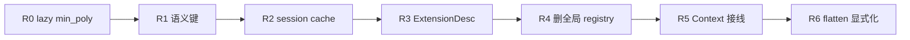

# GIAC — 取消进程级 `FieldRegistry`，对齐 upstream `_EXT` 模型

**状态:** R0–R5 ✅（R3 `ExtensionDesc` + layer `min_poly` 已落地）  
**类型:** 实施计划 / AFK  
**父项:** [GIAC-lazy-common-tower-plan.md](GIAC-lazy-common-tower-plan.md)（S0–T4a ✅ 之后）  
**相关:** [GIAC-algext-adoption.md](GIAC-algext-adoption.md) §8.2；[GIAC-poly-roots-field-session-plan.md](GIAC-poly-roots-field-session-plan.md)；[giac-tower-common-math.md](../giac-tower-common-math.md)  
**上游参考:** `giac/giac-2.0.0/src/alg_ext.cc`（`algebraic_EXTension`、`common_EXT`、`common_minimal_POLY`）  
**Rust 落点:** `giac-core::algebra::{ext_tower, alg_ext, alg_ext_c, field_session}`  
**快照:** 2026-06-22（含 plan review 修订；R5 方案 A 定稿）

---

## 1. 问题陈述

当前 `ext_tower.rs` **曾**使用进程级 `FieldRegistry`（R4 已删除）。下文 §1 表为迁移前对照；现行模型见 §3 与 R3 `ExtensionDesc`。

- `register_adjoin`（非 Base parent）：`compose_min_poly_over_q`（本原元搜索 + `char_poly_matrix`）
- `register_adjoin_parent_coeffs`（T3+ `u²−α` 等）：`char_poly_matrix` 于 register 阶段

这与 upstream giac 节奏不一致：

| | upstream `_EXT` | giac-rs 现状（过渡态） |
|--|-----------------|------------------------|
| adjoin | `algebraic_EXTension(coords, minpoly)`，不 flatten 成 ℚ(θ) | lazy layer + session dedup（R3 `ExtensionDesc`） |
| 同域 | minpoly 相同（指针 / 结构） | 同一 `Arc<ExtensionField>` + 稳定 `id` |
| common | `common_EXT` 才贵 | flatten / tower compositum + **session** cache |
| 并发 | 无全局 field 表；`proot` 等局部锁 | `FieldSession` per `Context`；无进程级 `Mutex` |

塔计划（T1–T4a）已落地 **lazy common、塔运算、子域快路径**；本计划收束 **存储模型**：minpoly 为真源，registry 下沉到 session 或取消。

---

## 2. 目标与边界

### 2.1 目标

1. **adjoin 便宜：** 登记 layer minpoly + 塔链；**不在 adjoin 时**算 ℚ 上本原元多项式（除非调用方显式请求 flatten 元数据）。
2. **common 按需：** 仅在 `align_elements` / 跨域运算时付 compositum 成本；cache **可复现、可本地化**。
3. **取消进程级 `FieldRegistry`：** 去掉全局 `Mutex`；测试可去掉 `#[serial]`（若无非全局可变状态）。
4. **对齐 upstream 心理模型：** 元素级 `(coords, minpoly)`；嵌套扩域用 **parent 系数 minpoly**（T3+ 已部分支持）。
5. **数学等价：** golden / `eq_mod` 不退化；`rootof` 显示字符串不变。

### 2.2 非目标（本计划不做）

- `Expr::AlgExt` AST 变体或大改 `display` 管线
- 一次性删除 flatten `common`（`--no-default-features` bisect 保留到 R4 末）
- 完整移植 giac `common_minimal_POLY`（2D poly + `mrref` + 数值选 k）
- `Poly<AlgExtC>` gcd/factor 全闭环（B-02，另开）
- 多线程 **跨线程** dedup（每线程一 `Context` / `FieldSession` 即可）
- 去掉 `ExtensionField::rational()` 的静态 `OnceLock<Arc<…>>`（**保留**：不可变 ℚ 单例，无 `Mutex`，与删 registry 无关）

---

## 3. 目标架构（normative）

```text
┌─────────────────────────────────────────────────────────────┐
│  AlgExtData { desc: Arc<ExtensionDesc>, coords, root_index } │
│  ExtensionDesc { tower, layer_min_poly, min_poly_over_q? }   │
│    min_poly_over_q: OnceLock / Option — lazy flatten 元数据   │
└───────────────────────────┬─────────────────────────────────┘
                            │
┌───────────────────────────▼─────────────────────────────────┐
│  FieldSession（每 eval / 每线程）                             │
│    adjoin_cache: HashMap<adjoin_key, Arc<ExtensionDesc>>      │
│    common_cache: HashMap<(sem_key, sem_key), CommonFieldPair> │
│    — &mut，无 Mutex                                           │
└─────────────────────────────────────────────────────────────┘

adjoin(parent, P)  →  ExtensionDesc::adjoin（O(1) 构造）
                   →  可选 session.adjoin_cache insert（去重）

align / add 跨域  →  session.common_cache 或冷算 common
```

**`ExtensionField`：** 保留公开名，实现为 `Arc<ExtensionDesc>` 的 type alias 或薄包装，避免全仓库重命名。

**同域判定：** `Arc::ptr_eq(desc) || *desc == *other`（对标 giac `*(a._EXTptr+1)==*(b._EXTptr+1)`）。

---

## 4. 分阶段实施（Phase R）



| Phase | 摘要 | 删 Mutex? |
|-------|------|-----------|
| **R0** | 两条 adjoin 路径不算 flatten；`min_poly_over_q` lazy；Eq 仅 `tower` | 否 |
| **R1** | cache / fold 用语义键；修 `id` 比较 bug | 否 |
| **R2** | `common_cache` → `FieldSession` | 全局 Mutex 可减 |
| **R3** | `ExtensionDesc`；`AlgExtData::min_poly` 读 layer | 否 |
| **R4** | 删 `FieldRegistry` 静态单例 | **是** |
| **R5** | `Context` / solve / eval 传 session | 是（端到端） |
| **R6** | 删 `ExtensionDesc` flatten `OnceLock`；显式 `flatten_min_poly_over_q` — 见 [GIAC-ext-flatten-explicit-plan.md](GIAC-ext-flatten-explicit-plan.md) | 否 |

**门禁（每 PR）：** 开发可用 `cargo test -p giac-core` 子集；**合并前** `cargo test-timeout` + `cargo ci-clippy`。

---

### Phase R0 — Lazy `min_poly_over_q`（**建议第一 PR**）

**目的：** adjoin 与 upstream 同节奏；**不改** registry 对外行为。

**R0 不变量（R0–R2 全程保持）：**

- **显示 / `rootof`：** `AlgExtData::min_poly()` / `to_rootof` 仍走 **flatten** `min_poly_over_q`（经 accessor lazy 填充）；**R3 才**切到 layer minpoly（见 R3 验收 + golden）。
- **`PartialEq`：** **仅比 `tower`**（R3 前 `min_poly_over_q` 可为空）；**禁止**在 `==` 里触发 lazy compose（避免 Eq 侧效应与竞态）。R3 后 `ExtensionDesc` 上可再收紧。
- **塔上元素运算：** 非平凡 parent 已走 `uses_tower_arithmetic()` → `element_*_tower`，**不依赖** register 时填好的 `min_poly_over_q`；R0 跳过 compose 不影响 K₁/K₂ 上 `+ − ×`。

**与 R3 结构：** R0 可在 `ExtensionField` 上直接加 `OnceLock`（最小 diff）；R3 再迁入 `ExtensionDesc`（允许一次字段搬家，不在 R0 提前引入完整 `ExtensionDesc` API）。

| 任务 | 文件 |
|------|------|
| `min_poly_over_q` → `OnceLock<CoordsQ>` 或 `Option` + lazy fill | `ext_tower.rs` |
| `register_adjoin`：`parent.is_base()` 仍拷贝 layer；**`parent != Base` 不调用** `compose_min_poly_over_q` | `ext_tower.rs` |
| **`register_adjoin_parent_coeffs`：register 阶段不算 `char_poly_matrix`**；`min_poly_over_q` 同 lazy accessor | `ext_tower.rs` |
| 公开 `min_poly_over_q()` 经 accessor，首次访问再 compose / char poly | `ext_tower.rs` |
| `top_min_poly_exprs`、**仅** `element_*_primitive` 路径走 accessor（tower 路径不变） | `ext_tower.rs`, `alg_ext.rs` |
| `PartialEq` / `Eq`：**`tower` 相等即相等**（见上不变量） | `ext_tower.rs` |
| `#[cfg(test)]` 计数器：两条 adjoin 路径 register 阶段 compose/char poly 调用次数均为 0 | `ext_tower.rs` tests |

**验收：**

- [x] T1b / T3 / T4a 现有测全绿
- [x] `cargo test -p giac-core --no-default-features`（flatten bisect）仍绿
- [x] `adjoin(K₁, u²−3)` register 阶段无 compose
- [x] `adjoin_irreducible_parent_coeffs(K₁, u²−α)` register 阶段无 char poly
- [x] `rootof` / `to_rootof` 字面与 R0 前一致（单层 adjoin）；嵌套塔 R3 用 layer minpoly

**风险：** 低。

---

### Phase R1 — 语义键替代 `field.id()`

**目的：** 为删 registry 清障；支持「数学相等、非单例 id」。

| 任务 | 文件 |
|------|------|
| `ExtensionDesc::semantic_key()`（tower + layer minpoly 字节；稳定排序） | `ext_tower.rs` |
| `common_cache` 键：`(sem_key(a), sem_key(b))` 替代 `(id_lo, id_hi)` | `ext_tower.rs` |
| `direct_adjoin_parent_embedding`：`parent.id()` → `ptr_eq \|\| ==` | `ext_tower.rs` |
| `pick_tower_adjoin_parent` tie-break：语义键 lex | `ext_tower.rs` |
| `fold_algext_sum` Canonical：`sort_by_key(semantic_key)` | `alg_ext.rs` |
| 测试：`field_registry_dedup` → `k1 == k2`；保留 `duplicate_field_arc` merge 测 | `ext_tower.rs`, `alg_ext.rs` |
| **回归：** `duplicate_field_arc_for_test` 作 parent 时 `direct_adjoin_parent_embedding` / `try_subfield_embedding` 仍成功（修 id 比较前红） | `ext_tower.rs` tests |

**验收：**

- [x] `fold_algext_sum_merges_equal_fields_without_ptr_eq` 绿
- [x] `duplicate_field_arc` 下 `common_over_q` / `align` 仍 `eq_mod`
- [x] `duplicate_field_arc` parent/child 链上 embedding 不报错
- [x] `embedding_for` / S0 逆序回归仍绿

**风险：** 中（语义键定义须文档化，见 §7）。

---

### Phase R2 — Session 级 cache

**目的：** 全局可变表从 3 张减到 0；为 R4 删 Mutex 做准备。

| 任务 | 文件 |
|------|------|
| `FieldSession { adjoin_cache, common_cache }` | `field_session.rs` |
| `common_over_q(a, b, session: &mut FieldSession)` 内部实现 | `ext_tower.rs` |
| `align_elements` / `AlgExtData::add` 经 session 传 cache（或 `FieldSession` 方法） | `alg_ext.rs`, `field_session.rs` |
| **`AlgExtCData::align_pair` / `add` / `mul`：** `align_elements` 走 session，静态调用方不再写全局 `common_cache` | `alg_ext_c.rs` |
| `poly_roots` / `grow` 复用已有 `FieldSession` | `poly_roots.rs` |
| 静态 `common_over_q(a,b)` 保留一版：`thread_local` 冷 session 或无 cache（ponytail: 注释标 ceiling） | `ext_tower.rs` |
| 全局 `common_cache` deprecated 一 PR 后删除 | `ext_tower.rs` |

**验收：**

- [x] `t2_align_subfield_does_not_grow_common_cache` 改为 session 计数
- [x] 同线程第二次 `common(√2,√3)` session hit
- [x] 无 session 静态路径仍数学正确（R5b：ephemeral per-call cache）

**风险：** 中（API 是否强制 `&mut FieldSession`；`alg_ext_c` 静态入口须在本阶段收束或明确 `thread_local` 过渡截止 PR）。

---

### Phase R3 — `ExtensionDesc` + 元素级 minpoly

**目的：** minpoly 挂在描述符上，对标 `_EXT`；**切换** `AlgExtData::min_poly()` 语义（层多项式，非 flatten）。

| 任务 | 文件 |
|------|------|
| 引入 `ExtensionDesc { tower, layer_min_poly, min_poly_over_q: OnceLock<...> }` | `ext_tower.rs` |
| `ExtensionField` = `Arc<ExtensionDesc>` 或内嵌 `desc` | `ext_tower.rs` |
| `AlgExtData::min_poly()` 读 **layer** minpoly，非 flatten metadata | `alg_ext.rs` |
| `fields_same` → `desc` 相等 | `alg_ext.rs` |
| `from_rootof` → `ExtensionDesc::adjoin` + session 可选 dedup | `alg_ext.rs` |
| 更新 [giac-core-algebra-api-stability.md](../giac-core-algebra-api-stability.md) | `.doc` |

**验收：**

- [x] adoption §8.2「`min_poly` = 层多项式」与实现一致（`layer_min_poly_exprs`）
- [x] `sqrt2` rootof roundtrip；嵌套塔 `min_poly` 为 layer（degree 2）非 flatten（degree 4）
- [x] `AlgExtData.field` 仍为 `Arc<ExtensionField>`（`ExtensionField` = `ExtensionDesc` 别名）
- [x] R0 的 `OnceLock` 在 `ExtensionDesc` 上（`min_poly_over_q` lazy flatten 元数据）

**风险：** 中高。

---

### Phase R4 — 删除进程级 `FieldRegistry`

**目的：** 去 `Mutex`；adjoin = 构造 `Arc<ExtensionDesc>`。

| 任务 | 文件 |
|------|------|
| 删除 `FieldRegistry`、`field_registry()`、`op_lock`、三 `Mutex<HashMap>` | `ext_tower.rs` |
| `adjoin_irreducible` → `ExtensionDesc::adjoin` + `session.adjoin_cache` | `ext_tower.rs`, `field_session.rs` |
| `register_common` → session 或一次性 `Arc`（不全局 intern） | `ext_tower.rs` |
| 删除 `common_cache_len_for_test` / `duplicate_field_arc_for_test` 或迁 session | `test_fixtures.rs` |
| 移除 **`#[serial]`**（当前约 **46** 处：`ext_tower` 28 + `poly_roots` 15 + `field_session` 3） | 上述三文件 tests |
| **删除 nextest 整包串行：** `.config/nextest.toml` 中 `package(giac-core)` → `giac-core-serial` override（非仅 ext_tower 注释所述） | `.config/nextest.toml` |
| 记录 R4 前后 `cargo test-timeout -p giac-core` 墙钟（并行收益） | 本 issue 或 PR 描述 |
| 更新 [giac-tower-common-math.md](../giac-tower-common-math.md) §并发 | `.doc` |

**验收：**

- [x] `rg FieldRegistry field_registry` 为零（注释 / 本 issue / 测名除外）
- [x] `cargo test -p giac-core` 全绿（**giac-core 默认可并行**，无 `serial_test` 依赖）
- [x] 无 `std::sync::Mutex` in `ext_tower.rs`（`OnceLock` / session 内部 `RefCell` 除外）
- [x] `nextest.toml` 无 `package(giac-core)` 全包 `max-threads = 1`

**风险：** 高。

---

### Phase R5 — `Context` / eval 管线接线

**目的：** solve、normal 等同线程复用 session cache。

**Session 容器（R5 实现）：** `Context` 内嵌 `Rc<FieldSession>`（cache / `working` 用内部 `RefCell`）；`Clone` 浅拷贝 `Rc`；`!Send`。

| 任务 | 文件 |
|------|------|
| `context.rs`：`field_session: Rc<FieldSession>`；`session()` | `context.rs` |
| R5：`Context` 内嵌 `Rc<FieldSession>`；静态 API 无跨调用 cache（R5b ephemeral） | `ext_tower.rs`, `context.rs`, `field_session.rs` | ✅ |
| `eval` / `solve` 经 `ctx.session()` 取 cache | `eval.rs`, `giac-solve`, `alg_ext*` | ✅ |
| 文档：线程模型 §6.1 | adoption §8, `giac-core-algebra-api-stability.md` | ✅ |

**验收：**

- [x] P3-6 / `poly_algext_roots` 测仍 ≤10s（`poly_algext_roots_for_ctx` 路径）
- [x] solve 路径 adjoin / roots 走 `ctx.session()`（`poly_algext_roots_for_ctx`）
- [x] `Context::clone()` 与另一 handle 共享 `common_cache`（单测）
- [x] `Context` 为 `!Send`（`Rc<FieldSession>`；编译期）
- [x] 无独立 `TLS_COMMON_CACHE` / `shared_field_session`（R5b）
- [x] eval `Add`/`Mul` 的 AlgExt fold 走 `fold_*_for_ctx`（`ctx.session()` cache）

**风险：** 中（跨 crate 接线 + `RefCell` 借用规则）。

---

## 5. 与塔计划 / backlog 关系

| 项 | 关系 |
|----|------|
| [GIAC-lazy-common-tower-plan](GIAC-lazy-common-tower-plan.md) T1–T4a | **前置已完成**；本计划是 Phase R，不重复 T* |
| T3+ `adjoin(K, u²−α)` | 可与 R0 并行；R0 降低 T3+ 登记成本 |
| [GIAC-poly-roots-field-session-plan](GIAC-poly-roots-field-session-plan.md) | R2/R5 强化 `FieldSession`；Cardano 链少 flatten common |
| flatten `--no-default-features` | R4 前保留；R4 后可 `#[cfg(feature = "flatten-common")]` |
| [GIAC-rs-crate-dedup-plan](GIAC-rs-crate-dedup-plan.md) | 无冲突；solve 接线在 R5 |

---

## 6. 决策记录

### 6.1 已定稿

| 问题 | 决定 |
|------|------|
| Session 从哪进 API？ | 先 **`FieldSession` 已有路径**（roots）；R2 静态 API 用 `thread_local` 过渡；**R5 收束到 `Context`** |
| 无 session 时 dedup？ | **不 dedup**（数学正确，可能多算 common） |
| 公开名 `ExtensionField`？ | **保留**，实现为 `Arc<ExtensionDesc>`（R3） |
| `min_poly_over_q` 还要吗？ | **Lazy `OnceLock`**；roots / flatten / 展示按需 |
| `field.id()`？ | R1 后 **deprecated**；测试改语义键或 `==` |
| 进程级 field 表 Mutex？ | R4 删除 `FieldRegistry` 后 **不需要** |
| R0–R2 显示用 flatten、R3 用 layer？ | **是**；R3 切换时跑 golden / `assert_equiv` |
| `ExtensionField::rational()`？ | **保留** 静态不可变单例 |
| **`Context` session 容器（R5）** | **`Rc<FieldSession>` 内嵌 `Context`**；`Clone` 浅拷贝共享 cache；**不用 `Mutex`** |
| **R5b 静态 API** | `common_over_q` / `align_elements` 用 **ephemeral** 每调用 cache；dedup 走 `FieldSession` |
| **`Context::Clone`** | 手动实现：浅拷贝 `Rc` → **共享同一 `FieldSession` / cache**（同线程 eval 管线） |
| **线程约束** | `Rc` → **`Context: !Send`**（编译期禁止跨 `thread::spawn` 搬运）；见 §6.2 |
| **R5 后静态 TLS cache** | **已删除**；`Context` 或 ephemeral 静态路径 |

### 6.2 线程模型（normative）

「每线程一 Context」在此处的精确含义是：**每线程至多一份可变的 field session cache，且不可跨线程共享 `Context`**——不是禁止同线程多次 `Context::new()`。

| 规则 | 机制 |
|------|------|
| 不可 `Send` 到其他线程 | `Rc<RefCell<FieldSession>>` 使 `Context: !Send` |
| 同线程 `Clone` 共享 cache | `Clone` 复制 `Rc` 指针，不复制 `HashMap` |
| 同线程多个独立 `Context::new()` | **允许**（各自 `Rc` → 各自冷 cache）；热路径应复用 `clone()` 或单例式 `xcas_default()` |
| 跨线程 eval（未来并行 conformance） | 每 worker **`Context::xcas_default()`**；禁止 `Arc<Mutex<Context>>` 共享 session |
| 开发期保险（可选） | `#[cfg(debug_assertions)]` 在 `session_mut()` 比对 `thread::current().id()` |

**R5 落点草图：**

```rust
pub struct Context {
    // ...现有字段...
    field_session: Rc<RefCell<FieldSession>>,
}

impl Context {
    pub fn session_mut(&self) -> RefMut<'_, FieldSession> {
        self.field_session.borrow_mut()
    }
}

// Clone: field_session: Rc::clone(&self.field_session)
// Context 因 Rc 而为 !Send
```

`eval(expr, &Context)` 可保留：内部 `ctx.session_mut()` 再调 algext；**不要求**全 workspace 改 `&mut Context`。

### 6.3 待 R3/R4 定稿

| 问题 | 选项 |
|------|------|
| `ExtensionField` = `Arc<ExtensionDesc>` **alias** vs **薄包装** | **已定：type alias** `ExtensionField = ExtensionDesc`（R3） |
| R4 `adjoin_cache` + `register_common` | session dedup vs 一次性 `Arc` |
| R3 后 `PartialEq` | 仍仅 `tower` vs 含 layer / flatten |
| `legacy-global-registry` feature | 仅 R4 风险过高时引入 |

---

## 7. 语义键 `semantic_key`（R1 规范）

与 registry `by_adjoin` 键对齐，但 **不依赖 `parent_id`**：

```text
semantic_key(desc) =
  parent_semantic_key (或 0 for ℚ)
  || layer_kind (rational_constants | parent_blocks)
  || min_poly_key(layer)
```

- `min_poly_key`：现有 `FieldRegistry::min_poly_key` / `parent_blocks_key` 逻辑复用。
- `common_cache`：**域对** `(sem_key(field_a), sem_key(field_b))`，`k_a <= k_b` 字典序；**禁止**仅用 `min_poly_key(min_poly_over_q)` 作 cache 键（R4 后无全局 `by_min_poly` intern，同 primitive poly、不同 tower 构造可并存，数学仍对）。
- `pick_tower_adjoin_parent` tie-break：候选 parent 按 `semantic_key` 字典序取最小（与 R1 任务一致，规范只写此处）。
- **禁止**用 `fetch_add` 的 `id` 作数学或 cache 键。

---

## 8. 受影响模块清单

| 模块 | R0 | R1 | R2 | R3 | R4 | R5 |
|------|----|----|----|----|----|-----|
| `ext_tower.rs` | ● | ● | ● | ● | ● | ● |
| `alg_ext.rs` | ○ | ● | ● | ● | ○ | ○ |
| `alg_ext_c.rs` | ○ | ○ | ●（align/add/mul → session） | ● | ○ | ○ |
| `context.rs` | ○ | ○ | ○ | ○ | ○ | ● |
| `.config/nextest.toml` | ○ | ○ | ○ | ○ | ● | ○ |
| `field_session.rs` | ○ | ○ | ● | ● | ● | ● |
| `poly_roots.rs` | ○ | ○ | ● | ○ | ○ | ● |
| `giac-solve` | ○ | ○ | ○ | ○ | ○ | ● |
| `test_fixtures.rs` | ○ | ○ | ○ | ○ | ● | ○ |

---

## 9. 测试策略

1. **每 Phase：** 开发 `cargo test -p giac-core`；**合并** `cargo test-timeout`（workspace 门禁，防挂死）。
2. **慢测** `common(√2,∛2)` 仍 `#[ignore]` 或 tower-common 快路径；不挡 R0–R2。
3. **属性不变：** `eq_mod`、维数、子域 `is_subfield_of`、S0 逆序 align。
4. **删除断言：** `k1.id() == k2.id()` → `k1 == k2` 或 `ptr_eq(desc)`（`ext_tower` / `alg_ext` 内约数十处，随 R1/R4 分批改）。
5. **R4 后：** 去掉全部 `#[serial]`（§8 三文件）+ nextest 整包 `giac-core` 串行 override；`cargo test-timeout -p giac-core` 并行全绿为 DoD。
6. **R0–R2：** `rootof` / `to_rootof` 字面不变；**R3：** 允许 layer minpoly 显示变，须 golden 或 `assert_equiv`。

---

## 10. 第一周起步（推荐）

### PR-1（仅 R0）

1. `ext_tower.rs`：`register_adjoin` 非 Base 跳过 `compose_min_poly_over_q`；**`register_adjoin_parent_coeffs` 跳过 register 阶段 char poly**。
2. `min_poly_over_q` lazy accessor；`PartialEq` 仅比 `tower`。
3. 两条 adjoin 路径 compose/char poly 计数器 = 0。
4. 跑 `cargo test -p giac-core` 与 `--no-default-features`；合并前 `cargo test-timeout`。

### PR-2（R1，可与 PR-1 叠若 diff 小）

1. `semantic_key` + `common_cache` 域对键迁移（§7）。
2. 修 `direct_adjoin_parent_embedding` id 比较 + `duplicate_field_arc` embedding 回归测。
3. 更新 `field.id()` 相关断言（先 ext_tower 高频测）。

### 勿第一步就做

- 一次删除 `FieldRegistry`
- 改 `Expr::AlgExt` AST
- 删除 flatten fallback

---

## 11. 已知风险与回滚

| 风险 | 缓解 |
|------|------|
| lazy `min_poly_over_q` 与 `PartialEq` | R0–R2：**Eq 仅比 `tower`**，不在 `==` 里 lazy fill；compose 仅在显式 accessor / flatten 路径 `get_or_init` |
| T3+ register 漏改仍 eager char poly | R0 两条 adjoin 路径 + 计数器测（§R0 验收） |
| R3 显示从 flatten 切 layer | golden / `assert_equiv`；登记 known-divergences |
| 无全局 dedup 性能回退 | session cache；数学仍对 |
| coords 基混淆（flatten vs 塔） | 沿用 tower plan §12.9；`from_coords_q` 文档不降级 |
| golden 字面变化 | `assert_equiv`；登记 [known-divergences.md](../known-divergences.md) |

**回滚：** R0/R1 可独立 revert；R4 前保留 `FieldRegistry` feature flag `legacy-global-registry`（可选，仅当 R4 风险过高时引入）。

---

## 12. DoD（全计划完成）

- [x] 无进程级 `FieldRegistry` / `ext_tower` 无 `Mutex`
- [x] adjoin 两条路径（`register_adjoin` + `register_adjoin_parent_coeffs`）**不在 register 时** compose / char poly
- [x] `AlgExtData::min_poly` 反映 layer minpoly（R3：`layer_min_poly_exprs`）
- [x] `common_cache` 在 `FieldSession`（经 `Context` 的 `Rc<…>`）
- [x] `ExtensionField::rational()` 静态单例保留
- [x] adoption §8.2 + `giac-core-algebra-api-stability.md` 已更新（R3/R5b）
- [x] Phase **R6** flatten 显式化 — [GIAC-ext-flatten-explicit-plan.md](GIAC-ext-flatten-explicit-plan.md)（P0–P2 已实施）
- [ ] `cargo test-timeout` + `cargo ci-clippy` 全绿（合并门禁）
