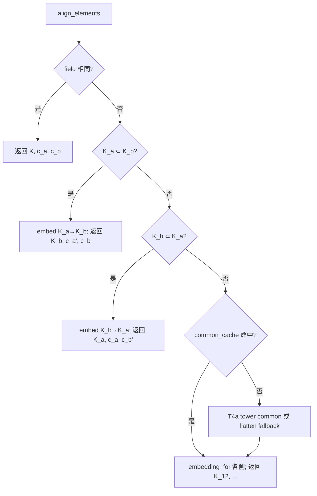

# GIAC — Lazy `common` + 塔式 `ExtensionTower` 改动计划

**状态:** draft（S0 ✅、S1 ✅、S1-opt ✅、T1 ✅、T2 ✅、T3 ✅、T4a ✅、T4b ✅；**T3+ ☐**；DoD 部分待 §11/solve）  
**类型:** 实施计划 / AFK  
**相关:** [GIAC-algext-adoption](GIAC-algext-adoption.md) §8.2、B-05；[GIAC-poly-algext-backlog](GIAC-poly-algext-backlog.md)  
**Rust 落点:** `giac-core::algebra::{ext_tower, alg_ext, alg_ext_c, field_arith}`  
**快照:** 2026-06-19  
**附录:** §12 目标态存储方案与算法例子（√2、√3、√2+√3、`align_elements` 流程）

---

## 1. 目标与边界

### 1.1 目标

1. **Lazy common：** `from_rootof` / 表示层只挂**最小域**；`common` 仅在二元运算、判等、系数环 canonicalize 时触发。
2. **对齐语义正确：** 跨域嵌入按 `FieldEmbedding.source` 选矩阵，不假定 `embed_a` = 调用方第一个操作数。
3. **塔式生长（B-05）：** `Adj{parent}` 为真父塔；子域包含时 **O(嵌入)**，避免重复 flatten `k` 搜索。
4. **行为：** 现有 golden / conformance **数学等价**；显示 `rootof` 字符串不变。

### 1.2 非目标（本计划不做）

- `Poly<AlgExtC>` 上 gcd/factor/roots 全闭环（B-02，另开）
- 参数 minpoly / assume（Phase C）
- 删除 flatten `common` 路径（塔未就绪前保留 fallback）
- `Expr` AST 大改（不新增 `Expr::AlgExtSum` 等）

---

## 2. 现状摘要（2026-06-20，T4a 默认后）

| 路径 | common? | 状态 |
|------|---------|------|
| `from_rootof` | 否（lazy adjoin） | ✅ |
| `align_pair` / `AlgExtC::align_with` | 经 `align_elements` | ✅ S0 |
| `fold_algext_sum` | Split：组间可留 `Add` 树；Canonical：按 `field.id` merge | ✅ S1 / S1-opt |
| `common_over_q` | T4b 子域 / T4a 塔 adjoin / flatten bisect | ✅ 默认塔 |
| `ExtensionTower::Adj` | 真 parent 链 | ✅ T1–T3 |
| `adjoin(K, u²−α)`（α∈K 非常数） | **未实现**（`adjoin_irreducible` 拒 parent 系数） | ☐ **T3+** |

---

## 3. 分阶段实施

### Phase S0 — 统一对齐入口（1 PR，无塔行为变化）

**目的：** 单一 `align_elements`；修嵌入选择 bug。

| 任务 | 文件 |
|------|------|
| 新增 `AlignedElements { field, left, right }` | `ext_tower.rs` |
| `ExtensionField::align_elements(a_f, a_c, b_f, b_c)` | `ext_tower.rs` |
| `embedding_for(field, &CommonFieldPair) -> &FieldEmbedding` | `ext_tower.rs` |
| `align_pair` → 薄包装调用 `align_elements` | `alg_ext.rs` |
| `AlgExtC::align_with`、`common_ext` 同上 | `alg_ext.rs`, `alg_ext_c.rs` |
| **`AlgExtC::from_complex_parts`**：`re`/`im` 域 id 与参数顺序无关时仍须 `embedding_for`（同 S0 嵌入 bug，**不**等到 S2） | `alg_ext_c.rs` |
| 测试：`embedding_for` 按 `source` 选矩阵，非 `embed_a`=第一参数 | `ext_tower.rs` tests |
| **必加回归：** cache 预热 + 操作数逆序 `align_elements` / `add` | `ext_tower.rs` tests |

**验收：**

- `cargo test -p giac-core` 全过
- 新测：`align_elements` 在 `(a,b)` 与 `(b,a)` 下 `element_add` 结果 `eq_mod` 一致
- **必加回归（review）：** 先 `common_over_q(√2,√3)`（dim=4，比 √2+∛2 快）预热 cache；再 **操作数逆序** 调 `align_elements` / `AlgExt::add`，`left`/`right` 对调但和在 compositum 中一致；验证 `embedding_for` 匹配 `embed_*.source` 而非调用顺序
- 现有 `common_sqrt2_cbrt2_*` 仍可为 `#[ignore]`（perf）；S0 不依赖其 un-ignore
- 无新 `common` 调用点（grep 审计：仅 `align_elements` 内调 `common_over_q`）

**Review 补充（2026-06-20，已并入本 Phase）：**

- **优先级：** S0 是正确性修复（`common_cache` 按 id 排序 vs `align_pair` 假定 `embed_a`=第一参数），非纯重构；**必须最先做**。
- **与 S1 合并：** 风险低时可 S0+S1 同一 PR；**S0 逆序回归不可省**。
- **测试策略：** 小域对（**ℚ+√2** cache 预热 + 逆序 `align_elements`/`add`，快）或手工 `CommonFieldPair` 测 `embedding_for`；√2+√3 dim=4 可作手测；慢测 √2+∛2 仍 `#[ignore]`。

---

### Phase S1 — Lazy 边界文档化 + `fold` 加固（1 PR）✅ 2026-06-20

| 任务 | 文件 |
|------|------|
| `fold_algext_sum` 分组：`ptr_eq \|\| field ==` | `alg_ext.rs` |
| 注释：组间 `add` 才 common；`to_rootof_expr` 不 common | `alg_ext.rs`, `display.rs` |
| adoption §8.2 补「lazy common 决策树」链到本文 | `GIAC-algext-adoption.md` |

**验收：**

- `fold_algext_sum` 测：同 minpoly 不同 `Arc`（若 registry dedup 则同 ptr）
- 文档索引可发现

#### Phase S1-opt（可选，同 PR 或紧随 S1）— Canonical fold 确定性 merge ✅ 2026-06-20

**目的：** 多域组间合并时 **不依赖 Expr 遍历顺序**；与左结合 binary common 渐近同为 \(O(D^3)\)，但 **common 调用序列可复现**，利于测试与 cache 预热。  
**非目标：** 完整「平衡 merge 树」（按维数配对降中间维峰值）、N 元一次 compositum——**未立项**（见 §8.4）。

| 任务 | 文件 |
|------|------|
| Canonical 路径：各 `field` 组代表元按 `field.id()` **升序** 排列 | `alg_ext.rs` | ✅ |
| 两两 `acc.add(&next)` 合并（递增链，非 Expr 左结合顺序） | `alg_ext.rs` | ✅ |
| 开关：`FoldAlgExtMode::Split`（默认）/ `Canonical`（`fold_algext_sum_mode`） | `alg_ext.rs` | ✅ |
| 文档：说明与塔路径（T1–T2）关系——塔顶同域时 fold 不触发组间 common | 本文 §12.6 E | ✅ |

**验收：**

- 四域例（√2、∛2、√3、∛3）：**未测**（3+ 无关简单域 flatten 慢）；已测 √2+√3 **两域** `Canonical` 顺序无关
- 合并过程：组间 `common` 按 `id` 递增顺序发生（可用测试 hook 记录 `(id_lo,id_hi)` 序列）
- `Split`：两域时 pairwise `add` 可 lazy common 合并；**三域及以上** 仍常为 `Add` 树（见 §12.6 E）

**优先级：** P2 可选；不挡 S0/T1。无塔时略减「加法顺序敏感」；有塔时收益有限。

---

### Phase T1 — 真 parent `Adj` + `adjoin(parent, P)`（1–2 PR）✅ 2026-06-20

**目的：** ℚ→K₁→K₂ 链；**仍可用 ℚ 系数描述 parent 元素**（Phase B 约束）。

| 任务 | 文件 |
|------|------|
| `ExtensionField::adjoin_irreducible(parent, min_poly_q)` | `ext_tower.rs` |
| `register_simple` → `adjoin(Base, P)` | `ext_tower.rs` |
| registry 键：`(parent_id, min_poly_key)` | `ext_tower.rs` |
| `from_rootof` 可选 `parent`（默认 Base） | `alg_ext.rs` |
| `ExtensionField::is_subfield_of(a, b)` — 塔遍历 | `ext_tower.rs` |
| `try_subfield_embedding(sub, sup)` | `ext_tower.rs` |

**验收（review 收紧）：**

- **T1a：** `adjoin(Base, t²−2)` 与现 `adjoin_irreducible_over_q` 等价，\([K_1:\mathbb{Q}]=2\)
- **T1b：** `adjoin(K₁, u²−3)`——\(K_1=\mathbb{Q}(\sqrt2)\)，minpoly 系数为 **\(K_1\) 里的常数 3**（坐标 \((3,0)\)），\([K_2:\mathbb{Q}]=4\)；**本阶段不做** \(u^2-\alpha\)（\(\alpha=\sqrt2\) 在 \(K_1\) 中的非平凡系数），该形态推到 **T3+**
- `is_subfield_of(K₁, K₂)` 为 true
- 旧 `adjoin_irreducible_over_q` 仍可用（别名 `adjoin(rational(), P)`）

---

### Phase T2 — `align_elements` 子域快路径（1 PR）✅ 2026-06-20

| 任务 | 文件 |
|------|------|
| `align_elements`：`a ⊂ b` → embed a→b，不 `common_cached` | `ext_tower.rs` |
| `align_elements`：`b ⊂ a` → 对称 | `ext_tower.rs` |
| 否则 → 现有 `common_cached` | `ext_tower.rs` |

**验收：**

- 在 T1 的 K₂ 中 `√2 + √2` **不**触发 `common_cache` insert（可用计数器或 spy 测）
- `(√2)+(∛2)` 走 **T4a** 塔 compositum（默认）；flatten 仅 `--no-default-features`

---

### Phase T3 — 塔顶元素算术（parent 系数）（2 PR）✅ 2026-06-20

| 任务 | 文件 |
|------|------|
| `field_arith`：`poly_*_with_coeffs_in_field(parent, …)` | `field_arith.rs` |
| `element_mul/inv` 用塔顶 `min_poly`，系数在 parent 乘 | `ext_tower.rs` |
| `AlgExtData::mul_rational` mod **塔顶** minpoly，非仅 `min_poly_over_q` | `alg_ext.rs` |

**验收：**

- K₁ 内 `√2 * √2 = 2`
- K₂ 内 `(√2·β) * (β)` 等与手算一致（小用例）

**与 T3+ 分界：** T3 在**已登记**塔顶做 parent 系数 `element_*`（含 T1b 的 \(u^2-3\)）；**不**解除 `adjoin_irreducible` 对层 minpoly「parent 非常数系数」的登记限制。

---

### Phase T3+ — 层 minpoly 含 parent 非常数系数（`adjoin(K, u²−α)`）（1–2 PR）☐

**目的：** 一般四次 resolvent 等在 K 上 adjoin \(u^2-\alpha\)（\(\alpha\in K\) 非 embed 有理常数）；与 T3 **算术**互补——T3+ 才允许 **register** 新层。

| 任务 | 文件 |
|------|------|
| `adjoin_irreducible`：parent≠Base 时接受 parent 系数 minpoly（现拒：`layer_minpoly_rational_constants`，`ext_tower.rs` ~164） | `ext_tower.rs` |
| 层系数 embed → parent operational 基；deg / 约化检查 | `ext_tower.rs` |
| `min_poly_over_q` / 张量基与 T3 `element_*` 一致 | `ext_tower.rs` |
| 测试：`adjoin(K₁, u²−√2)`（α 在 K₁ 为 `(1,0)`）维数与手算 `eq_mod` | `ext_tower.rs` tests |

**验收：**

- **T3+a：** `adjoin(K₁, u²−α)`，\(K_1=\mathbb{Q}(\sqrt2)\)，\(\alpha=\sqrt2\)，\([K_2:\mathbb{Q}]=4\)
- T1b `adjoin(K₁,u²−3)` 仍绿（常数系数路径不退化）
- **阻塞 P3-6：** 无 T3+ 则 `Poly<AlgExtC>::roots` 无法在 resolvent 步建 \(u^2-\alpha\) 层

---

### Phase T4 — 塔式 `common`（B-05 主交付）（2–3 PR）

拆为两个子阶段（review）：

#### T4a — 并列简单域 compositum（新 `Adj` 层） ✅ 2026-06-20

| 任务 | 文件 | 状态 |
|------|------|------|
| `compute_common_tower(a, b)`：并列 simple-over-ℚ → 塔 adjoin | `ext_tower.rs` | ✅ 默认 `tower-common` |
| flatten fallback bisect | `ext_tower.rs` | ✅ `--no-default-features` |
| `CommonFieldPair` 文档：embed = `source → target` | `ext_tower.rs` | ✅ |
| 可审计的正确性验证（§4） | `.doc/giac-tower-common-math.md` §4 | ✅ |
| 验收：√2+∛2 快测、逆序 align、cache | `ext_tower` tests | ✅ |
| 改默认路径 / 去 feature | `Cargo.toml` | ✅ `default = ["tower-common"]` |

**T4a 验收：**

- `(√2)+(∛2)` 数学正确
- `common(a,b)` 与 `common(b,a)` 对齐结果一致（配合 S0 逆序测）
- `field_registry_dedup` / cache 仍有效；第二次 `common(√2,∛2)` cache hit
- （可选）flatten 与 tower 两条路径小域对 `eq_mod` 一致

#### T4b — 子塔包含 = 仅提升嵌入（与 T2 闭环） ✅

| 任务 | 文件 | 状态 |
|------|------|------|
| 子域 `common` = 包含映射，不 flatten | `subfield_common_pair` | ✅ |
| 与 T2 `align_elements` 统一验收 | `ext_tower.rs` tests | ✅ `t4b_common_subfield_*` |
| 可选重命名 embed API | — | ☐ |

**T4b 验收：**

- `common(K₁, K₂)`（\(K_1\subset K_2\)）返回超域、不 flatten 搜 \(k\)；cache 可存子域对但 **不新建 compositum**
- B-05 adoption 行可勾选

---

### Phase S2 — `AlgExtC` 可选延迟 common（**P2 可选** PR）

| 任务 | 说明 |
|------|------|
| `from_complex_parts` | re/im 同域不变；异域可延迟到首次 `add/mul` |
| `Expr::Complex` | eval 前保持 L0 |

**验收：** `i*sqrt(2)` 构造不 common；`mul` 时 common。

---

## 4. 文件触达矩阵

| 文件 | S0 | S1 | T1 | T2 | T3 | T4a | T4b |
|------|----|----|----|----|----|-----|-----|
| `ext_tower.rs` | ● | | ● | ● | ● | ● | ● |
| `field_arith.rs` | | | | | ● | ○ | |
| `alg_ext.rs` | ● | ● / ○ opt | ○ | | ● | | |
| `alg_ext_c.rs` | ● | | | | | | ○ |
| `GIAC-algext-adoption.md` | | ● | | | | ● | ● |
| `GIAC-poly-algext-backlog.md` | | | | | | ● | ●（§5.1 solve） |

图例：`●` 必改；`○` 可能触达；`○ opt` 仅可选 Phase（如 S1-opt）。

---

## 5. 测试策略

1. **单元：** 每层验收表 + `align` 对称性 + **S0 cache hit 逆序操作数** + 子域无 common 计数
2. **集成：** `solve(t²-2)`, `solve(t⁴-2)`, `solve(t⁴+t+1)`（P3-6+**T3+**）, `factor(x²-2)`, `realroot`
3. **golden：** `cargo test` conformance 无回归；偏离登记 `known-divergences.md`
4. **属性（可选）：** flatten common 与 tower common 结果 `eq_mod`（小域对）

---

## 6. 风险与回滚

| 风险 | 缓解 |
|------|------|
| T3 parent 系数算术复杂 | T1 仅 T1a/T1b（\(u^2-3\) 常数）；\(u^2-\alpha\) 延至 **T3+** adjoin |
| 嵌入顺序 bug 复发 | S0 强制所有路径经 `align_elements` |
| 性能回退 | 保留 `common_cache`；T2 子域快路径 |
| API 破坏 | `adjoin_irreducible_over_q` 保留；`CommonFieldPair` 字段名变更需 major 注记 |

**回滚：** 每 Phase 独立 PR；**T4a** 可用 feature `tower-common` 切换 flatten fallback；T4b 仅影响子塔路径。

**T4a DoD 补充（review）：** `tower-common` **off** 时行为与 Phase 0 flatten 等价（便于 bisect / 回滚）。

---

## 7. 推荐 PR 顺序

```text
S0 → S1 [→ S1-opt 可选] → T1 → T2 → T3 → T3+ → T4a → T4b → (S2 可选，P2)
```

**AFK 最小竖切：** 仅 **S0 + T1 + T2** 即可交付「lazy + 子域嵌入」大部分收益；**T4a** 为 B-05 并列域主交付，**T4b** 与 T2 合并验收子塔包含。

**与 poly backlog 并行（review）：**

| 可并行（不挡塔） | 须等塔 Phase |
|------------------|--------------|
| P2-1/6、P4-6（factor + 双二次 solve） | **T3+** → P3-6 一般四次（\(u^2-\alpha\) adjoin） |
| 任何不跨域 `align` 的 poly 工作 | **T4a** → 并列不可约因子 compositum |
| **S0** 可与上述 poly 工作并行 | **S0** 本身 unlock 多根 `eq_mod` / 逆序 `add` |

---

## 8. 开放决策（实施前需确认）

1. **T4a 前** flatten common 是否保留为默认路径？（**已决 2026-06-20：** 否；`default = ["tower-common"]`；bisect 用 `--no-default-features`）
2. **`CommonFieldPair` 命名**是否改为 `embed_for(source)` 消灭 a/b？（建议：S0 先修语义，T4b 再改名）

**已决（review 并入）：**

3. **T1 验收** 采用 **T1a** `adjoin(Base, t²−2)` + **T1b** `adjoin(K₁, u²−3)`（\(K_1\) 常数 3）；**\(u^2-\alpha\)** 不在 T1/T2 做，留待 **T3+**（T3 仅 parent 系数算术）。

4. **平衡 merge 树** 是否立项？（建议：**否**；**S1-opt** 仅做按 `field.id` 排序的两两 Canonical merge；按维数配对的平衡树、N 元 compositum 留待塔成熟后再评估）

5. **通用五次 solve** 是否立项？（建议：**否**（根式）；**是**（P3-7 factor 降次 + 不可约 `rootof`），见 §10 与 poly backlog §5.1）

---

## 9. 完成定义（DoD）

- [x] S0：`embedding_for` + 逆序 cache 回归测绿（2026-06-20）
- [x] T3：塔顶 parent 系数 `element_*` + `mul_rational` + K₁/K₂ 验收测绿（2026-06-20）
- [x] 所有跨域对齐经 `align_elements`（2026-06-20 grep：生产路径仅 `align_elements`→`common_over_q`；`common_ext` 同链；测试直接调 `common_over_q` 除外）
- [x] adoption B-05 验收行勾选（T4b 后，2026-06-20）
- [x] `.doc/issues/GIAC-poly-algext-backlog.md` P0-B（M-塔）登记 ✅
- [x] `giac-core` / 相关 crate 测试绿（2026-06-20）
- [ ] **T3+：** `adjoin(K, u²−α)` 登记 + 维数 / `eq_mod` 验收
- [ ] 无新增 `poly_error_compat` 类双错误映射
- [x] T4a：`tower-common` 默认开；`--no-default-features` = Phase 0 flatten（bisect，测 `flatten_bisect::*`）

---

## 10. 下一阶段（塔计划本体已闭合；solve 依赖 T3+）

| 优先级 | 事项 | 文档 |
|--------|------|------|
| **P0** | **T3+** `adjoin(K, u²−α)`（P3-6 前置） | 本文 §3 Phase T3+ |
| **P1** | 一般四次 solve（P3-6，resolvent 在 K 上 split） | 本文 §11；[GIAC-poly-algext-backlog](GIAC-poly-algext-backlog.md) §5.1 |
| **P2** | `AlgExtC::from_complex_parts` 延迟 common（S2） | 本文 §3 Phase S2 |
| **P2** | `CommonFieldPair` → `embed_for(source)` 重命名 | 本文 §8.2 |
| **P2** | conformance 集成：`solve(t⁴+t+1)` 等 | 本文 §5 |
| **P2** | 稠密 poly1 算术下沉 `giac-poly`（删 `field_arith` 双份） | [GIAC-dense-poly1-refactor](GIAC-dense-poly1-refactor.md) D1–D4 |

---

## 11. Solve 管线：四次与 deg≥5（与 poly backlog 对齐）

**交叉引用：** [GIAC-poly-algext-backlog.md](GIAC-poly-algext-backlog.md) §5.1（P2-6、P3-6/7、P4-6/7）。

### 11.1 目标与边界

| 范围 | 立场 |
|------|------|
| **deg≤4，一般 ℚ 四次** | **必做**（P3-6）；走 `Poly<AlgExtC>::roots`，非 `giac-solve/rootof.rs` 新形状表 |
| **deg≥5** | **不做**通用根式闭式（Abel–Ruffini）；**要做** factor 降次 + 不可约因子 `rootof(α)` |
| **表示** | 代数根一律 `AlgExt` / `AlgExtC`；`giac_poly::roots` 仅 ℚ 有理根（或迁入废弃） |

### 11.2 塔 Phase 对 solve 的阻塞关系

```text
P ∈ Poly<ℚ>, solve(t)
  → factor / sqff（P3-7）
  → 对因子 Pᵢ 求根
        │
        ├─ deg≤4：Poly<AlgExtC>::roots
        │     ├─ 二次 / 双二次：K₀ adjoin（现 flatten，T1a 等价）
        │     ├─ 三次 resolvent：K₀ 或 K₁ 上 roots → 需 T1 + T3 系数算术
        │     └─ 一般四次：resolvent cubic + K 上二次 split
        │           └─ minpoly 系数 ∈ K₁（如 u²−α）→ **硬依赖 T3+ adjoin**
        │
        └─ deg≥5 不可约：rootof(生成元, Pᵢ)（L1 lazy adjoin）
              └─ 多根同属分裂域时：T2 子域嵌入；并列因子 T4a common
```

| 塔 Phase | solve 解锁 |
|----------|------------|
| **S0** | 多根列表、`froot` 输出后续 `add`/`eq_mod` 嵌入不错序 |
| **T1–T2** | solve 会话塔生长；`√2` 已在 K₂ 时不重复 flatten common |
| **T3** | 已登记塔顶 parent 系数 `element_*`（T1b 等） |
| **T3+** | **P3-6 一般四次**：在 K 上 **register** \(u^2-\alpha\) adjoin |
| **T4a** | 并列不可约因子（如两不同五次）进公共域 |

**AFK 竖切建议：** S0 + T1 + T2 与 P2-1/6、P4-6（factor+递归+双二次）可并行；**P3-6 一般四次**验收挂在 **T3+ 之后**（T3 alone 不足：现 `adjoin_irreducible` 仍拒 parent 系数层）。

### 11.3 验收补充（接 §5 测试策略）

| 用例 | 期望 | 塔/note |
|------|------|---------|
| `solve(t⁴−2=0,t)` | 四根；双二次路径 | T1a 或 flatten；已有 |
| `solve(t⁴+t+1=0,t)` | 四根 `eq_mod`；非 `NotImplemented` | 需 P3-6 + **T3+** |
| `solve(t⁵−2=0,t)` | 一支 `rootof` 或五根（若可根式子类） | **不**要求通用根式；`rootof`+`min_poly` 可接受 |
| `(x²+1)(x³−x+1)` factor 后 solve | 降次递归 | P3-7；不触发四次未实现 |
| 同次方程两次 solve | 同分裂域 `field` 可对齐 | T2 / registry `by_adjoin` |

### 11.4 明确不做

- Ferrari / resolvent 的 **`giac-solve` 旁路实现**（与 P4-6 统一 `Poly<AlgExtC>::roots` 冲突）。
- **通用五次根式**闭式及更高次根式公式。
- 在 **T3+** 前用 flatten 冒充「一般四次」并标为 P3-6 完成（允许 **临时** 双二次+可约降次，须登记 `known-divergences`）。

---

## 12. 附录：目标态存储方案与算法例子

改造完成（S0 + S1-opt + T1–T4b）后的**运行时形态**说明；与 §1 目标、§3 各 Phase 验收一致。

### 12.1 三层表示（L0 / L1 / L2）

| 层 | 载体 | 何时 | 是否 `common` |
|----|------|------|----------------|
| **L0** | `Expr`（`rootof` / `Add` 树） | 解析、未 eval、仅 display | 否 |
| **L1** | `AlgExtData { field, coords }` | `from_rootof`、单域一元运算 | 否（最小域） |
| **L2** | `AlgExtData`（对齐后） | `add` / `mul` / `eq_mod`、跨域 fold（Canonical） | 运算时 `align_elements` 可能 common |

**规则：** `from_rootof` 只产生 L1；二元运算内部经 `align_elements` 升到 L2，再写回带（可能更大的）`field` 的 `AlgExtData`。`to_rootof_expr` / display **不**触发 common。

示例 L0：

```text
rootof([1,0], poly1[1,0,-2]) + rootof([1,0], poly1[1,0,-3])
```

---

### 12.2 塔结构 `ExtensionTower`

每个 `ExtensionField` 指向**塔顶**；`Adj` 记录逐层 adjoin（parent 为真父塔，非写死 `Base`）。

```text
K₀ = Base (ℚ)
  │
  ├─► K₁ = Adj { parent: K₀, min_poly: t²−2,  ext_degree: 2 }
  │         embed_parent: [ (1,0) ]              // ℚ·1 → K₁ 基 {1,α}
  │
  └─► K₂ = Adj { parent: K₁, min_poly: u²−3,  ext_degree: 2 }
            // minpoly 系数 3 ∈ K₁，坐标 (3,0)
            embed_parent: [ (1,0), (0,1) ]        // K₁ 基 {1,α} → K₂ 基 {1,α,β,αβ}
            dim(K₂) = 4
```

**并列域**（非父子）各自从 `Base` 生长，例如：

```text
K₁ = ℚ(√2)       id=7    registry[(0, key(t²−2))]
K₃ = ℚ(√3)       id=9    registry[(0, key(t²−3))]    // parent 也是 Base，与 K₁ 并列
K₂ = ℚ(√2,√3)    id=12   registry[(7, key(u²−3))]    // T1b：在 K₁ 上 adjoin
```

**塔顶基（T1–T3）：** 张量基。\(K_2=\mathbb{Q}(\sqrt2,\sqrt3)\) 取 `{ 1, α, β, αβ }`（α²=2，β²=3 在 K₁ 上），`coords` 长度为 `field.dimension()`。

---

### 12.3 全局 Registry

| 表 | 键 | 值 | 含义 |
|----|-----|-----|------|
| `by_adjoin` | `(parent_id, min_poly_key)` | `Arc<ExtensionField>` | 同一 parent 上同一 adjoin 去重 |
| `common_cache` | `(id_lo, id_hi)` | `CommonFieldPair` | 并列域 compositum + 嵌入（T4a）；纯子域包含通常不写 |

`AlgExtData` 与 `CommonFieldPair` 结构（目标 API）：

```rust
AlgExtData {
    field: Arc<ExtensionField>,   // 塔顶句柄
    coords: Vec<ExprArc>,         // 塔顶基坐标
    root_index: Option<u32>,
}

CommonFieldPair {
    field: Arc<ExtensionField>,   // 公共超塔顶
    embed_a: FieldEmbedding { source, target, matrix },  // S0: 按 source 选，非调用顺序
    embed_b: FieldEmbedding { ... },
}
```

---

### 12.4 存储例子

#### 例 A：`√2`（L1）

```text
from_rootof([1,0], poly1[1,0,-2])
  → registry (parent=ℚ, t²−2) → K₁ (id=7)
  → AlgExtData { field: K₁, coords: (0, 1) }    // √2 = α
```

#### 例 B：`√3`（并列 L1）

```text
registry (parent=ℚ, t²−3) → K₃ (id=9)
  → AlgExtData { field: K₃, coords: (0, 1) }
```

#### 例 C：T1b `K₂ = K₁(√3)`

```text
adjoin(K₁, u²−3)   // 系数 3 在 K₁ 中为 embed(3)=(0,3) 于 block u^0
  → registry (parent_id=7, key(u²−3)) → K₂ (id=12), dim=4
  → is_subfield_of(K₁, K₂) = true
  → √2 在 K₂ 中（张量基）: coords = (1, 0, 0, 0)     // block u^0 = α
  → √3 = β 在 K₂ 中: coords = (0, 0, 0, 1)           // block u^1 = parent.one
  → 常数 1 在 K₂ 中: coords = (0, 1, 0, 0)           // block u^0 = parent.one
```

（与 flatten `min_poly_over_q` 本原元 θ 幂基不同，见 §12.9。）

---

### 12.5 算法：`align_elements` 决策树



所有 `align_pair` / `AlgExtC::align_with` / `common_ext` **必须**经此入口（S0）。

---

### 12.6 算法例子

#### B：`√2 + √2`（同域 K₂，T2 快路径）

```text
a, b: field=K₂, coords=(0,1,0,0)
align_elements → same field，无 common
element_add → (0,2,0,0)     // 2√2
common_cache 不增长
```

#### C：`√2 + √3`（并列 K₁ 与 K₃，触发 common）

```text
L1:  a: K₁ (0,1)    b: K₃ (0,1)

align_elements:
  非 same；互不包含；cache miss (7,9)
  → T4a（或 flatten）得 K₁₂ ≅ ℚ(√2,√3)，dim=4
  → common_cache[(7,9)] = CommonFieldPair { ... }
  → c_a' = embed(K₁→K₁₂)(0,1) = (0,1,0,0)
  → c_b' = embed(K₃→K₁₂)(0,1) = (0,0,1,0)
element_add → (0,1,1,0)

L2 结果: AlgExtData { field: K₁₂, coords: (0,1,1,0) }
```

**S0 逆序回归：** 先 `common(K₁,K₃)` 预热 cache；再 `align_pair(√3_elt, √2_elt)`，经 `embedding_for` 仍得 `(0,1,1,0)`。

#### D：同一和式，若 √3 已在 K₂（子域路径）

```text
a: K₂ (0,1,0,0)    b: K₂ (0,0,1,0)
align_elements → same field
→ (0,1,1,0)，全程无 common
```

#### E：`fold_algext_sum`（lazy Split / Canonical）

```text
Add(√2_rootof, √3_rootof, 1)
  → 两组 L1 + rat 1

Split（默认，S1）:
  → 按 field 分组；组内 `element_add`，不跨组 common
  → **仅一组且新项异域**：pairwise `add` → 可 lazy common（如 √2+√3 → 单个 L2 AlgExt）
  → **三域及以上**： unlike fields 仍常为 `Add` 树

Canonical（S1-opt 可选）:
  → 各 field 组按 field.id 升序排列
  → 两两 acc.add（经 align_elements / common_cache）
  → 单个 L2 AlgExt；与 Expr 项顺序无关（eq_mod 一致）
  → 非平衡树：递增 id 链，非按维数配对
```

#### F：`solve(t⁴−2=0)` 塔生长（草图）

```text
K₁ = ℚ(α), α²=2
→ adjoin 得 β⁴=2 或分步二次 → K₂
→ 需 i 时 adjoin(v²+1) → K₃
根 ±2^(1/4), ±i·2^(1/4) 为各步塔顶上 AlgExtC
同题后续 align 走子域提升；\(u^2-\alpha\) adjoin 见 **T3+**
```

---

### 12.7 改造前后对比（√2+√3）

| | 改造前（扁平 Phase 0） | 改造后（塔 + lazy） |
|---|------------------------|---------------------|
| √2 / √3 存储 | 各 `ℚ(θᵢ)`，parent=Base | 同；或 √3 在 K₂ 为子域坐标 |
| 第一次加 | flatten common，试 \(k=1..12\) | 并列域仍 common（T4a）；已在 K₂ 则 **不** common |
| 结果 field | 新扁平 `ℚ(g)`，deg=4 | `K₁₂` 塔记录或已有 K₂ |
| 结果坐标 | 本原元 θ 幂基 | 优先 `{1,√2,√3,√6}` 张量基 |
| display | 各自 `rootof` | golden 不变 |

---

### 12.8 数据流总图

```text
用户:  rootof(√2) + rootof(√3)
         │                    │
         ▼                    ▼
L1      AlgExt(K₁,(0,1))     AlgExt(K₃,(0,1))
         │                    │
         └──────── add ───────┘
                    │
                    ▼
            align_elements
         ┌──────────┼──────────┐
         │          │          │
      same?      K_a⊂K_b?   common_cache / T4a
         │          │          │
         ▼          ▼          ▼
      直接加    embed 提升   K₁₂ + embedding_for
                    │
                    ▼
L2      AlgExt(K₁₂, (0,1,1,0))
                    │
         to_rootof_expr（不 common）
                    ▼
显示:  rootof / 展开（与 golden 一致）
```

**小结：** **存储** = 塔链 `Adj{parent, min_poly, embed_parent}` + `by_adjoin` 去重 + 元素只带塔顶 `field`/`coords`；**算法** = 表示停 L1，运算时 `align_elements` 三分（同域 / 子域嵌入 / common），并列域才付 compositum 成本。

---

### 12.9 Flatten vs 塔 坐标基对照（audit 2026-06-20）

**同一数学域**在不同登记路径下 **`coords` 下标含义不同**。`AlgExtData::from_coords_q` 不做基变换；`fold_algext_sum` 合并有理项须走 `field.embed_rational` + `field.element_add`（**不能**假定常数在 `coords.last()`，也不能对塔域 `poly_reduce` mod `min_poly_over_q`）。

#### 基的定义

| 路径 | 何时 | `coords` 语义 | 长度 |
|------|------|---------------|------|
| **Primitive** | `parent = ℚ`（含 legacy `adjoin_irreducible_over_q`） | giac `poly1` 降幂：下标 0 = 最高次，**常数 1 在末位** | `deg(min_poly)` |
| **Tower 张量** | `parent` 为非 Base 扩域（T3 `element_*_tower`） | `[block u^0 ∥ block u^1 ∥ …]`，每 block 长 `parent.dim`，block 内为 **parent 的 operational 基** | `parent.dim × ext_degree` |
| **Flatten common** | `register_common` / `common_over_q`（Phase 0，T4a 前） | 本原元 θ 的 **ℚ 幂基** mod `min_poly_over_q(θ)`；常数在末位 | compositum 次数 |

#### K₁ = ℚ(√2)（两路径一致）

| 元素 | coords `(c₀,c₁)` | 含义 |
|------|------------------|------|
| 1 | `(0, 1)` | 常数项 |
| α = √2 | `(1, 0)` | α |
| 2 | `(0, 2)` | 有理数 embed |

#### K₂ = K₁(β)，β² = 3（T1b + T3 张量基 vs flatten metadata）

`min_poly_over_q` 仍是 **θ 的 4 次** compositum 多项式（`compose_min_poly_over_q`）；**塔上运算**用层 minpoly `u²−3` + 张量坐标。

| 元素 | Tower 张量 coords（4） | Flatten θ 幂基（4） | 备注 |
|------|------------------------|---------------------|------|
| 1 | `(0, 1, 0, 0)` | `(0, 0, 0, 1)` | 常数位置不同 |
| √2 = α | `(1, 0, 0, 0)` | 依 θ 本原元选取而变 | 子域嵌入 block u^0 |
| √3 = β | `(0, 0, 0, 1)` | 依 θ 本原元选取而变 | `generator_coords` = u·1 |
| α + 5 | `element_add(α, embed(5))` | **≠** 末位 +5 再 `poly_reduce` | fold 回归测 |

#### 登记与嵌入

| | Flatten `common` / `register_common` | Tower `adjoin_irreducible(parent, …)` |
|---|--------------------------------------|----------------------------------------|
| `parent_field` | `None` | `Some(parent)` |
| `ExtensionTower::Adj.parent` | 恒 `Base` | 真父塔 |
| ℚ ↪ K 嵌入 | `m[dim−1][0]=1`（常数在末位） | 同左（parent 为 Base 时） |
| K₁ ↪ K₂ 嵌入 | flatten 矩阵（`common_primitive_sum`） | 块对角：`child[i][i]=1`，i < parent.dim |
| 域内 `element_mul` | mod **`min_poly_over_q`**（primitive） | parent 非 Base：**tower** mod 层 minpoly |

#### API 约束（DoD 补充）

- **`from_coords_q`：** 调用方必须提供 **该 `field` 句柄的 operational 基** 坐标；勿把 flatten θ 坐标直接挂到塔句柄上。
- **`fold_algext_sum`：** 单 AlgExt 组 + 有理叶子 → `embed_rational` + `element_add`（已修复，测 `fold_algext_sum_rat_on_k2_*`）。
- **测试夹具：** `algebra::test_fixtures`（`#[cfg(test)]`）— `t1b_k2_adjoin_sqrt3_over_k1()` 等，对应 plan §12.4 例 C / T1b，避免各测重复写 minpoly。
- **数学 / 可审计验证：** [.doc/giac-tower-common-math.md](../giac-tower-common-math.md) — compositum 文献、Lean 分层证明路线（非全库 machine-checked 形式化）。
- **`eq_mod` / `align_elements`：** 子域快路径在张量基下正确；flatten common 对齐到 **common.field** 的 θ 基——与塔基 **`eq_mod` 仍成立**，但 **coords 字面不可比**。

#### Rust 坐标转换 API（D4，`giac-poly::dense::convert`）

| 布局 | 向量语义 | Rust |
|------|----------|------|
| giac **`poly1` HighFirst** | 下标 0 = 最高次；常数在末位 | `ext_tower` / `field_arith::CoordsQ`；`sparse_ascending_to_dense_high_first` |
| giac-poly **ascending** | 下标 0 = 常数项 | `univariate_coeffs_ascending`；`dense_high_first_to_ascending` |
| sparse `Poly` | 升幂存储 | `dense_high_first_to_sparse` / 上式互逆 |

**禁止：** 不经上述 API 把 sparse 系数向量当作 `CoordsQ` 使用，或把 flatten θ 坐标挂塔句柄（见 [GIAC-dense-poly1-refactor](GIAC-dense-poly1-refactor.md) §4.2）。

