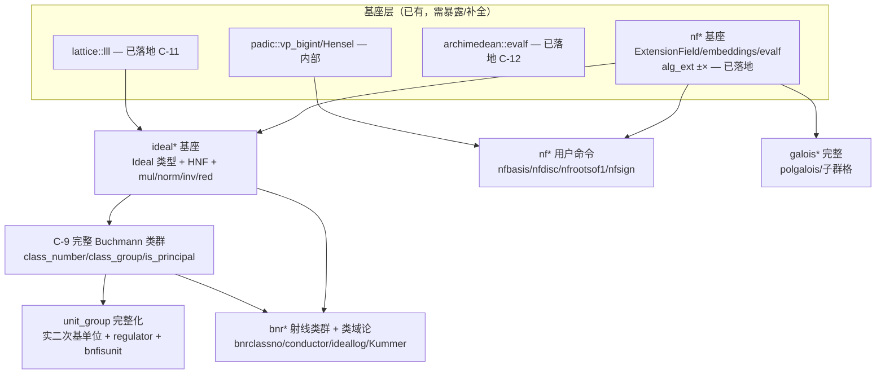

# Pari `bnf*` 对标 — 数论深化主线方案 + 优先级

**状态:** open（方案 / 跟踪）
**类型:** 扩展功能规划（非 upstream giac 对齐）
**上游基线:** **Pari/GP `bnf*` / `bnr*` / `ideal*` / `nf*` / `galois*` 函数族**（giac-2.0.0 无对标）
**相关:** [GIAC-core-upstream-gaps](GIAC-core-upstream-gaps.md) §4 Phase E（C-9..C-12）、[GIAC-p2-algebraic-number-theory-api](GIAC-p2-algebraic-number-theory-api.md)（已落地 C-11/C-12）、[GIAC-poly-f5-fglm-hasse-lean4-verification](GIAC-poly-f5-fglm-hasse-lean4-verification.md)（数学正确性线）
**Rust 落点:** `giac-rs/crates/giac-core/src/algebra/{ideal(新),class_group,unit_group,lattice,archimedean,number_field_arith,padic,galois_automorphism}.rs` + `eval.rs`
**快照:** 2026-07-02

---

## 问题陈述

Pari/GP 的数论函数族是分层的（`nf*` 基础 → `bnf*` 类群/单位 → `bnr*` 射线类域论 → `ideal*` 理想算术 → `galois*` 分裂域）。giac-rs 现状只在 `nf*` 基础和 `bnf*` 的内部辅助层有覆盖，**用户级命令几乎全空**。

本 issue 跟踪：**以 Pari `bnf*` 系列为 upstream 对标的数论深化主线实施方案 + 优先级**，按依赖序 + 性价比推进。这些是 **giac-rs 比 upstream giac 多的差异化扩展**，非 conformance 硬阻塞。

**定位：** upstream giac-2.0.0 **没有** `class_number` / `class_group` / `is_principal` / 理想算术等命令（Pari/GP 才有）。本主线是 giac-rs 在代数数论上对标 Pari 的扩展线。

---

## 现状（snapshot 2026-07-02）

| 模块 | 行数 | 现状 pub API | 唯一外部消费者 |
|------|------|-------------|-------------|
| `class_group.rs` | ~2300 | `pub(crate) class_number` / `class_number_from_relations` / `ideal_is_principal` / `hasse_is_square` / `hasse_sqrt`（有界 sound-skip）；`kronecker_symbol` / `class_number_real_quad_analytic`（实二次解析类数公式） | `poly_roots.rs:2089 hasse_sqrt` + eval `class_number` |
| `unit_group.rs` | 1046 | `pub(crate) Torsion` / `torsion` / `fundamental_units`（实二次 `d≥3` `None`-on-not-found） | 内部 |
| `lattice.rs` | 449 | **`pub(crate) lll` / `lll_with_transform` — C-11 已接 eval（`lll(matrix)` 命令）** | 内部 + eval |
| `archimedean.rs` | 803+ | `pub(crate) Signature` / `field_signature` / `is_totally_positive` / `Embeddings` / `embeddings` / **`algext_evalf` / `algextc_evalf`（C-12）** | 内部 + eval |
| `number_field_arith.rs` | 1294 | `pub(crate) PrimeIdealRec` / `IdealValuationScan` / `compute_ideal_valuations` / `poly_discriminant_low` / `power_order_is_maximal` | 内部 |
| `galois_automorphism.rs` | 303 | `pub(crate) conjugate_map_sends` / `try_galois_sqrt_second`（内部 √-判定用，非完整 Galois 群） | 内部 |
| `padic.rs` | 359 | `pub(crate) mod_pk` / `vp_bigint` / `rat_poly_mod_pk` / `poly_*mod_pk` / `hensel_lift_factor` | 内部 |
| `ideal.rs` | ✅ P1-1b 基座（~370 行，`pub(crate)`） | `pub(crate) Ideal` / `idealhnf` / `idealmul` / `Ideal::norm` / `idealred`（复用 `lattice::lll`）；`idealinv`/`idealpow`/`idealaddtoone`/`idealchinese` 未做（P1-1b-followup） | 内部（`bnf*` C-9 将消费） |

**`ponytail:` 现状边界：** `class_group::ideal_is_principal` 是 `hasse_sqrt` 特化硬编码的「J 理想 = 坐标边界内枚举」，`IDEAL_GEN_COORD_BOUND`（per degree）+ `N_J_MAX = 10⁷`；超界 → `None`（sound，**不区分「非主」vs「界太小」**）。**无通用 `Ideal` 对象**。

---

## 分层对照（Pari 函数族 vs giac-rs 现状）

| 层 | Pari 函数族 | giac-rs 现状 | 缺口 |
|----|------------|-------------|------|
| **`nf*` 数域基础** | `nfinit` / `nfbasis` / `nfdisc` / `nfrootsof1` / `nfsign` / `nfeltadd` / `nfalgtobasis` / `nfeltmul` | `ExtensionField::adjoin_irreducible` ✅、`embeddings`/`field_signature` ✅、`evalf(AlgExt)` ✅（C-12）、`AlgExt ±×` ✅、`padic::vp_bigint` ✅ | `nfbasis`（integral basis）、`nfdisc`（判别式）、`nfrootsof1`（`unit_group::torsion` ✅ 内部）、`nfsign`（`archimedean::is_totally_positive` ✅ 内部）—— **均未暴露为用户命令** |
| **`bnf*` 类群 + 单位** | `bnfinit` / `bnfclassunit` / `bnfisprincipal` / `bnfisunit` / `bnfunits` / `bnfregulator` / `bnfcond` | `class_group::ideal_is_principal` 有界 sound-skip、`unit_group::torsion` ✅、`fundamental_units` 部分（实二次 `d≥3` 缺）、`hasse_sqrt` 内部用类群 | **完整 Buchmann（C-9）**、`bnfisunit`、`bnfregulator`、`bnfunits`、`bnfcond` |
| **`bnr*` 射线类群 + 类域论** | `bnrinit` / `bnrclassno` / `bnrclassunit` / `bnrconductor` / `bnrL1` / `bnrclassfield` / `ideallog` / `quadray` / `rnfkummer` | ❌ **完全无** | 整个射线类群层：射线类数、conductor、L 函数、类域构造（Abel 扩张）、`ideallog` |
| **`ideal*` 理想算术** | `idealhnf` / `idealmul` / `idealpow` / `idealinv` / `idealnorm` / `idealaddtoone` / `idealchinese` / `idealprincipal` | ❌ **无用户级理想对象/算术**；仅 `number_field_arith::IdealValuationScan`（内部赋值扫描） | 理想表示（HNF/两元素）、`×`/`pow`/`inv`/`norm`/`chinese`/主理想判定 —— **bnf* 的前置基座** |
| **`galois*` 分裂域** | `polgalois` / `galoissubgroups` / `galoissubcycles` / `galoisexport` / `polcompositum` / `polrootsmod` / `polrootspadic` | `galois_automorphism::conjugate_map_sends` / `try_galois_sqrt_second`（内部 √-判定用）、`compositum_session` ✅（部分） | 完整 Galois 群计算 + 子群格、`polgalois`、`polrootsmod`/`polrootspadic` |

---

## 依赖结构



**关键判断：第一缺口是 `ideal*` 基座（非 Buchmann 算法本身）。** 现状 `class_group::ideal_is_principal` 是 `hasse_sqrt` 特化硬编码的「J 理想 = 坐标边界内枚举」，无通用 `Ideal` 对象。要做完整 Buchmann 并暴露 `bnfisprincipal(ideal)`，必须先有 `Ideal` 类型 + HNF + `idealmul`/`idealnorm`/`idealinv`/`idealred`（复用已有 `lattice::lll`）。

---

## 优先级排序（依赖序 + 性价比）

| 优先级 | 工作 | 工程量 | 落点 | 解锁 |
|--------|------|--------|------|------|
| **P1 ✅** | `ideal*` 基座 | 中（新 `ideal.rs` ~370 行） | `crates/giac-core/src/algebra/ideal.rs`（新），复用 `lattice::lll` 做 `idealred` | `bnfisprincipal` 前置、Buchmann 的理想乘法/约化基座（**用户级命令暴露延后 P2**，需 `Ideal`↔`Expr` 表示设计） |
| **P1 ✅** | `nf*` 用户命令 | 小（基座已 `pub(crate)`，eval 接线） | `eval.rs` 加 `FuncKind::{Nfdisc,Nfrootsof1,Nfsign}` + parser/display | 立刻有用户 API：`nfrootsof1(P)`/`nfsign(P)`/`nfdisc(P)` ✅ 已落地 |
| **P2 ◐** | C-9 完整 Buchmann | 大（`class_group.rs` 666→~2000+ 行） | `class_group.rs`：Minkowski 约化理想枚举 + 关系格 LLL → 类群结构/类数；依赖 P1 `ideal*` | `class_number(P)`✅(2a-S1 虚二次 + 2a-S2b-partial 一般域窄情形 + 2a-S2b-full 虚二次 Buchmann + **2a-S2b-full-real 实二次解析类数公式**) / `class_group(P)`/`is_principal(ideal)`(待)、砍 `hasse_sqrt` 的 `N_J_MAX` 盲区 |
| **P2 ◐** | `unit_group` 完整化 | 中（`unit_group.rs` 已有骨架，补 LLL 搜索） | `unit_group.rs::fundamental_units` 补实二次 `d≥3` LLL 搜索；`bnfregulator`/`bnfisunit`/`bnfunits` | `bnfunits(P)`✅(2b-S1 实二次r=1) / `bnfregulator(P)`✅(2b-S1)；Dirichlet 基单位(2b-S2 r≥2)、regulator(2b-S2 多单位)、单位群离散对数 |
| **P3** | `bnr*` 射线类群 + 类域论 | 大（整个新层 `ray_class.rs`） | 新 `crates/giac-core/src/algebra/ray_class.rs`；依赖 P1+P2 | 射线类数、conductor、`ideallog`、Kummer/Abel 扩张构造 |
| **P3** | `galois*` 完整 | 大（独立于 bnf*，可并行） | `galois_automorphism.rs` 扩完整 Galois 群 + 子群格；`polgalois` | Galois 群结构、子群格、`polgalois(P)` |

---

## 分阶段交付

### 阶段 1（P1，并行两条小线）— 基座 + 即时用户 API

**状态:** 1a ✅ 已落地（commit `5d2d38e`）；1b ✅ 基座已落地（`ideal.rs` + 单测，见下「已落地细节」）。

**1a `nf*` 用户命令（小，立即可用）✅**

- `nfdisc(P)`：域判别式 `D_K`。当 `ℤ[α]=𝓞_K`（`power_order_is_maximal=Some(true)`，monogenic 幂基极大）时返回 `disc(m_α)`；非极大序 → `NotImplemented`（需 `nfbasis`/整基，C-9 范围）。
- `nfrootsof1(P)`：复用 `unit_group::torsion`（全实域 → 2，极大虚二次 disc −3→6/−4→4，其余形状 → `NotImplemented`）。
- `nfsign(P)`：复用 `archimedean::field_signature` → `[r1, r2]`。
- eval 接线：`FuncKind::{Nfdisc,Nfrootsof1,Nfsign}` + parser/display + `poly_expr_to_highfirst_q`。
- 单测（11 个，对照 Pari 金值）：`nfsign(x²-5)=[2,0]`、`nfsign(x²+5)=[0,1]`、`nfsign(x³-2)=[1,1]`、`nfrootsof1(x²+1)=4`、`nfrootsof1(x²-x+1)=6`、`nfrootsof1(x²-2)=2`、`nfdisc(x²+1)=-4`、`nfdisc(x²-2)=8`、`nfdisc(x²-3)=12`、`nfdisc(x²-5)=NotImplemented`（非极大序，须 error 不返回 20）。

**1b `ideal*` 基座（中，bnf* 解锁钥匙）✅ 基座**

- 新 `crates/giac-core/src/algebra/ideal.rs`（`pub(crate)`，~370 行）。
- `Ideal` 类型：HNF ℤ-基（upper-tri row-HNF，行 = `{1,α,…,α^{n-1}}` 坐标下的基）+ 两元素表示 `⟨a, α+b⟩`。
- `idealhnf(field, a, b)`：从 `⟨a, α+b⟩` 构造（生成元 = `a·𝓞_K` 的 n 基 + `(α+b)·𝓞_K` 的 n 基，过 `row_hnf`）。
- `idealmul(I, J)`：生成元 = 基行两两乘（field 元素乘，`mul_coords` mod minpoly）→ `row_hnf`。
- `Ideal::norm()`：`|det(HNF)|`（幂基下 `det(𝓞_K-basis)=1`）。
- `idealred(I)`：复用 `lattice::lll`（f64）短化基 → 重 HNF。`ponytail:` 是格基短化，非 Pari 两元素 `idealred`；范数不变。
- 整数 `row_hnf`（自研，upper-tri，对角正、上对角 mod 对角）+ `det`（cofactor，`ponytail:` O(n!)，n≤~6 够用）。
- 单测（8 个，对照手算/Pari 金值）：
  - `idealhnf(ℚ(√2),[1,0])` = `[[1,0],[0,1]]`，norm 1（单位理想）
  - `idealhnf(ℚ(√2),[2,0])` = `[[2,0],[0,1]]`，norm 2（2 的分歧素理想）
  - `idealhnf(ℚ(i),[2,1])` = `[[1,1],[0,2]]`，norm 2（⟨1+i⟩）
  - `idealmul(⟨2,√2⟩,⟨2,√2⟩)` = `[[2,0],[0,2]]`，norm 4（= (2)）
  - `idealmul(⟨1+i⟩,⟨1+i⟩)` norm 4
  - `idealred` 保范数不变
  - `row_hnf` 零生成元 → 零格（rank-deficient pad）
  - `mul_coords` trivial（1·1=1，α·α=2）

**1b `ponytail:` 边界 / 后续（P1-1b-followup）：**
- 仅 monogenic 幂基（`ℤ[α]=𝓞_K`）；非极大序需整基（`nfbasis`，C-9）。仅单生成元域（`generator_minpoly_low` 对塔返回 `None` → 报错）。
- **未做（延后）：** `idealinv` / `idealpow` / `idealaddtoone` / `idealchinese`（`bnfisprincipal` C-9 主理想判定 + `bnr*` P3 才需要）。
- **未做（延后）：** `ideal*` 用户命令暴露（`idealhnf(P,[a,b])`/`idealmul`/`idealnorm` 作为 `FuncKind`）。需 `Ideal`↔`Expr` 表示设计（HNF 矩阵不携带 field；需新 `Expr` 变体或带 P 的 tagged matrix），与 P2 `bnf*` 对象表示一并设计。
- 测试用极大序域（`x²-2`/`x²+1`，幂基 = 整基）使 HNF 与 Pari 一致；`x²-5`（非极大）不入 HNF 矩阵精确对照（仅 `nfdisc` 侧验证非极大 → error）。

### 阶段 2（P2）— 完整 Buchmann + 单位群

**状态:** 2a-S1 ✅ 已落地（虚二次 `class_number`，commit 见下）；2a-S2 / 2b / 2c 待做。

**2a-S1 `class_number(P)` — 虚二次极大序（Gauss–Dirichlet 既约型计数）✅**

- `class_group.rs::class_number(field)`：deg-2 imag-quadratic maximal → `D_K = c₁²−4c₀`（极极大序 ⟹ 基本判别式）→ 既约二元二次型 `[a,b,c]` 计数 = `h(K)`。
- `count_reduced_forms(D)`：`a ≤ ⌊√(|D|/3)⌋`，`b²≡D (mod 4a)`，`|b|≤a≤c`，边规则 `|b|=a ∨ a=c ⇒ b≥0`。`BigInt` 精确，`BigInt::sqrt` 取整。
- 用户命令 `class_number(P)`：`FuncKind::ClassNumber` + parser/display/eval 接线。
- 单测（15 个，对照 Pari 金值）：ℚ(i)/ℚ(√-3)/ℚ(√-2)/ℚ(√-7)→1、ℚ(√-5)→2、ℚ(√-6)→2、ℚ(√-10)→2、ℚ(√-14)→4、`count_reduced_forms` 直接验 h(-3..-56)、实二次(ℚ(√23))→None、非极大序(ℚ(√5))→None、cubic→None。
- `ponytail:` 仅 deg-2 imag-quadratic maximal。实二次（不定型/连分数）+ deg≥3（完整 Buchmann）= **2a-S2**（留）。

**2a-S2 完整 Buchmann（一般域）— 进行中**

- **2a-S2a ✅ Minkowski 界 + 界下素理想枚举（内部基座）**：
  - `class_group.rs::minkowski_bound(field)`：`M_K=(4/π)^{r2}·(n!/n^n)·√|D_K|`（maximal 序 ⟹ `disc(m_α)=D_K`，复用 `poly_discriminant_low` + `field_signature`）。
  - `class_group.rs::prime_ideals_below_minkowski(field)`：枚举有理素数 `p ≤ ⌊M_K⌋`，每个 `(p)` 经 `number_field_arith::prime_ideals_above_p`（新 `pub(crate)` wrapper，复用 (A_fin) 的 `factor_with_multiplicities`+`dedekind_index_ok` 核心）做 Dedekind/Kummer 分解，保留 `Norm(𝔭)=p^{f} ≤ M_K` 的素理想作为类生成元。返回 `(p, PrimeIdealRec)` 列表。
  - 单测（8 个）：`M_K(ℚ(√-5))≈2.847`、`M_K(ℚ(√2))≈1.414`、`M_K(ℚ(√23))≈4.796`；`prime_ideals_below_minkowski`：ℚ(√2)→[]（h=1）、ℚ(√-5)→1 个（(2) ramified e=2 f=1）、ℚ(√23)→1 个（(2) ramified；(3) inert norm9>4.8 排除）、ℚ(√-14)→3 个（(2) ramified + (3) split 两理想）。非极大序→None。
- **2a-S2b-partial ✅ class_number 一般域（Minkowski 框架，窄情形）**：
  - `class_number` 重构为 dispatcher：deg-2 imag-quadratic maximal → 2a-S1 既约型计数（exact，全 h）；否则 → `class_number_general`（Minkowski 框架）。
  - `class_number_general`：`M_K < 2` ⟹ 空素数集 ⟹ `h=1`（Minkowski：唯一 norm≤M_K 的理想是 𝓞_K）。`prime_ideals_below_minkowski` 增返回 `all_factored` 标志（**soundness 门**：被 skip 的素数 p≤M_K 可能是类生成元 ⟹ 不全分解时 sound-skip）。全分解且单 ramified 素理想 𝔭（`(p)=𝔭²`）⟹ 类群 `⟨[𝔭]|[𝔭]²=1⟩` ⟹ `h=1`（𝔭 主，构造 J=𝔭 经 `ideal_is_principal` 找 γ，norm=p^f）或 `h=2`（𝔭 非主，definite 域认证）。多素理想 / 非 ramified 单 / 有 skip ⟹ `None`（2a-S2b-full）。
  - 单测：`class_number(ℚ(√23))=1`（γ=5+√23, N=2）、`ℚ(√2/√3)=1`（M<2）、`ℚ(√6/√7)=1`（单 ramified 𝔭 主）；`ℚ(√10)→None`（3 素理想，多基）；`ℚ(∛2)→None`（(2) wild skip ⟹ all_factored=false sound-skip）；非极大序→None。eval 命令 `class_number(x²-23)=1`、`class_number(x²-10)`→error。
  - `ponytail:` 解锁实二次金值 `x²-23→1`。`x²-163→1`（M_K≈12.77，多素理想）仍需 2a-S2b-full 关系格。
- **2a-S2b-infra ✅ SNF over BigInt + class_number_from_relations（关系格基座）**：
  - `class_group.rs::snf_bigint(m) -> Vec<BigInt>`：整数矩阵 Smith 标准型（pivot-eliminate + 整除 fix-up，BigInt 精确）。返回不变因子 `d_1|…|d_r`（正、整除链，pad 到 min(m,n)，秩亏尾零）。
  - `class_group.rs::class_number_from_relations(relations, k) -> BigInt`：关系向量集 over k 素理想基 → `h = ∏ d_i`（SNF 不变因子积）。`m < k` 或秩亏 → 返回 0（关系不全信号，调用方继续枚举）。**调用方保证关系格完备**（Buchmann 完备性认证）。
  - 单测（12 个）：SNF(I)=全 1、SNF(diag(2,3))=[1,6]、SNF(diag(2,4))=[2,4]、单元素含符号归一、非对角 [[0,2],[2,0]]=[2,2]；class_number_from_relations：ℤ/2→h=2、平凡→1、ℤ/2×ℤ/2→4、ℤ/4→4、ℤ/6→6、秩亏(m<k)→0、k=0→1。
  - `ponytail:` 关系查找 + 完备性认证（2a-S2b-full 主体）留。本切片是必要件，独立可测。
- **2a-S2b-full 主体 ✅ 关系查找 + 完备性认证（基础设施完备；DIV-100、DIV-101 均已修，虚二次 ℚ(√-14)、ℚ(√-23) Buchmann 认证解锁）**：
  - `number_field_arith.rs::compute_ideal_valuations_full`：`compute_ideal_valuations` 的「不在首个奇赋值处 break」变体（Buchmann 需要全 `v_𝔭(γ)`，奇/偶都要）。原 `_` 的 break 是 `hasse_sqrt` parity scan 的早退（首个奇 ⟹ (A_fin) 失败 ⟹ 无需后续），对 Buchmann 是误退。
  - `class_group.rs::enumerate_relations_deg2(field, basis, bound)`：deg-2 闭式 norm `N=a²−c₁ab+c₀b²`（精确 BigInt），枚举 `|coord|≤bound` 的 γ，`all_prime_factors_in_set` 拒绝含界外素数的范数，`_full` 分解 (γ) 入素理想基（按 `PolyMod` 相等匹配 `g_i`）→ 关系向量，去重。
  - `class_group.rs::ramification_relations(basis)`：`(p)=∏𝔭_j^{e_j}` 主 ⟹ 关系 `[e_j]`（锚定分歧结构，恒可用）。
  - `class_group.rs::all_basis_primes_principal(field, basis)`：**SOUND h=1** —— 每个基素理想 𝔭 经 `ideal_is_principal`（J=𝔭, v_p_u=2）判主，全主 ⟹ 由 Minkowski 每类有 norm≤M_K 代表 ⟹ h=1。**多素理想基 h=1 的 sound 推广**（2a-S2b-partial 仅单 ramified）。
  - `class_group.rs::class_number_general` 重构：`k=0`→1；`all_basis_primes_principal`→1（SOUND）；否则全格 → deg-2 独立证书交叉校验（虚二次 `count_reduced_forms==h_buchmann` / **实二次解析类数公式 `class_number_real_quad_analytic==h_buchmann`**）；高次（deg≥3）无完备性证书 ⟹ sound-skip `None`。
  - **新解锁（sound）**：`class_number(ℚ(√19))=1`（3 素理想基，𝔭₂←13+3√19, 𝔭₃←4+√19, 𝔭₃'←4−√19 全主）、`class_number(ℚ(∛2))=1`（(2)=𝔭³, 𝔭=(α) 主）、**`class_number_general(ℚ(√-14))=Some(4)`（Buchmann 全格 + forms 交叉校验通过；DIV-100 修复后解锁）**、**`class_number_general(ℚ(√-23))=Some(3)`（DIV-101 修复后 Buchmann 全格 + forms 交叉校验通过）**、**`class_number(ℚ(√10))=2`、`class_number(ℚ(√15))=2`（实二次解析类数公式解锁；原 sound-skip）**。
  - **DIV-100 已修复**：`padic.rs::hensel_lift_factor` 的 witness 提升由「交叉耦合+rem」改为「自耦合、不取 rem」（`δa=a·q, δb=b·q`），witness 精确满足 `≡1 mod m²`，分裂素数高 `n_prec` 不再取错共轭根。ℚ(√-14) `p=3 g=x−1`→`x−16 mod 27`、ℚ(√-23) 两共轭不坍缩。
  - **DIV-101 已修复**：`class_group.rs::snf_bigint` 主元归正由「单格取负」改为「整行取负」（幺模行操作 det=−1），保持关系格幺模等价性、k×k 子式 gcd 不变。原单格取负等价于对单一坐标减非单位倍数，破坏格不变性（ℚ(√-23) 139×4 在第 3 主元 gcd_4x4 由 3 跌至 1 ⟹ SNF=[1,1,1,1] vs 真值 [1,1,1,3]）。修复后 ℚ(√-23) Buchmann 认证 `Some(3)`。
  - 单测：`all_basis_primes_principal(ℚ(√19))=true`/`(ℚ(√10))=false`、`ramification_relations(ℚ(√-14))` sanity、`class_number(ℚ(√19))=1`、**`class_number(ℚ(√10))=2`、`class_number(ℚ(√15))=2`（解析类数公式解锁）**、`class_number(ℚ(∛2))=1`、`class_number_general(ℚ(√-14))=Some(4)`（DIV-100 修复）、`class_number_general(ℚ(√-23))=Some(3)`（DIV-101 修复）、**`class_number_general(ℚ(√10))=Some(2)`（Buchmann + 解析交叉校验）**、`kronecker_symbol_known_values`、`class_number_real_quad_analytic_h1_cases`（√2/√3/√5/√6/√7→1）、`class_number_real_quad_large_regulator_sound_skips`（√163 无基本单位→None）；`padic::tests` 2 个 Hensel 共轭回归锚、`snf_bigint_non_square_many_rows_preserves_invariants` SNF 回归锚。
  - **实二次解析类数公式（2a-S2b-full-real）✅**：`class_group.rs::class_number_real_quad_analytic(field)` —— Dirichlet 类数公式 `h·R = (√D/2)·L(1,χ_D)` 的闭式 `h = −(1/(2R))·Σ_{a=1}^{D-1} χ_D(a)·ln|sin(πa/D)|`，其中 `D=D_K`（域判别式，幂基极大序 ⟹ `disc(m_α)`），`R=ln|σ_max(ε₀)|`（基本单位，复用 `fundamental_units`），`χ_D(a)=kronecker_symbol(D,a)`（自研 i128 Kronecker）。SOUND：公式是定理；`fundamental_units` 超界返 `None` ⟹ 无 R ⟹ `None`（不返错 h）；f64 求和，舍入歧义（距半整数 <0.01）⟹ `None`。D≤10⁶ 求和可行；基本单位需在 `UNIT_COORD_BOUND=256` 内。实二次 h>1 用户级 `class_number` 现经此路径直接返回（dispatcher），`class_number_general` 用其与 Buchmann `h_buchmann` 交叉校验（相等 ⟹ 关系格完备 ⟹ 管线一致）。验证：ℚ(√2)→1、ℚ(√3)→1、ℚ(√5)→1、ℚ(√6)→1、ℚ(√7)→1、ℚ(√10)→2、ℚ(√15)→2（Pari 金值）。
  - `ponytail:` 全格关系查找 + ramification + SNF + `_full` 赋值 + 解析类数公式 = **完备基础设施 + 实二次 h>1 证书**，DIV-100/DIV-101 均已修。仍待：① 实二次大 regulator（`fundamental_units` 256-bound 外，如 ℚ(√163) ε~10³⁷）→ 需 Pell/连分数单位求解器；② `class_group(P)`/`is_principal(ideal)`/2c。`x²-163→1`：ε 超界 ⟹ 当前 sound-skip，待 Pell 求解器。

**2b-S1 `bnfunits(P)` / `bnfregulator(P)` — 实二次极大序（单位秩 1）✅**

- 复用 `unit_group::fundamental_units`（实二次 r=1 暴力 `|N|=1` 搜索已有）暴露为用户命令。
- `bnfunits(P)`：返回 `Expr::List` of `AlgExt`（基本单位基；实二次 r=1 → 一个单位）。虚二次（r=0）→ `[]`（torsion 归 `nfrootsof1`）。
- `bnfregulator(P)`：`R = ln|σ_max(ε)|`，用 `archimedean::embeddings` 在实嵌入处求值 ε → f64 → `f64_to_decimal_rat`（12 位）。
- 单测（6 个）：`bnfunits(√2)`→rootof-形一个单位、`bnfunits(ℚ(i))`→`[]`、`bnfunits(x³-2)`→error（cubic 延后）、`bnfregulator(√2)`≈0.8814、`bnfregulator(√3)`≈1.3170、`bnfregulator(ℚ(i))`→0。
- `ponytail:` 仅实二次 maximal（r=1, r₂=0）。`r≥2`（全实 deg≥3 LLL 对数格搜索）+ 复 rank 单位 + `bnfisunit`（单位群离散对数）= **2b-S2**（留）。

**2b-S2 `unit_group` 完整化 — 待做**

- `fundamental_units` 补 `r≥2`（全实 deg≥3）LLL 对数嵌入格短向量搜索 + 运行时 index-1 认证。
- `bnfisunit(u)`：单位群离散对数（依赖 regulator + 基本单位）。
- 多单位 regulator（`r≥2` 对数嵌入格行列式）。

**2c `hasse_sqrt` 砍边界**

- 移除 `class_group.rs` 的 `N_J_MAX` / `IDEAL_GEN_COORD_BOUND` sound-skip
- 改走完整类群确定性判定（`(C)` 步 J 是否主 → 不再有「算不动」盲区）
- 回归四次求根 conformance（`quartic_a4_galois_dim_le_12` / Euler path）

### 阶段 3（P3，可选/远期）— 射线类域论 + Galois

**3a `bnr*` 射线类群 + 类域论**

- 新 `crates/giac-core/src/algebra/ray_class.rs`
- 射线类数 `bnrclassno`、conductor `bnrconductor`、`ideallog`（理想→射线类群离散对数）
- Kummer / Abel 扩张构造 `bnrclassfield` / `quadray` / `rnfkummer`
- 依赖阶段 1b `ideal*` + 阶段 2a Buchmann

**3b `galois*` 完整**

- `galois_automorphism.rs` 扩完整 Galois 群计算 + 子群格
- `polgalois(P)`：多项式 Galois 群
- `galoissubgroups` / `galoissubcycles`
- 独立于 bnf*，可与阶段 3a 并行

---

## 验证线

- 每阶段对照 **Pari/GP 黄金**：`bnfclassunit` / `bnfisprincipal` / `bnfunits` / `bnfregulator` / `idealhnf` / `idealmul`
- 数学正确性按 [GIAC-poly-f5-fglm-hasse-lean4-verification](GIAC-poly-f5-fglm-hasse-lean4-verification.md) 约束
- 工程门禁：`cargo nextest run --release --workspace` + conformance + clippy 全绿
- `ponytail:` 每阶段非平凡逻辑留一个可运行的自检/单测

---

## 验证命令

```bash
cd giac-rs
cargo nextest run --release -p giac-core class_group -- --include-ignored   # 类群（sound-skip 现状）
cargo nextest run --release -p giac-core lattice                            # LLL
cargo nextest run --release -p giac-core alg_ext                            # AlgExt / AlgExtC
cargo nextest run --release -p giac-core eval_evalf                         # evalf（C-12）
cargo nextest run --release -p giac-core eval_lll                           # lll 命令（C-11）
cargo nextest run --release --workspace                                     # 全量
cargo nextest run --release -p giac-conformance                             # conformance
cargo clippy --workspace --all-targets                                      # clippy
```

---

## 参考

- 主缺口索引：[GIAC-core-upstream-gaps](GIAC-core-upstream-gaps.md) §4 Phase E
- 已落地 API 暴露：[GIAC-p2-algebraic-number-theory-api](GIAC-p2-algebraic-number-theory-api.md)（C-11 LLL ✅、C-12 evalf ✅）
- Hasse 数学正确性线：[GIAC-poly-f5-fglm-hasse-lean4-verification](GIAC-poly-f5-fglm-hasse-lean4-verification.md)
- API 分层：[giac-core-algebra-api-stability.md](../giac-core-algebra-api-stability.md)
- Pari/GP 对照：`bnfinit` / `bnfclassunit` / `bnfisprincipal` / `bnfunits` / `bnfregulator` / `bnr*` / `idealhnf` / `idealmul` / `polgalois`
