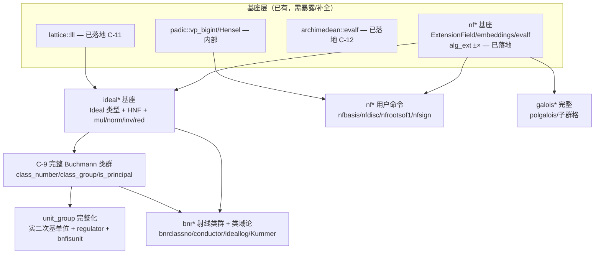

# Pari `bnf*` 对标 — 数论深化主线方案 + 优先级

**状态:** open（方案 / 跟踪）
**类型:** 扩展功能规划（非 upstream giac 对齐）
**上游基线:** **Pari/GP `bnf*` / `bnr*` / `ideal*` / `nf*` / `galois*` 函数族**（giac-2.0.0 无对标）
**相关:** [GIAC-core-upstream-gaps](GIAC-core-upstream-gaps.md) §4 Phase E（C-9..C-12）、[GIAC-p2-algebraic-number-theory-api](GIAC-p2-algebraic-number-theory-api.md)（已落地 C-11/C-12）、[GIAC-poly-f5-fglm-hasse-lean4-verification](GIAC-poly-f5-fglm-hasse-lean4-verification.md)（数学正确性线）、[GIAC-p2-bnf-relation-gen-plan](GIAC-p2-bnf-relation-gen-plan.md)（关系生成对齐子计划：7e-i/7e-ii）
**Rust 落点:** `giac-rs/crates/giac-core/src/algebra/{ideal(新),class_group,unit_group,lattice,archimedean,number_field_arith,padic,galois_automorphism}.rs` + `eval.rs`
**快照:** 2026-07-03

---

## 问题陈述

Pari/GP 的数论函数族是分层的（`nf*` 基础 → `bnf*` 类群/单位 → `bnr*` 射线类域论 → `ideal*` 理想算术 → `galois*` 分裂域）。giac-rs 现状只在 `nf*` 基础和 `bnf*` 的内部辅助层有覆盖，**用户级命令几乎全空**。

本 issue 跟踪：**以 Pari `bnf*` 系列为 upstream 对标的数论深化主线实施方案 + 优先级**，按依赖序 + 性价比推进。这些是 **giac-rs 比 upstream giac 多的差异化扩展**，非 conformance 硬阻塞。

**定位：** upstream giac-2.0.0 **没有** `class_number` / `class_group` / `is_principal` / 理想算术等命令（Pari/GP 才有）。本主线是 giac-rs 在代数数论上对标 Pari 的扩展线。

---

## 现状（snapshot 2026-07-02）

| 模块 | 行数 | 现状 pub API | 唯一外部消费者 |
|------|------|-------------|-------------|
| `class_group.rs` | ~2300 | `pub(crate) class_number` / `class_number_from_relations` / `ideal_is_principal` / `hasse_is_square` / `hasse_sqrt`（有界 sound-skip）；`kronecker_symbol` / `class_number_real_quad_analytic`（实二次解析类数公式） | `poly_roots.rs:2089 hasse_sqrt` + eval `class_number` |
| `unit_group.rs` | 1310 | `pub(crate) Torsion` / `torsion` / `fundamental_units`（实二次 r=1 经 CF 求基本单位：`√d`-CF ±1 Pell `d≡2,3mod4` / `(1+√d)/2`-CF ±4 半整数 `d≡1mod4`，`O(√d)` 渐近分数 [`cf_period_cap`] 可证界，无坐标枚举） | 内部 |
| `lattice.rs` | 449 | **`pub(crate) lll` / `lll_with_transform` — C-11 已接 eval（`lll(matrix)` 命令）** | 内部 + eval |
| `archimedean.rs` | 803+ | `pub(crate) Signature` / `field_signature` / `is_totally_positive` / `Embeddings` / `embeddings` / **`algext_evalf` / `algextc_evalf`（C-12）** | 内部 + eval |
| `number_field_arith.rs` | 1294 | `pub(crate) PrimeIdealRec` / `IdealValuationScan` / `compute_ideal_valuations` / `poly_discriminant_low` / `power_order_is_maximal` | 内部 |
| `galois_automorphism.rs` | 303 | `pub(crate) conjugate_map_sends` / `try_galois_sqrt_second`（内部 √-判定用，非完整 Galois 群） | 内部 |
| `padic.rs` | 359 | `pub(crate) mod_pk` / `vp_bigint` / `rat_poly_mod_pk` / `poly_*mod_pk` / `hensel_lift_factor` | 内部 |
| `ideal.rs` | ✅ P1-1b 基座 + R4/R7 扩展（~600 行，`pub(crate)`） | `pub(crate) Ideal`（含 `den` 分母字段支持分式理想）/ `idealhnf` / `ideal_from_generators`（R7，生成元列表→HNF，表出 deg≥3 `g_i` 次数≥2 的素理想）/ `idealmul` / `Ideal::norm` / `idealred`（复用 `lattice::lll`）/ `idealinv`（结构常数+SNF）/ `idealpow`；`idealaddtoone`/`idealchinese` 未做（P3 `bnr*` 前置） | 内部（`bnf*` C-9 已消费，R7 `ideal_is_principal` LLL 回退消费 `ideal_from_generators`）+ 用户命令（R2/R4） |

**`ponytail:` 现状边界：** `class_group::ideal_is_principal` 是 `hasse_sqrt` 特化的「J 理想主性测试」。原有界路径 `IDEAL_GEN_COORD_BOUND`（per degree）+ `N_J_MAX = 10⁷`；超界 → `None`（sound，**不区分「非主」vs「界太小」**）。**R7 加 LLL 短向量回退**（deg-agnostic）：有界路径 `None` 时，构造 `J` 的 HNF、LLL 规约、检查短向量 `|N(γ)|=N(J)`，砍掉 deg≥5 / `N(J)>10⁷` 两处 sound-skip（仅发 `Some((true,γ))`，不凭 LLL 断言非主）。deg-2 虚二次的穷尽 `(false)` 非主性证书由有界路径保留。已有通用 `Ideal` 对象（R2 落地）。

---

## 完成度登记 — `class_number_general` 完整 Buchmann（C-9 核心）

**快照:** 2026-07-03（R1 `class_group(P)` 落地后）

**最终目标（对标 Pari `bnfinit`）：** 任意数域 `K=ℚ(α)`（任意次数 / 任意 signature / 极大序含非 monogenic 需整基）下，**内禀完备性证书**地算出类群结构（SNF 不变因子）+ 类数。核心特征：① 关系生成走 sub-exp 主理想搜索 + LLL，按 **Bach 界** `B≈12·(log|D|)²`（GRH 下）生成足量关系 ⟹ 关系格完备性**内禀可证**，不依赖外部 oracle；② 完备性证书内禀（Bach 界 ⟹ 关系格完备 ⟹ SNF = 类群结构）；③ 单位群 sub-exp 搜索 + **index-1 saturation 证书**喂主理想判定；④ 非 monogenic 经 `nfbasis` 整基按 𝓞_K 算。

`class_group.rs::class_number_general_cert`（line 796-832）分派结构 = Buchmann 骨架（Minkowski → 素理想基 → h=1 快路 → 关系格 → SNF → 交叉认证），只是三部件被 deg-2/外禀替代。逐部件完成度：

| 部件 | 代码锚 | deg 通用性 | 状态 | 差距 |
|---|---|---|---|---|
| `minkowski_bound` `M_K=(4/π)^r2·(n!/n^n)·√\|D\|` | `class_group.rs:1086` | **任意 deg** | ✅ | — |
| `prime_ideals_below_minkowski` + Dedekind/Kummer + `dedekind_index_ok` | `class_group.rs:1120` | **任意 deg**（∛2 证明）| ✅ | wild/bad 素数 → `all_factored=false` sound-skip |
| h=1 快路：`M_K<2` / `k=0` / `all_basis_primes_principal` | `class_group.rs:876,802,813` | **任意 deg**（∛2 deg-3 h=1 sound）| ✅ SOUND | — |
| `ramification_relations` `(p)=∏𝔭_j^{e_j}` 主 | `class_group.rs:902` | **任意 deg** | ✅ | — |
| SNF → 结构 `class_group_invariants_from_relations` | `class_group.rs:1627` | **任意 deg**（关系完备后即用）| ✅ | — |
| **关系生成 `enumerate_relations_deg2`** | `class_group.rs:927-1008` | **仅 deg-2**（`field.dimension()!=2 → return`，line 933）| ◐ | deg≥3 无闭式范数形式；**有界坐标枚举 `\|coord\|≤BUCH_COORD_BOUND=64`**（line 854）与完备性脱钩 |
| **完备性证书** | `class_group.rs:816-822` | **外禀交叉校验**：deg-2 虚→既约型、deg-2 实→解析类数公式；deg≥3 无 oracle → sound-skip | ◐ | **无内禀 Bach/Buchmann 完备性界** ⟹ deg≥3 h>1 全 sound-skip |
| 单位群（喂主理想判定 saturation） | `unit_group.rs` | 实二次 r=1 CF ✅；r≥2 候选有 `fundamental_units_real_multi` 但**无运行时 index-1 证书** | ◐ | r≥2 sound 证书阻塞（Friedman 下界过弱）⟹ `bnfisprincipal` saturation 步也阻塞 |
| 非 monogenic 整基 | `number_field_arith.rs:nfbasis` | deg-2 极大幂基 + 非极大 `{1,ω}`（`D_K`/index `f` 从 `disc(m_α)=D_K·f²`）；deg≥3 非极大 sound-skip | ◐ | deg≥3 非极大需 Round-2/Buchmann–Lenker |

### 总体流程（`class_number_general_cert`，`class_group.rs:796-832`）

```
class_number_general_cert(field)  →  Option<(h, invariants)>
│
├─ ① Minkowski 界                line 799   bound = minkowski_bound(field)?
│   bound = (4/π)^r2 · (n!/n^n) · √|D_K|        (任意 deg，需极大序 ⟹ D_K = disc(m_α))
│   None ⟹ 非极大序 / 域形状不支持 → 整体 sound-skip
│
├─ ② 界下素理想基                 line 804   (ideals, all_factored) = prime_ideals_below_minkowski(field)?
│   枚举 p ≤ ⌊M_K⌋，每个 (p) 经 Dedekind/Kummer 分解为 𝔭_j，保留 Norm(𝔭)=p^f ≤ M_K 的
│   返回 k = ideals.len()（类生成元候选数）+ all_factored 标志
│   !all_factored (wild/bad 素数被 skip) ⟹ line 806 None（界下素数可能本该是类生成元）
│
├─ ③ h=1 快路（三道，全 SOUND，任意 deg）
│   ├─ 3a  M_K < 2                line 801   primes_up_to(bound_i).is_empty()
│   │   ⟹ 唯一 norm ≤ M_K 的整理想是 𝓞_K ⟹ h=1, invariants=[]  (line 802)
│   ├─ 3b  k = 0                  line 809   所有素理想因 norm > M_K 被排除
│   │   ⟹ 类生成元空 ⟹ h=1, []  (line 810)
│   └─ 3c  all_basis_primes_principal  line 813   每个基素理想 𝔭 经 ideal_is_principal 判主
│       全主 ⟹ 由 Minkowski 每类有 norm≤M_K 代表 ⟹ h=1, []  (line 814)
│       【∛2 deg-3 h=1 走这条：𝔭=(α) 主】
│
├─ ④ 独立证书 cert_h              line 816-822
│   ├─ deg-2 虚二次极大 → class_number_imag_quad_forms (Gauss 既约型计数)    line 817
│   ├─ deg-2 实二次极大 → class_number_real_quad_analytic (Dirichlet 解析类数公式) line 819
│   └─ deg ≥ 3                 → line 821 None  【无独立 oracle ⟹ sound-skip】
│   任一 None ⟹ 整体 sound-skip
│
├─ ⑤ 关系格                       line 823-824
│   relations = ramification_relations(&ideals)            line 823  (p)=∏𝔭_j^{e_j} 主 ⟹ [e_j]
│   relations.extend(enumerate_relations_deg2(field, &ideals, BUCH_COORD_BOUND=64))  line 824
│       deg-2 闭式范数 N(a+bα)=a²−c₁ab+c₀b²，枚举 |coord|≤64，
│       all_prime_factors_in_set 拒绝含界外素数，compute_ideal_valuations_full 分解 (γ) → 关系向量
│       【deg-2 only：field.dimension()!=2 → return empty】
│
├─ ⑥ SNF → 结构                   line 825   invariants = class_group_invariants_from_relations(&relations, k)?
│   关系矩阵 → Smith 标准型 → 不变因子 d_1|…|d_r (>1) = 类群循环分解
│   None ⟹ 关系秩 < k（关系不全）→ sound-skip
│
├─ ⑦ h = ∏ d_i                    line 826
│
└─ ⑧ 交叉认证                     line 827-831
    h == cert_h ?  Some((h, invariants))  :  None
    【数学：h_buchmann 总是 true h 的倍数；等式 ⟹ 关系格完备 ⟹ SNF 不变因子 = 类群结构】
    【不等 ⟹ 关系不全（BUCH_COORD_BOUND 不够）或 bug → sound-skip】
```

**数学骨架：** 流程是 Buchmann 算法的「外禀证书版」。
- ①② Minkowski 框架：`M_K` 保证每类含 `norm ≤ M_K` 的整理想 ⟹ 类群由「`norm ≤ M_K` 素理想」（`ideals`）生成。
- ③ h=1 sound 快路：生成元集平凡（空 / 全主）⟹ 类群平凡，无需关系格。
- ④⑤⑥⑦ Buchmann 主体：关系格 = 主理想的素理想赋值向量集，SNF 给结构，`h = ∏ d_i`。`h_buchmann` 是 `true h` 的倍数（关系不全 ⟹ 偏大）。
- ⑧ 完备性证书：`h_buchmann == cert_h` ⟹ 关系格完备 ⟹ SNF 不变因子**就是**类群结构。证书来自独立计算（forms / 解析公式），非关系格本身——这是与「最终完整 Buchmann」的关键差别。

**三个退化点（vs 完整 Buchmann）：**

| 步骤 | 现在 | 完整 Buchmann |
|---|---|---|
| ⑤ 关系生成 | deg-2 闭式范数 + `\|coord\|≤64` 有界枚举 | deg-agnostic 范数 + LLL 短向量，Bach 界 `B≈12(log\|D\|)²` |
| ⑧ 完备性证书 | **外禀**（forms / 解析公式，仅 deg-2）| **内禀**（Bach 界 ⟹ 关系格完备，无需外部 oracle）|
| ④ 单位群喂主理想判定 | deg-2 r=1（实二次 CF）/ r=0（虚二次）| r≥2 sub-exp 单位搜索 + index-1 saturation 证书 |

deg-2 极大序下三处退化都「恰好够用」（闭式范数 + 有界枚举能找到关系，外禀 forms/analytic 证书可得，r≤1 单位已 CF 解），故 deg-2 100% sound。deg≥3 三处全断 ⟹ h>1 sound-skip（h=1 经 ③c all-principal 仍 sound）。

**量化：** 基础设施层 ~85%（degree-agnostic 部分到位，缺 deg≥3 范数形式 + LLL 关系搜索）；完备性证书层 ~30%（仅 deg-2 外禀交叉校验，内禀 Bach 界 0%）；单位群层 ~40%（r=1 全域 CF，r≥2 候选有但无 index-1 证书）；非 monogenic 整基 0%。**综合：deg-2 极大序 100% sound 覆盖（h + 结构）；deg≥3 仅 h=1 sound（all-principal 快路）；任意域 h>1 完整 Buchmann ≈ 25–35%。**

**已知 sound-skip 边界（行为正确，非 bug）：**
- 大 regulator 实二次 h>1 结构（如 √265，基本单位坐标 ~6000 ≫ `BUCH_COORD_BOUND=64`）⟹ 有界 Buchmann 枚举找不到关系 ⟹ `class_group_structure` 返 `None`（`class_number` 仍经解析公式返回 h）。
- deg≥3 h>1（无内禀完备性证书）⟹ `None`。
- 非极大序 ⟹ `None`。

**升级三件套（解锁任意域 h>1 的关键工程）：**
1. **deg≥3 关系生成器**：deg-agnostic 范数形式（`Resultant(m_α, a+bα+cα²+…)` 或 `Norm(γ)=∏σ_i(γ)`）+ LLL 短向量关系搜索（取代有界坐标枚举）。解锁 deg≥3 h>1 的第一砖。
2. **内禀完备性证书**：Bach 界 `B≈12(log|D|)²`（GRH 下）保证关系格完备 ⟹ 砍对外禀 forms/analytic 交叉校验的依赖 ⟹ deg≥3 h>1 可证。**核心工程，量级大。**
3. **r≥2 单位 index-1 证书**：~~依赖 R1 `class_group` 结构 + R2 `ideal*` + R3 `bnfisprincipal` 做 saturation（「基素理想积是否 p 次幂」），或新颖 per-field 穷举 saturation（small-regulator 域可行）。喂主理想判定 saturation 步。~~ **改投路径 A 内禀（依据 upstream Pari，2026-07-06 决策，见下「#6 决策」段）：#6 并入 #7，单位从关系生成元 arch 分量 LLL 提取，index-1 = `get_regulator(A)≈R`（关系格 SNF regulator），由 Bach 界关系格完备性保证。**

**依赖链：** R2 `ideal*`（用户命令 + `Ideal↔Expr`）→ R3 `bnfisprincipal`（saturation）↔ r≥2 单位证书 ↔ deg≥3 关系生成 ↔ Bach 内禀界。互相耦合，R2 是共同前置。

---

## #6 决策：改投路径 A 内禀（依据 upstream Pari，2026-07-06）

**背景**：r≥2 单位 index-1 证书原列两条路径——A（saturation 经类群）/ B（per-field 穷举 + witness 界）。经 upstream 分析后改投 **A 内禀**。

**upstream 证据（`pari/src/basemath/buch2.c`）：**
- giac C++ 无原生 bnf（`prog.cc` 注释 "used by PARI in bnfinit" + `pari.cc` 桥接；`is_unit` 是多项式么元、`*_axis_unit` 是图形轴）⟹ **giac 非 #6 参考**。
- Pari `getfu(nf, &A, ...)`（L1126）：单位从**关系生成元 arch 对数分量矩阵 `A`** LLL 提取（`matep=fixarch(Aj) → lll(real_i(matep)) → RgM_solve_realimag(M, gexp(y))` 提升回精确单位），**不独立搜索**。
- `get_regulator(A)=|det(real_i(A) 顶行)|`（L3527）= 同批 arch 分量的格 covolume = 单位格 regulator。
- **index-1 = regulator 匹配**（L4388-4389）：`get_regulator(A) ≈ R`（`R` = 关系格 SNF 给的 regulator）⟹ 单位格 index-1；不匹配 ⟹ 加 prec 重试（非 saturation 补单位）。
- **完备性凭证 = Bach 界（GRH）**：`GRHcheck`（L354）/`LIMC`/`compute_invres`（L545）/`GRHchk`（L719）—— 关系生成到 `B≈12(log|D|)²` ⟹ 关系格完备 ⟹ **类群结构 AND 单位 index-1 同时得证**。
- **无后置 saturation、无 per-field 穷举**：buch*.c 全树搜 `saturat|add_unit|missing_unit|sublattice` 仅命中 torsion index（`itu`，buch4.c:204）。`bnfsaturate` 不存在。单位与类群是**同一次 Buchmann 计算**的两产物。

**结论**：upstream 把 #6 和 #7 当**同一个 Buchmann 计算**——单位 index-1 是关系格完备性的副产品，不是独立证书。故：
- **路径 A 内禀 = #7 本体**：做 #7（deg-agnostic 关系生成 + Bach 内禀完备性界）自然带出 #6（单位从关系生成元 arch 分量 LLL 提取，index-1 = `get_regulator(A)≈R`）。#6 不单独做。
- **路径 A 后置 saturation**（Cohen ATCNT Alg 7.5.4 理论拆分）= retrofit，仍需 #7 类群，Pari 不走。
- **路径 B（per-field 穷举 + witness 界）放弃**：无 upstream 先例，witness 坐标界 `~exp(r·R)` 使穷举不可行（r=2 小 regulator 域已 ~10⁴–10⁶ ⟹ `(2B+1)^n` 不可行）。

**#6 并入 #7 的工程含义**：`unit_group::fundamental_units` r≥2 不再独立求证书；改为在 #7 的 Buchmann 关系搜索中，从关系生成元 γ_j 的 arch 对数分量（`embeddings` 下 `log|σ_i(γ_j)|`，减 `log|N(γ_j)|/n` 归一化，即 Pari `fixarch`）构 arch 分量矩阵 `A`，LLL 提取基本单位基，`|det(real_i(A) 顶行)|` = regulator；与关系格 SNF 给的 `R` 匹配 ⟹ index-1 ⟹ `fundamental_units` 返 `Some`。Bach 界保证关系格完备 ⟹ 匹配即证书。`bnfisunit` r≥2 / `bnfregulator` r≥2 / `bnfunits` r≥2 随之解锁。

---

## 分层对照（Pari 函数族 vs giac-rs 现状）

| 层 | Pari 函数族 | giac-rs 现状 | 缺口 |
|----|------------|-------------|------|
| **`nf*` 数域基础** | `nfinit` / `nfbasis` / `nfdisc` / `nfrootsof1` / `nfsign` / `nfeltadd` / `nfalgtobasis` / `nfeltmul` | `ExtensionField::adjoin_irreducible` ✅、`embeddings`/`field_signature` ✅、`evalf(AlgExt)` ✅（C-12）、`AlgExt ±×` ✅、`padic::vp_bigint` ✅、**`nfbasis(P)` ✅(deg-2 极大幂基 + 非极大 `{1,ω}`，快照 2026-07-03)** | `nfdisc(P)`✅(极大序)、`nfrootsof1(P)`✅、`nfsign(P)`✅ —— **均已暴露为用户命令**；`nfbasis` deg≥3 非极大（Round-2/Buchmann–Lenker 延后）、`nfdisc` 非极大序（需 `nfbasis` 整基后扩展）、`nfeltadd`/`nfalgtobasis`/`nfeltmul` 待 |
| **`bnf*` 类群 + 单位** | `bnfinit` / `bnfclassunit` / `bnfisprincipal` / `bnfisunit` / `bnfunits` / `bnfregulator` / `bnfcond` | `class_number` ✅(deg-2 极大 + **deg≥3 h=1 极大经 LLL 主性测试 + Minkowski**，快照 2026-07-06)、`class_group` ✅(deg-2 极大 SNF 结构 + **deg≥3 h=1 空结构**)、**`bnfisprincipal(I)` ✅(deg-2 极大，完整 `[γ,[e_i]]` 含生成元 + `𝓞_K^×` 单位规范化，快照 2026-07-03)**、`class_group::ideal_is_principal` **LLL 短向量回退（deg-agnostic，解锁 deg≥5 / N(J)>10⁷ 主性测试，快照 2026-07-06）**、`unit_group::torsion` ✅、`fundamental_units` ✅(实二次 r=1 全域 CF)、`bnfisunit` ✅(r≤1)、`bnfunits` ✅(r=1)/`bnfregulator` ✅(r=1)、`hasse_sqrt` 内部用类群 | `bnfisprincipal` 大素理想（>M_K）/deg≥3 h>1（需 #6/#7 完整 Buchmann + Bach 界）、`class_group`/`class_number` deg≥3 h>1 + 大 regulator 实二次 h>1 结构、`bnfisunit` r≥2、`bnfregulator`/`bnfunits` r≥2、`bnfcond` |
| **`bnr*` 射线类群 + 类域论** | `bnrinit` / `bnrclassno` / `bnrclassunit` / `bnrconductor` / `bnrL1` / `bnrclassfield` / `ideallog` / `quadray` / `rnfkummer` | ❌ **完全无** | 整个射线类群层：射线类数、conductor、L 函数、类域构造（Abel 扩张）、`ideallog` |
| **`ideal*` 理想算术** | `idealhnf` / `idealmul` / `idealpow` / `idealinv` / `idealnorm` / `idealaddtoone` / `idealchinese` / `idealprincipal` | **`idealhnf(P,[a,b])`✅ / `idealmul(I,J)`✅ / `idealnorm(I)`✅ / `idealred(I)`✅ / `idealinv(I)`✅ / `idealpow(I,n)`✅（R2+R4 用户命令 + `Ideal↔Expr` 不透明值 `Expr::IdealNum(Arc<Ideal>)`，镜像 `Expr::AlgExt` 先例；`Ideal` HNF 基座 P1-1b；R4 加 `den` 分母字段支持分式理想，`idealinv` 经结构常数+SNF 求 `I^{-1}={x:xI⊆𝓞_K}`）**；`idealaddtoone`/`idealchinese`/`idealprincipal` 待（`bnr*` P3 前置） | `idealaddtoone` / `idealchinese` / `idealprincipal` —— **`bnr*` P3 前置** |
| **`galois*` 分裂域** | `polgalois` / `galoissubgroups` / `galoissubcycles` / `galoisexport` / `polcompositum` / `polrootsmod` / `polrootspadic` | `galois_automorphism::conjugate_map_sends` / `try_galois_sqrt_second`（内部 √-判定用）、`compositum_session` ✅（部分） | 完整 Galois 群计算 + 子群格、`polgalois`、`polrootsmod`/`polrootspadic` |

---

## 依赖结构



**关键判断：第一缺口是 `ideal*` 基座（非 Buchmann 算法本身）。** 现状 `class_group::ideal_is_principal` 是 `hasse_sqrt` 特化硬编码的「J 理想 = 坐标边界内枚举」，无通用 `Ideal` 对象。要做完整 Buchmann 并暴露 `bnfisprincipal(ideal)`，必须先有 `Ideal` 类型 + HNF + `idealmul`/`idealnorm`/`idealinv`/`idealred`（复用已有 `lattice::lll`）。

---

## 优先级排序（依赖序 + 性价比）

| 优先级 | 工作 | 工程量 | 落点 | 解锁 |
|--------|------|--------|------|------|
| **P1 ✅** | `ideal*` 基座 | 中（新 `ideal.rs` ~370 行） | `crates/giac-core/src/algebra/ideal.rs`（新），复用 `lattice::lll` 做 `idealred` | `bnfisprincipal` 前置、Buchmann 的理想乘法/约化基座（**用户级命令暴露延后 P2**，需 `Ideal`↔`Expr` 表示设计） |
| **P1 ✅** | `nf*` 用户命令 | 小（基座已 `pub(crate)`，eval 接线） | `eval.rs` 加 `FuncKind::{Nfdisc,Nfrootsof1,Nfsign}` + parser/display | 立刻有用户 API：`nfrootsof1(P)`/`nfsign(P)`/`nfdisc(P)` ✅ 已落地 |
| **P2 ◐** | C-9 完整 Buchmann | 大（`class_group.rs` 666→~2000+ 行） | `class_group.rs`：Minkowski 约化理想枚举 + 关系格 LLL → 类群结构/类数；依赖 P1 `ideal*` | `class_number(P)`✅(2a-S1 虚二次 + 2a-S2b-partial 一般域窄情形 + 2a-S2b-full 虚二次 Buchmann + 2a-S2b-full-real 实二次解析类数公式 + **R7 deg≥3 h=1 经 LLL 主性测试 + Minkowski**) / **`class_group(P)`✅(2a-S2b-full-struct：SNF 循环分解，对标 Pari `bnfinit().cyc`，√-14→[4]/√-23→[3]/√10→[2]，deg-2 极大序 sound；R7 deg≥3 h=1 空结构)** / `is_principal(ideal)`(待用户命令，内部 `ideal_is_principal` 已 LLL 回退) / 砍 `hasse_sqrt` 的 `N_J_MAX` 盲区（**R7 部分砍：deg≥5 / N(J)>10⁷ 主性测试不再 sound-skip**） |
| **P2 ◐** | `unit_group` 完整化 | 中（`unit_group.rs` 已有骨架，补 LLL 搜索） | `unit_group.rs::fundamental_units` 补实二次 `d≥3` LLL 搜索；`fundamental_unit_via_cf_sqrt_d(d)`（±1 Pell，`d≡2,3mod4`）/ `fundamental_unit_via_cf_half(d)`（±4 半整数 `(1+√d)/2`-CF，`d≡1mod4`），`cf_period_cap = 4√d+8`（Lagrange 周期 `≤2√d` 可证界，**无坐标枚举/无 256-bound**）；`bnfregulator`/`bnfisunit`/`bnfunits` | `bnfunits(P)`✅(2b-S1 实二次r=1 全域 CF，含 d=5/13/17/21/29/265/163) / `bnfregulator(P)`✅(2b-S1 + √163 R≈18.669 + √265 R≈9.4046 + √5 R≈0.4812) / **`bnfisunit(P,u)`✅(2b-S2 r≤1：单位群离散对数，对标 Pari `bnfisunit`，ℚ(√2)/ℚ(i) 金值对齐)**；Dirichlet 基单位(2b-S2 r≥2 **阻塞**：index-1 证书需 deg≥3 Buchmann 或 per-field saturation)、regulator(2b-S2 多单位) |
| **P3** | `bnr*` 射线类群 + 类域论 | 大（整个新层 `ray_class.rs`） | 新 `crates/giac-core/src/algebra/ray_class.rs`；依赖 P1+P2 | 射线类数、conductor、`ideallog`、Kummer/Abel 扩张构造 |
| **P3** | `galois*` 完整 | 大（独立于 bnf*，可并行） | `galois_automorphism.rs` 扩完整 Galois 群 + 子群格；`polgalois` | Galois 群结构、子群格、`polgalois(P)` |

---

## R2 ✅ `ideal*` 用户命令 + `Ideal↔Expr` 表示（已落地，快照 2026-07-03）

**目标：** 把 P1-1b 的 `Ideal` 基座暴露为用户级命令，让理想成为一等值（Pari `idealhnf` 返回模型），为 R3 `bnfisprincipal(ideal)` 提供前置。

**表示设计：** `Expr::IdealNum(Arc<Ideal>)` —— 不透明理想值变体，镜像 `Expr::AlgExt(Arc<AlgExtData>)` 先例。`Ideal`（`algebra/ideal.rs`，`pub struct`）携带 `field + HNF + two_el`；`idealhnf` 返回它，`idealmul`/`idealred` 消费并返回它，`idealnorm` 读取它。支持链式 `idealnorm(idealmul(I, J))`。

**4 个用户命令（`FuncKind::{Idealhnf,Idealmul,Idealnorm,Idealred}`）：**
- `idealhnf(P, [a, b])`：构造 `⟨a, α+b⟩ ⊆ 𝓞_K`，返回 `IdealNum`。第二参数 `Expr::List([Int, Int])`（两元素表示）。
- `idealmul(I, J)`：积理想 `I·J`（同域），返回 `IdealNum`（`two_el=None`）。
- `idealnorm(I)`：`N(I)=|det(HNF)|`（正整数，`Expr::Int`）。
- `idealred(I)`：LLL 短化 ℤ-基（范数不变，非 Pari 两元素 `idealred`），返回 `IdealNum`。

**接线点：**
- `expr.rs`：`Expr::IdealNum(Arc<Ideal>)` 变体 + `FuncKind::{Idealhnf,Idealmul,Idealnorm,Idealred}`。
- `eval.rs`：4 个 `eval_ideal*` + `ideal_from_expr` / `bigint_list_from_expr` helper + atom 分支（`IdealNum` 自返）+ dispatch + FuncKind 名字。
- `display.rs`：`format_ideal`（显示 HNF 矩阵 `ideal([...])`，Pari 风格）+ FuncKind 名字。
- `parser.rs`：4 个 `ideal*` 名字映射。
- `ideal.rs`：`Ideal` 加 `PartialEq` derive + `to_expr()` helper；`idealhnf`/`idealmul`/`idealred` 的 `Result<_, String>` 改 `Result<_, EvalError>`（对齐 `alg_ext.rs` 模式）。
- `poly_conv.rs` / `context.rs`：`Expr::IdealNum(_)` 加入穷尽 match（不透明值，不含 symbol/alg coeff → `false`）。

**`ponytail:` 边界：**
- 仅 monogenic 幂基极大序（`ℤ[α]=𝓞_K`）；非极大序需 `nfbasis` 整基（C-9）。
- 仅单生成元域（`generator_minpoly_low` 对塔返 `None` → 报错）。
- 显示为 HNF 矩阵（Pari 兼容），field 绑定隐含在 `IdealNum` 值中（不在显示里）。
- 未做（延后 P3 `bnr*`）：`idealaddtoone` / `idealchinese` / `idealprincipal`。`idealinv`/`idealpow` ✅ 已落地（R4，见下「R4 ✅」小节）。

**单测（eval 端到端 11 个 + ideal.rs 基座 8 个，对照 Pari 金值）：**
- `idealhnf_unit_ideal_norm_is_1`、`idealhnf_ramified_prime_over_2_in_q_sqrt2_norm_2`、`idealhnf_gaussian_prime_over_2_norm_2`（Pari `idealnorm(idealhnf(x^2-2,[2,0]))=2` 等）。
- `idealmul_chained_norm_is_product_of_norms`（`idealnorm(idealmul(I,I))=4`，**链式 IdealNum 往返**——R2 核心能力）、`idealmul_gaussian_prime_squared_norm_4`。
- `idealred_preserves_norm`、`idealhnf_displays_as_hnf_matrix`。
- 错误路径：`idealnorm_rejects_non_ideal_arg`、`idealmul_rejects_cross_field`、`idealhnf_rejects_non_integer_list`、`idealhnf_rejects_wrong_arity`。

**验证：** `cargo nextest run --release --workspace` 1381 passed / 0 fail；`cargo clippy --workspace --all-targets` 全绿。

---

## R3 ✅ `bnfisprincipal(ideal)` 完整 `[γ, [e_i]]`（已落地，快照 2026-07-03）

**目标：** 给定整理想 `I`，判定是否主理想；若是，返回生成元 `γ`（`(γ)=I`，模 `𝓞_K^×` 唯一）+ 类群离散对数 `[e_i]`（SNF 基坐标，全 0 ⟹ 主）；若非主，返回 `[0, [e_i]]`（`γ=0` sentinel + 非平凡类 log）。对齐 Pari `bnfisprincipal(bnf, ideal)` 的 `[γ, e]` 双元组。

**API：** `bnfisprincipal(I)`（单参，理想自带域 —— 对齐 `ideal*` 命令族；Pari 取 `(bnf, ideal)`，giac-rs 无 bnf 对象故省 bnf 参）。返回 `Expr::List([γ_expr, log_expr])`：`γ_expr` = `Expr::AlgExt`（主时）或 `Expr::Int(0)`（非主）；`log_expr` = `Expr::List([Int; #invariants>1])`（类 log，主时为零向量，平凡类群为 `[]`）。

**数学管线（deg-2 极大域，全部 `class_group.rs`）：**
1. `certified_class_data_with_gens(field) -> Option<CertClassData{h, invariants, basis, relations}>`：复用 `class_number_general_cert` 的认证逻辑（Minkowski 界 + 素理想基 + h=1 快路 + deg-2 交叉认证），但关系带生成元 `γ_i`。h=1 全主路：每个基素理想 `𝔭_j` 经 `ideal_is_principal` 取 `γ_j`，构造标准基关系 `e_j`（SNF 全 1，任意 `I=∏𝔭_j^{v_j}` 的 `γ=∏γ_j^{v_j}`）。h>1 路：`ramification_relations_with_gens`（`γ=p`）+ `enumerate_relations_deg2_with_gens`（`γ=a+bα`）。
2. `ideal_valuation_vector_deg2(field, I, basis) -> Option<vec<BigInt>>`：HNF 理想 → 素理想赋值向量 `v∈ℤ^k`。inert(f=2) `v=v_p(N)/2`；ramified(f=1,e=2) `v=v_p(N)`；split(f=1,e=1) 两共轭经 `ideal_contains_deg2`（2×2 HNF 包含测试 `j11|i11 ∧ j22|i22 ∧ j11·j22|(i12·j11−i11·j12)`）+ `containment_valuation_deg2`（`v_𝔭=max{t:I⊆𝔭^t}`，`𝔭^t` 经 `idealmul` 递推）分配。**sound-skip**：`N(I)` 含基外素因子（`q>M_K`）→ `None`。
3. `snf_bigint_with_transforms(R) -> (D, U, V)`：`U·R·V=D`（**新增行变换 U 跟踪** —— `UnimodMat` 加 `row_u` 字段，每个行算子镜像 `U←E·U`）。`w = v·V`；主性 ⟺ `d_i|w_i ∀i`；组合系数 `c = (w/D)·U`（长 m）；`γ = ∏γ_i^{c_i}` 在 `K^×` 中（负 `c_i` → `element_inv`），主性时落回 `𝓞_K`（`(γ)=I` 整）。

**接线点：**
- `class_group.rs`：`UnimodMat` 加 `row_u` + `new_with_transforms` + `into_transforms`；`snf_bigint_with_transforms`；`ramification_relations_with_gens` / `enumerate_relations_deg2_with_gens`（核心版带 γ，原版薄包装）；`CertClassData` + `certified_class_data_with_gens` + `basis_prime_generator`；`v_p` / `linear_root_mod_p` / `ideal_contains_deg2` / `containment_valuation_deg2` / `ideal_valuation_vector_deg2`；`unit_high` / `bnfisprincipal`。
- `expr.rs`：`FuncKind::Bnfisprincipal`。
- `eval.rs`：`eval_bnfisprincipal` + dispatch + FuncKind 名字。
- `display.rs` / `parser.rs`：`bnfisprincipal` 名字映射。

**`ponytail:` 边界：**
- **sound 范围 = deg-2 极大域 + M_K-平滑理想**（`N(I)` 素因子全 ≤ M_K）。大素理想（`q>M_K`）/ deg≥3 / 非极大序 → `NotImplemented`（sound-skip）。理由：关系格仅覆盖基素理想（≤M_K），类群由基素理想生成（Minkowski），但**精确**生成元 `γ`（`(γ)=I` 含 >M_K 素因子）需完整 Pari-式 `bnfinit` 关系库（含大素理想的关系），deferred。
- **生成元单位规范化 ✅（R5，见下「R5 ✅」小节）**：`γ = ∏γ_i^{c_i}` 经 `reduce_generator_by_units` 模 `𝓞_K^×` 规范化（实二次 r=1 用基本单位 ε 的 log 基本域 + 坐标 L∞ 极小；rank 0 符号规范化）。`c_i` 经 `to_i64` 有界，超大变换条目 → sound-skip。
- **log 约定**：`[e_i = w_i mod d_i : d_i>1]`，主理想为零向量（如 C2 域主理想 → `[0]`，平凡类群 → `[]`）。Pari 在精度告警下显示 `[]~`（主）—— 表示层小偏离，语义一致（Pari `bnfinit(x^2±d)` 默认精度常触发 "precision too low for generators" 告警致 γ/log 显示错乱，见下「验证」）。

**单测（代数层 4 + eval 端到端 5，对照 Pari 金值）：**
- 代数层（`class_group::tests`）：`bnfisprincipal_q_sqrtneg5_p2_nonprincipal_log1`（𝔭₂ 非主 log=[1]）、`bnfisprincipal_q_sqrtneg5_p2_squared_principal_gamma_norm4`（𝔭₂²=(2) 主 γ=2 `|N(γ)|=4`）、`bnfisprincipal_q_sqrtneg5_ok_principal_gamma1`（𝓞_K 主 γ=1）、`bnfisprincipal_q_sqrt19_p2_principal_gamma_norm2`（ℚ(√19) h=1，𝔭₂ 主 `|N(γ)|=2`）。
- eval 端到端（`eval::tests`）：上述三例的 `format_expr` 对照（`[0,[1]]` / `[rootof([±2],poly1[1,0,5]),[0]]` / `[γ,[]]`）+ arity / 类型错误路径。
- SNF 变换不变性（`snf_transforms_*` 4 个）：`U·M·V=D` 对单位阵 / 对角 / 非对角 / 秩亏矩阵均成立。

**验证：**
- `cargo test -p giac-core --lib`：595 passed / 0 fail（含 9 新 `bnfisprincipal` + 4 新 `snf_transforms`）。
- `cargo clippy --workspace --all-targets` 全绿。
- Pari/GP 对照（`/home/kanli.hu/upstream/pari`）：`K5=bnfinit(x^2+5); p2=idealhnf(K5,2,x-1)` → `bnfisprincipal(K5,p2)` 非主（log 非空，γ 精度告警未给）；`bnfisprincipal(K5,p2^2)` 主（log=`[]~`）；`K19=bnfinit(x^2-19)` → `K19.no=1, cyc=[]` ⟹ 𝔭₂ 主。**语义一致**（主/非主判定 + h=1 全主）；Pari 默认精度触发 "precision too low for generators" 致 γ/log 显示不可靠，giac-rs 用精确 `BigInt` + `HighFirstQ` 无此问题。

---

## R4 ✅ `idealinv` / `idealpow` 分式理想（已落地，快照 2026-07-03）

**目标：** 补齐 `ideal*` 算术族的逆与幂，支持分式理想（`idealinv` 输出分式，`idealpow` 负幂输出分式），为 `bnr*` P3 的 `idealchinese`/`idealaddtoone` 铺管线。

**API：** `idealinv(I) -> IdealNum`（分式，带分母 `den`）；`idealpow(I, n) -> IdealNum`（`n≥0` 整，`n<0` 分式）。显示：分式理想 `ideal([...])/d`（`den≠1`）。

**数学（`ideal.rs`）：**
- `Ideal` 加 `den: BigInt` 字段（默认 1，整理想）；`idealmul` 分母相乘后 `reduce_den`（消 `gcd(全体 HNF 元, den)`）；`idealnorm` 真值 = `|det(H)|/den^n`（eval 端 `den=1` → `Int`，否则 `Rat`）。
- `idealinv(I) = {x∈K : x·I⊆𝓞_K}`：**不是** naive `adj(H)/det(H)`（那是 ℤ-格对偶，对非-ℤ 环错）。正确做法：结构常数 `C[j][k][l]`（`α^j·α^k=Σ_l C[j][k][l]α^l`，复用 `mul_coords`）构造线性系统 `T x ∈ ℤ^{n²}`，`T[(i,l),k]=Σ_j H[i][j]·C[j][k][l]`；Smith 形 `T=U·D·V` ⟹ `I^{-1}=V^{-1}·diag(1/d_i)·ℤ^n`，通分 `den=lcm(d_i)` 得整数 HNF + 分母。`I·I^{-1}=𝓞_K`（整，den=1）。
- `idealpow(I,n)`：`n=0`→𝓞_K；`n>0` square-and-multiply `idealmul`；`n<0`→`idealinv(I)^|n|`。

**接线点：** `expr.rs:FuncKind::{Idealinv,Idealpow}`；`eval.rs:eval_idealinv/eval_idealpow` + dispatch + 名字；`display.rs`/`parser.rs` 名字映射；`class_group.rs:ideal_valuation_vector_deg2` 加 `den≠1` guard（分式理想不入 bnfisprincipal，sound-skip）。

**`ponytail:` 边界：** `idealinv` 经 `n²×n` SNF（`O(n⁵)`-ish，`n≤6` OK）；`idealpow` 负幂 = `idealinv` 正幂；`bnfisprincipal` 仅整理想（`den≠1` → `None`）。

**单测（ideal.rs 8 + eval 6）：** `idealinv_of_unit_ideal_is_unit_ideal` / `idealinv_principal_integer_ideal_is_one_over_integer`（(2)⁻¹=(1/2)𝓞_K）/ `idealinv_times_ideal_is_unit_ideal`（I·I⁻¹=𝓞_K）/ `idealpow_{zero,positive_matches_repeated_mul,negative_matches_inverse_power}` / `adjugate_2x2_and_3x3`（`M·adj(M)=det(M)·I`）；eval：`idealinv_unit_ideal_is_integral` / `idealinv_principal_2_is_one_half_ideal` / `idealpow_positive_then_negative_is_unit` / `idealinv_times_ideal_norm_is_unit` / `idealpow_rejects_non_integer_exponent` / `idealinv_rejects_non_ideal`。

**验证：** `cargo test -p giac-core --lib` 全绿（含上述 14 新）；`cargo clippy -p giac-core --lib` 全绿。

---

## R5 ✅ `bnfisprincipal` 生成元单位规范化（已落地，快照 2026-07-03）

**目标：** `bnfisprincipal` 的生成元 `γ` 模 `𝓞_K^×` 规范化到「小」代表（对齐 Pari `bnfisprincipal` 返回 reduced γ 的惯例；数学上 `(γ)=I` 不变）。

**API：** 不变（`bnfisprincipal(I) -> [γ, [e_i]]`），γ 经规范化后输出。

**数学（`class_group.rs:reduce_generator_by_units`）：**
- `fundamental_units(field)`：`None`（未认证单位群 / r≥2）→ γ 不变（仍合法生成元）；`Some([])`（rank 0，虚二次 ±1）→ 符号规范化（最低次非零系数取正）；`Some([ε])`（实二次 r=1）→ log 基本域归约。
- r=1 归约：embeddings 取 `|σ(ε)|>1` 的扩张嵌入 `hi`，`L=ln|σ_hi(ε)|`，`g=ln|σ_hi(γ)|`，`k0=round(-g/L)`；扫 `k∈{k0-1,k0,k0+1}`，`γ·ε^k`（`unit_pow` square-and-multiply，负幂 `element_inv`）取坐标 `L∞`（`max(|numer|,|denom)|` 的 bits）极小者；最后 `sign_normalize`。
- `coord_linf`：用 `BigInt::bits()` 作大小代理（避免 `BigInt→u64` 溢出，huge unit 安全）。

**`ponytail:` 边界：** f64 log/eval 精度 ceiling（`|γ|~exp(Θ(√D))`）；`k0±1` 扫 + 精确坐标 tiebreak 把损害限制在「非极小但仍合法的代表」；多单位（r≥2）`fundamental_units` 返 `None` → 不规范化（sound）。

**单测（`class_group::tests` 2）：** `reduce_generator_by_units_q_sqrt2_brings_unit_power_to_small_unit`（ε³=7+5√2 是单位，归约后 `|N|=1` 且坐标 L∞≤1）/ `reduce_generator_by_units_sign_normalize_imag_quad`（ℚ(√-5) -2 → +2）。

**验证：** 既有 9 个 `bnfisprincipal` 测试全绿（规范化不破坏主性/类 log/γ 范数）；clippy 全绿。

---

## R6 ✅ `nfbasis(P)` 整基（deg-2，已落地，快照 2026-07-03）

**目标：** 非极大序 `ℤ[α]⊊𝓞_K` 的整基 —— 解锁 `nfdisc`/`bnf*` 在非 monogenic 域的 sound-skip 门（C-9 第一步）。对齐 Pari `nfbasis(P)`。

**API：** `nfbasis(P) -> List[AlgExt]`（𝓞_K 的 ℤ-基，按 `α` 幂基坐标表示）。

**数学（`number_field_arith.rs:nfbasis`）：**
- 极大幂基（`power_order_is_maximal=Some(true)`）→ 幂基 `{1, α, …, α^{n-1}}`。
- deg-2 非极大 → 域判别式 `D_K` + 指数 `f`（`disc(m_α)=c1²-4c0 = D_K·f²`，`fundamental_disc_and_index_i64`：squarefree 部分 `d_sf` → `D_K = d_sf` if `d_sf≡1mod4` else `4·d_sf`，`f=isqrt(disc/D_K)` 验完全平方）。
  - `√D = 2α+c1`，`√D_K = (2α+c1)/f`。
  - `D_K≡1mod4`：`ω=(1+√D_K)/2 = (2α+c1+f)/(2f)` → high-first `[1/f, (c1+f)/(2f)]`。
  - `D_K≡0mod4`（`D_K=4d`）：`ω=√d=√D_K/2=(2α+c1)/(2f)` → high-first `[1/f, c1/(2f)]`。
  - 基 `{1, ω}`。
- deg≥3 非极大 → `None`（Round-2 / Buchmann–Lenker 延后）。

**接线点：** `number_field_arith.rs:nfbasis` + `fundamental_disc_and_index_i64`；`expr.rs:FuncKind::Nfbasis`；`eval.rs:eval_nfbasis`（`AlgExtData::from_field_coords_q` 包 List）+ dispatch + 名字；`display.rs`/`parser.rs` 名字映射。

**`ponytail:` 边界：** deg-2 only（极大快路 + 非极大 `D_K/f`）；`disc` 经 `distinct_prime_factors_i64` 试除（`|disc|>10^14` composite residual → `None` sound-skip）；`f²=disc/D_K` 非完全平方 → `None`；deg≥3 非极大 Round-2 延后。

**单测（`number_field_arith::tests` 6 + eval 4）：** 代数：`nfbasis_{maximal_power_order_is_power_basis,gaussian_maximal_is_power_basis}`（{1,α}）/ `nfbasis_q_sqrt{neg3,sqrt5}_nonmaximal_is_one_plus_alpha_over_2`（{1,(1+α)/2}）/ `nfbasis_q_sqrt_neg2_via_x2_plus_8_is_alpha_over_2`（{1,α/2}）/ `nfbasis_degree_3_nonmaximal_sound_skips`；eval：`nfbasis_maximal_is_power_basis_list` / `nfbasis_q_sqrt{neg3,sqrt5}_nonmaximal_has_half_integer_omega`（显示含 `1/2`）/ `nfbasis_rejects_wrong_arity`。

**验证：** `cargo test -p giac-core --lib` 全绿（含 10 新）；clippy 全绿。
- Pari 对照金值：`nfbasis(x^2+3)=[1, (1+x)/2]`、`nfbasis(x^2-5)=[1, (1+x)/2]`、`nfbasis(x^2+8)=[1, x/2]`、`nfbasis(x^2-2)=[1, x]` —— 与 giac-rs 一致。

**后续：** `nfdisc` 非极大序可改用 `nfbasis` 算域判别式 `D_K`（当前非极大直接 `NotImplemented`，可扩展为返 `D_K`）；deg≥3 `nfbasis` 需 Round-2（p-极大化迭代）/Buchmann–Lenker。

---

## 分阶段交付

### 阶段 1（P1，并行两条小线）— 基座 + 即时用户 API

**状态:** 1a ✅ 已落地（commit `5d2d38e`）；1b ✅ 基座已落地（`ideal.rs` + 单测，见下「已落地细节」）。

**1a `nf*` 用户命令（小，立即可用）✅**

- `nfdisc(P)`：域判别式 `D_K`。当 `ℤ[α]=𝓞_K`（`power_order_is_maximal=Some(true)`，monogenic 幂基极大）时返回 `disc(m_α)`；非极大序 → `NotImplemented`（需 `nfbasis`/整基，C-9 范围）。
- `nfrootsof1(P)`：复用 `unit_group::torsion`（全实域 → 2，极大虚二次 disc −3→6/−4→4，其余形状 → `NotImplemented`）。
- `nfsign(P)`：复用 `archimedean::field_signature` → `[r1, r2]`。
- eval 接线：`FuncKind::{Nfdisc,Nfrootsof1,Nfsign}` + parser/display + `poly_expr_to_highfirst_q`。
- 单测（11 个，对照 Pari 金值）：`nfsign(x²-5)=[2,0]`、`nfsign(x²+5)=[0,1]`、`nfsign(x³-2)=[1,1]`、`nfrootsof1(x²+1)=4`、`nfrootsof1(x²-x+1)=6`、`nfrootsof1(x²-2)=2`、`nfdisc(x²+1)=-4`、`nfdisc(x²-2)=8`、`nfdisc(x²-3)=12`、`nfdisc(x²-5)=NotImplemented`（非极大序，须 error 不返回 20）。

**1b `ideal*` 基座（中，bnf* 解锁钥匙）✅ 基座**

- 新 `crates/giac-core/src/algebra/ideal.rs`（`pub(crate)`，~370 行）。
- `Ideal` 类型：HNF ℤ-基（upper-tri row-HNF，行 = `{1,α,…,α^{n-1}}` 坐标下的基）+ 两元素表示 `⟨a, α+b⟩`。
- `idealhnf(field, a, b)`：从 `⟨a, α+b⟩` 构造（生成元 = `a·𝓞_K` 的 n 基 + `(α+b)·𝓞_K` 的 n 基，过 `row_hnf`）。
- `idealmul(I, J)`：生成元 = 基行两两乘（field 元素乘，`mul_coords` mod minpoly）→ `row_hnf`。
- `Ideal::norm()`：`|det(HNF)|`（幂基下 `det(𝓞_K-basis)=1`）。
- `idealred(I)`：复用 `lattice::lll`（f64）短化基 → 重 HNF。`ponytail:` 是格基短化，非 Pari 两元素 `idealred`；范数不变。
- 整数 `row_hnf`（自研，upper-tri，对角正、上对角 mod 对角）+ `det`（cofactor，`ponytail:` O(n!)，n≤~6 够用）。
- 单测（8 个，对照手算/Pari 金值）：
  - `idealhnf(ℚ(√2),[1,0])` = `[[1,0],[0,1]]`，norm 1（单位理想）
  - `idealhnf(ℚ(√2),[2,0])` = `[[2,0],[0,1]]`，norm 2（2 的分歧素理想）
  - `idealhnf(ℚ(i),[2,1])` = `[[1,1],[0,2]]`，norm 2（⟨1+i⟩）
  - `idealmul(⟨2,√2⟩,⟨2,√2⟩)` = `[[2,0],[0,2]]`，norm 4（= (2)）
  - `idealmul(⟨1+i⟩,⟨1+i⟩)` norm 4
  - `idealred` 保范数不变
  - `row_hnf` 零生成元 → 零格（rank-deficient pad）
  - `mul_coords` trivial（1·1=1，α·α=2）

**1b `ponytail:` 边界 / 后续（P1-1b-followup）：**
- 仅 monogenic 幂基（`ℤ[α]=𝓞_K`）；非极大序需整基（`nfbasis`，C-9）。仅单生成元域（`generator_minpoly_low` 对塔返回 `None` → 报错）。
- **未做（延后 P3 `bnr*`）：** `idealaddtoone` / `idealchinese`（`bnr*` P3 才需要）。`idealinv`/`idealpow` ✅ 已落地（R4）。
- **未做（延后）：** `ideal*` 用户命令暴露（`idealhnf(P,[a,b])`/`idealmul`/`idealnorm` 作为 `FuncKind`）。需 `Ideal`↔`Expr` 表示设计（HNF 矩阵不携带 field；需新 `Expr` 变体或带 P 的 tagged matrix），与 P2 `bnf*` 对象表示一并设计。**✅ 已落地（R2，见上「R2 ✅ ideal* 用户命令」小节）：`Expr::IdealNum(Arc<Ideal>)` 不透明变体 + 4 个用户命令 `idealhnf`/`idealmul`/`idealnorm`/`idealred`。**
- 测试用极大序域（`x²-2`/`x²+1`，幂基 = 整基）使 HNF 与 Pari 一致；`x²-5`（非极大）不入 HNF 矩阵精确对照（仅 `nfdisc` 侧验证非极大 → error）。

### 阶段 2（P2）— 完整 Buchmann + 单位群

**状态:** 2a-S1 ✅ 已落地（虚二次 `class_number`，commit 见下）；2a-S2 / 2b / 2c 待做。

**2a-S1 `class_number(P)` — 虚二次极大序（Gauss–Dirichlet 既约型计数）✅**

- `class_group.rs::class_number(field)`：deg-2 imag-quadratic maximal → `D_K = c₁²−4c₀`（极极大序 ⟹ 基本判别式）→ 既约二元二次型 `[a,b,c]` 计数 = `h(K)`。
- `count_reduced_forms(D)`：`a ≤ ⌊√(|D|/3)⌋`，`b²≡D (mod 4a)`，`|b|≤a≤c`，边规则 `|b|=a ∨ a=c ⇒ b≥0`。`BigInt` 精确，`BigInt::sqrt` 取整。
- 用户命令 `class_number(P)`：`FuncKind::ClassNumber` + parser/display/eval 接线。
- 单测（15 个，对照 Pari 金值）：ℚ(i)/ℚ(√-3)/ℚ(√-2)/ℚ(√-7)→1、ℚ(√-5)→2、ℚ(√-6)→2、ℚ(√-10)→2、ℚ(√-14)→4、`count_reduced_forms` 直接验 h(-3..-56)、实二次(ℚ(√23))→None、非极大序(ℚ(√5))→None、cubic→None。
- `ponytail:` 仅 deg-2 imag-quadratic maximal。实二次（不定型/连分数）+ deg≥3（完整 Buchmann）= **2a-S2**（留）。

**2a-S2 完整 Buchmann（一般域）— 进行中**

- **2a-S2a ✅ Minkowski 界 + 界下素理想枚举（内部基座）**：
  - `class_group.rs::minkowski_bound(field)`：`M_K=(4/π)^{r2}·(n!/n^n)·√|D_K|`（maximal 序 ⟹ `disc(m_α)=D_K`，复用 `poly_discriminant_low` + `field_signature`）。
  - `class_group.rs::prime_ideals_below_minkowski(field)`：枚举有理素数 `p ≤ ⌊M_K⌋`，每个 `(p)` 经 `number_field_arith::prime_ideals_above_p`（新 `pub(crate)` wrapper，复用 (A_fin) 的 `factor_with_multiplicities`+`dedekind_index_ok` 核心）做 Dedekind/Kummer 分解，保留 `Norm(𝔭)=p^{f} ≤ M_K` 的素理想作为类生成元。返回 `(p, PrimeIdealRec)` 列表。
  - 单测（8 个）：`M_K(ℚ(√-5))≈2.847`、`M_K(ℚ(√2))≈1.414`、`M_K(ℚ(√23))≈4.796`；`prime_ideals_below_minkowski`：ℚ(√2)→[]（h=1）、ℚ(√-5)→1 个（(2) ramified e=2 f=1）、ℚ(√23)→1 个（(2) ramified；(3) inert norm9>4.8 排除）、ℚ(√-14)→3 个（(2) ramified + (3) split 两理想）。非极大序→None。
- **2a-S2b-partial ✅ class_number 一般域（Minkowski 框架，窄情形）**：
  - `class_number` 重构为 dispatcher：deg-2 imag-quadratic maximal → 2a-S1 既约型计数（exact，全 h）；否则 → `class_number_general`（Minkowski 框架）。
  - `class_number_general`：`M_K < 2` ⟹ 空素数集 ⟹ `h=1`（Minkowski：唯一 norm≤M_K 的理想是 𝓞_K）。`prime_ideals_below_minkowski` 增返回 `all_factored` 标志（**soundness 门**：被 skip 的素数 p≤M_K 可能是类生成元 ⟹ 不全分解时 sound-skip）。全分解且单 ramified 素理想 𝔭（`(p)=𝔭²`）⟹ 类群 `⟨[𝔭]|[𝔭]²=1⟩` ⟹ `h=1`（𝔭 主，构造 J=𝔭 经 `ideal_is_principal` 找 γ，norm=p^f）或 `h=2`（𝔭 非主，definite 域认证）。多素理想 / 非 ramified 单 / 有 skip ⟹ `None`（2a-S2b-full）。
  - 单测：`class_number(ℚ(√23))=1`（γ=5+√23, N=2）、`ℚ(√2/√3)=1`（M<2）、`ℚ(√6/√7)=1`（单 ramified 𝔭 主）；`ℚ(√10)→None`（3 素理想，多基）；`ℚ(∛2)→None`（(2) wild skip ⟹ all_factored=false sound-skip）；非极大序→None。eval 命令 `class_number(x²-23)=1`、`class_number(x²-10)`→error。
  - `ponytail:` 解锁实二次金值 `x²-23→1`。`x²-163→1`（M_K≈12.77，多素理想）仍需 2a-S2b-full 关系格。
- **2a-S2b-infra ✅ SNF over BigInt + class_number_from_relations（关系格基座）**：
  - `class_group.rs::snf_bigint(m) -> Vec<BigInt>`：整数矩阵 Smith 标准型（pivot-eliminate + 整除 fix-up，BigInt 精确）。返回不变因子 `d_1|…|d_r`（正、整除链，pad 到 min(m,n)，秩亏尾零）。
  - `class_group.rs::class_number_from_relations(relations, k) -> BigInt`：关系向量集 over k 素理想基 → `h = ∏ d_i`（SNF 不变因子积）。`m < k` 或秩亏 → 返回 0（关系不全信号，调用方继续枚举）。**调用方保证关系格完备**（Buchmann 完备性认证）。
  - 单测（12 个）：SNF(I)=全 1、SNF(diag(2,3))=[1,6]、SNF(diag(2,4))=[2,4]、单元素含符号归一、非对角 [[0,2],[2,0]]=[2,2]；class_number_from_relations：ℤ/2→h=2、平凡→1、ℤ/2×ℤ/2→4、ℤ/4→4、ℤ/6→6、秩亏(m<k)→0、k=0→1。
  - `ponytail:` 关系查找 + 完备性认证（2a-S2b-full 主体）留。本切片是必要件，独立可测。
- **2a-S2b-full 主体 ✅ 关系查找 + 完备性认证（基础设施完备；DIV-100、DIV-101 均已修，虚二次 ℚ(√-14)、ℚ(√-23) Buchmann 认证解锁）**：
  - `number_field_arith.rs::compute_ideal_valuations_full`：`compute_ideal_valuations` 的「不在首个奇赋值处 break」变体（Buchmann 需要全 `v_𝔭(γ)`，奇/偶都要）。原 `_` 的 break 是 `hasse_sqrt` parity scan 的早退（首个奇 ⟹ (A_fin) 失败 ⟹ 无需后续），对 Buchmann 是误退。
  - `class_group.rs::enumerate_relations_deg2(field, basis, bound)`：deg-2 闭式 norm `N=a²−c₁ab+c₀b²`（精确 BigInt），枚举 `|coord|≤bound` 的 γ，`all_prime_factors_in_set` 拒绝含界外素数的范数，`_full` 分解 (γ) 入素理想基（按 `PolyMod` 相等匹配 `g_i`）→ 关系向量，去重。
  - `class_group.rs::ramification_relations(basis)`：`(p)=∏𝔭_j^{e_j}` 主 ⟹ 关系 `[e_j]`（锚定分歧结构，恒可用）。
  - `class_group.rs::all_basis_primes_principal(field, basis)`：**SOUND h=1** —— 每个基素理想 𝔭 经 `ideal_is_principal`（J=𝔭, v_p_u=2）判主，全主 ⟹ 由 Minkowski 每类有 norm≤M_K 代表 ⟹ h=1。**多素理想基 h=1 的 sound 推广**（2a-S2b-partial 仅单 ramified）。
  - `class_group.rs::class_number_general` 重构：`k=0`→1；`all_basis_primes_principal`→1（SOUND）；否则全格 → deg-2 独立证书交叉校验（虚二次 `count_reduced_forms==h_buchmann` / **实二次解析类数公式 `class_number_real_quad_analytic==h_buchmann`**）；高次（deg≥3）无完备性证书 ⟹ sound-skip `None`。
  - **新解锁（sound）**：`class_number(ℚ(√19))=1`（3 素理想基，𝔭₂←13+3√19, 𝔭₃←4+√19, 𝔭₃'←4−√19 全主）、`class_number(ℚ(∛2))=1`（(2)=𝔭³, 𝔭=(α) 主）、**`class_number_general(ℚ(√-14))=Some(4)`（Buchmann 全格 + forms 交叉校验通过；DIV-100 修复后解锁）**、**`class_number_general(ℚ(√-23))=Some(3)`（DIV-101 修复后 Buchmann 全格 + forms 交叉校验通过）**、**`class_number(ℚ(√10))=2`、`class_number(ℚ(√15))=2`（实二次解析类数公式解锁；原 sound-skip）**。
  - **DIV-100 已修复**：`padic.rs::hensel_lift_factor` 的 witness 提升由「交叉耦合+rem」改为「自耦合、不取 rem」（`δa=a·q, δb=b·q`），witness 精确满足 `≡1 mod m²`，分裂素数高 `n_prec` 不再取错共轭根。ℚ(√-14) `p=3 g=x−1`→`x−16 mod 27`、ℚ(√-23) 两共轭不坍缩。
  - **DIV-101 已修复**：`class_group.rs::snf_bigint` 主元归正由「单格取负」改为「整行取负」（幺模行操作 det=−1），保持关系格幺模等价性、k×k 子式 gcd 不变。原单格取负等价于对单一坐标减非单位倍数，破坏格不变性（ℚ(√-23) 139×4 在第 3 主元 gcd_4x4 由 3 跌至 1 ⟹ SNF=[1,1,1,1] vs 真值 [1,1,1,3]）。修复后 ℚ(√-23) Buchmann 认证 `Some(3)`。
  - 单测：`all_basis_primes_principal(ℚ(√19))=true`/`(ℚ(√10))=false`、`ramification_relations(ℚ(√-14))` sanity、`class_number(ℚ(√19))=1`、**`class_number(ℚ(√10))=2`、`class_number(ℚ(√15))=2`（解析类数公式解锁）**、`class_number(ℚ(∛2))=1`、`class_number_general(ℚ(√-14))=Some(4)`（DIV-100 修复）、`class_number_general(ℚ(√-23))=Some(3)`（DIV-101 修复）、**`class_number_general(ℚ(√10))=Some(2)`（Buchmann + 解析交叉校验）**、`kronecker_symbol_known_values`、`class_number_real_quad_analytic_h1_cases`（√2/√3/√5/√6/√7→1）、`class_number_real_quad_large_regulator_sound_skips`（√163 无基本单位→None）；`padic::tests` 2 个 Hensel 共轭回归锚、`snf_bigint_non_square_many_rows_preserves_invariants` SNF 回归锚。
  - **实二次解析类数公式（2a-S2b-full-real）✅**：`class_group.rs::class_number_real_quad_analytic(field)` —— Dirichlet 类数公式 `h·R = (√D/2)·L(1,χ_D)` 的闭式 `h = −(1/(2R))·Σ_{a=1}^{D-1} χ_D(a)·ln|sin(πa/D)|`，其中 `D=D_K`（域判别式，幂基极大序 ⟹ `disc(m_α)`），`R=ln|σ_max(ε₀)|`（基本单位，复用 `fundamental_units`），`χ_D(a)=kronecker_symbol(D,a)`（自研 i128 Kronecker；`kronecker_symbol_bigint` 为复用原语 i128+BigInt dispatch）。SOUND：公式是定理；`fundamental_units` 超界返 `None` ⟹ 无 R ⟹ `None`（不返错 h）；f64 求和，舍入歧义（距半整数 <0.01）⟹ `None`。D≤10⁶ 求和可行；基本单位需在 `UNIT_COORD_BOUND=256` 内。实二次 h>1 用户级 `class_number` 现经此路径直接返回（dispatcher），`class_number_general` 用其与 Buchmann `h_buchmann` 交叉校验（相等 ⟹ 关系格完备 ⟹ 管线一致）。验证：ℚ(√2)→1、ℚ(√3)→1、ℚ(√5)→1、ℚ(√6)→1、ℚ(√7)→1、ℚ(√10)→2、ℚ(√15)→2（Pari 金值）。**原理与流程详见 [giac-real-quad-analytic-class-number](../giac-real-quad-analytic-class-number.md)**（证什么 / 两层流程 / 完备性两义的精确含义 / 与单位约化方案对比 / 边界）。
  - `ponytail:` 全格关系查找 + ramification + SNF + `_full` 赋值 + 解析类数公式 = **完备基础设施 + 实二次 h>1 证书**，DIV-100/DIV-101 均已修。**实二次基本单位全经连分数求解（无坐标枚举、无 256-bound）**：`unit_group.rs::fundamental_unit_via_cf_sqrt_d(d)`（`√d`-CF 首 `±1` Pell 渐近分数 = 基本单位，`d≡2,3mod4`，`𝓞_K=ℤ[√d]`）+ `fundamental_unit_via_cf_half(d)`（`(1+√d)/2`-CF 首 `±4` 渐近分数 = 基本单位，`d≡1mod4`，`𝓞_K=ℤ[(1+√d)/2]`）。**关键：坐标上界是 `exp(Θ(√D))`（大 regulator 的字面含义），不可多项式枚举；CF 周期 `ℓ≤2√d`（Lagrange）⟹ 工作量 `O(√d)` 渐近分数，与单位大小解耦**——`cf_period_cap = 4√d+8`（≥4× 余量，可证界，取代旧 `2·10⁶` 安全网）。`fundamental_units` 按 `c1` 奇偶分派：偶 ⟹ `D_K=4d`，`√d`-CF ±1；奇 ⟹ `D_K=d`，`(1+√d)/2`-CF ±4。`(1+√d)/2`-CF 的 Legendre 判据是 `d>4`（覆盖**所有** squarefree `d≡1mod4`，`d≥5`，含 `d=5`——这正是 `√d`-CF±4 方案 `d>16` 门漏掉的唯一例外）；且所有 `𝓞_K` 单位在该 CF 下统一是 `±4`（整数单位 `(x,y)` 偶 ↔ `(2x,2y)` 仍 `±4`）⟹ 首 `±4` 渐近分数 = 基本单位（无 `±1`/`±4` 混合、无 min-|ε| 追踪、无 `d>16` 门、无 `d=5` 特例）。坐标转换按 `√d=2α+c1`（`c1=±1`）：`[Y,(X+c1·Y)/2]`。**解锁** `class_number(ℚ(√163))=1`（`d≡3mod4`，ε~1.27×10⁸，R≈18.669）、`class_number(ℚ(√265))=2`（`d≡1mod4` 大 regulator，ε 坐标~6000，R≈9.4046）、`class_number(ℚ(√5))=1`/`bnfregulator≈0.4812`（`d=5` 极大序 `x²−x−1`，原 sound-skip）；`bnfregulator`/`bnfunits` 同步受益。**`power_order_is_maximal` 极大性认证现已 `disc` 完全分解**（`distinct_prime_factors_i64`：试除到 `min(√|disc|,10^7)` + Miller-Rabin 收尾，取代 `small_primes(60)`+remainder-skip）⟹ 解锁 `class_number(ℚ(√409))=1`/`bnfregulator≈26.1342`（`d≡1mod4` 大 regulator，素数 disc 409 > 281，ε 坐标 ~10¹⁰，原**认证侧** sound-skip，CF 本就可达）。`ponytail:` 上界 `|disc|>10^14` 且剩余 composite > 试除上限 → `None` sound-skip；升级路径 = Pollard-rho。仍待：① `is_principal(ideal)`/2c（**`class_group(P)` ✅ 已落地**，见下「2a-S2b-full-struct」）。
  - **2a-S2b-full-struct ✅ `class_group(P)` 用户命令（类群结构 = SNF 循环分解）**：`class_group.rs::class_group_structure(field) -> Option<Vec<BigInt>>` 返回 SNF 不变因子 `[d_1,…,d_r]`（`d_i>1`，`d_1|…|d_r`，对标 Pari `bnfinit(P).cyc`；空 ⟹ 平凡）。重构 `class_number_general` 为共享 core `class_number_general_cert -> Option<(h, invariants)>`（`class_number` 取 h，`class_group_structure` 取 invariants）；新 `class_group_invariants_from_relations`（SNF 对角 >1 因子 + minors debug_assert，`class_number_from_relations` 保留原样）。**sound 范围 = deg-2 极大序**（虚+实二次）：Buchmann 关系格 + 独立证书交叉认证（虚二次既约型 / 实二次解析类数公式）⟹ `h_buchmann == cert_h` ⟹ 关系格完备 ⟹ SNF 不变因子 = 类群结构。h=1 域经 Minkowski/all-principal 快路 ⟹ `[]`（含 ℚ(∛2) deg-3 h=1，all-principal sound 认证）。**关键修正**：ℚ(√-14) 类群是 **Z/4（`[4]`）非 Z/2×Z/2**（Pari `bnfinit(x²+14).cyc=[4]`，SNF 正确恢复循环结构）；d≡1mod4 域须用极大序 minpoly `x²−x+c`（`x²+c` 非极大 ⟹ sound-skip）。**边界**：大 regulator 实二次 h>1（如 √265，基本单位坐标~6000 ≫ `BUCH_COORD_BOUND=64`）⟹ 有界 Buchmann 枚举找不到关系 ⟹ `None` sound-skip（`class_number` 仍经解析公式返回 h，但解析公式只给 h 不给结构）；deg≥3 h>1 无完备性证书 ⟹ `None`。eval `class_group(P)`：`FuncKind::ClassGroup` + parser/display。单测：`class_group_invariants_from_relations` 6 个（Z/4 vs Z/2×Z/2 区分、平凡、k=0、rank-deficient）+ `class_group_structure` 3 个（√-14→[4]、√-23→[3]、h=1→[]）+ eval 9 个（√-5→[2]、√-14→[4]、√-23→[3]、√-15→[2]、√10→[2]、√15→[2]、h=1→[]、√265 sound-skip error、ℚ(∛2) h=1→[]、非极大 error）。

**2b-S1 `bnfunits(P)` / `bnfregulator(P)` — 实二次极大序（单位秩 1）✅**

- 复用 `unit_group::fundamental_units`（实二次 r=1 暴力 `|N|=1` 搜索已有）暴露为用户命令。
- `bnfunits(P)`：返回 `Expr::List` of `AlgExt`（基本单位基；实二次 r=1 → 一个单位）。虚二次（r=0）→ `[]`（torsion 归 `nfrootsof1`）。
- `bnfregulator(P)`：`R = ln|σ_max(ε)|`，用 `archimedean::embeddings` 在实嵌入处求值 ε → f64 → `f64_to_decimal_rat`（12 位）。
- 单测（6 个）：`bnfunits(√2)`→rootof-形一个单位、`bnfunits(ℚ(i))`→`[]`、`bnfunits(x³-2)`→error（cubic 延后）、`bnfregulator(√2)`≈0.8814、`bnfregulator(√3)`≈1.3170、`bnfregulator(ℚ(i))`→0。**大 regulator / d≡1mod4（CF 路径）**：`bnfregulator(√163)`≈18.669（`d≡3mod4` ±1 Pell）、`bnfregulator(√265)`≈9.4046（`d≡1mod4` ±4 半整数）、`bnfregulator(√5)`≈0.4812（`d=5` 极大序，`(1+√d)/2`-CF 解锁）、`bnfregulator(√409)`≈26.1342（`d≡1mod4` 大 regulator，素数 disc 409，`power_order_is_maximal` 完全分解 disc 解锁）。
- `ponytail:` 实二次 maximal（r=1, r₂=0）**全经连分数**（`√d`-CF ±1 / `(1+√d)/2`-CF ±4，`cf_period_cap=4√d+8` 可证界，**无坐标枚举/无 256-bound**）；覆盖 `d=5` 极大序（原 sound-skip）；极大性认证 `power_order_is_maximal` 现完全分解 `disc`（`distinct_prime_factors_i64`，试除到 `min(√|disc|,10^7)`+MR，取代 `small_primes(60)`+remainder-skip）⟹ 任意大素数 `disc` 均可证（`|disc|≤10^14` 覆盖所有在域二次）。`r≥2`（全实 deg≥3 LLL 对数格搜索）+ 复 rank 单位 + `bnfisunit`（单位群离散对数）= **2b-S2**（留）。

**2b-S2 `unit_group` 完整化 — ◐（`bnfisunit` r≤1 已落地；r≥2 sound 证书仍阻塞）**

- **`bnfisunit(P, u)` ✅（r ≤ 1）**：单位群离散对数，对标 Pari `bnfisunit`。`unit_group.rs::unit_discrete_log` 复用 `recover_free_exponents`（`unit_sqrt` (B) 的 f64 Minkowski log-map + `r×r` solve + round，现成 machinery）恢复自由指数 `e_i`，剥离 torsion `ζ = u·∏ε_i^{-e_i}`（精确 ℚ(α)），验证 `ζ^|μ|=1`，枚举 `ζ = ζ_gen^t`（精确，`|μ|≤6`）。返回 `[e_1,…,e_r, t]`（自由指数 + torsion 指数，**实测与 Pari `bnfisunit` 约定完全一致**：ζ_gen = −1（全实）/ i=α（ℚ(i)），ℚ(√2) `isunit(1+√2)=[1,0]`/`isunit(-1)=[0,1]`、ℚ(i) `isunit(i)=[1]`/`isunit(-1)=[2]`）。非单位 → `[]`（Pari-compat，`|N|≠1` 或非整均精确）；r≥2 / 非极大序 / 塔 / 数值失败 → error（sound-skip）。**eval 入口 `bnfisunit(P, u)`**：`FuncKind::Bnfisunit` + parser/display + `reduce_highfirst_mod_minpoly`（用户可写 `x^2`/`(1+x)^3`，mod 单生成元极小多项式约化到 α-基）。单测：`unit_discrete_log` 3 个（ℚ(√2) r=1、ℚ(i) r=0、cubic r=2 sound-skip）+ eval 10 个（含 mod-minpoly 约化、非单位 `[]`、cubic error）。
- **`r≥2` sound 证书仍阻塞**：`fundamental_units_real_multi`（LLL 对数格短向量 + 精确 ℚ 验单位）已实现并对 3 域（disc 49/81/725）对照 Pari regulator **事后认证**（covolume = Pari `reg` ⟺ index-1），但**运行时无廉价 index-1 证书**：Friedman `R > g(1/|D|)` 对小判别式过弱（`2·R_lb < R_true`，证不出 index≠2）；坐标 Minkowski 上界过松。sublattice basis 喂给 (B) 会 mod 2 欠计数 ⟹ unsound ⟹ `fundamental_units` r≥2 返 `None`。**根本性依赖**：r≥2 index-1 证书需 deg≥3 Buchmann 类群证书（R1 `class_group` 结构 + R2 `ideal*` + R3 `bnfisprincipal` 做 saturation「基素理想积是否 p 次幂」），或新颖的 per-field 穷举 saturation 证书（对 small-regulator 域可行：枚举 box 内所有单位，证其 ℤ-张成 = 候选格 Λ，需 index-m witness 坐标上界）。**升级路径** = deg≥3 Buchmann（大）或 per-field saturation（研究性，medium）。
- `bnfisunit(u)` r≥2 + 多单位 regulator（`r≥2` 对数嵌入格行列式）= 留（依赖 r≥2 证书）。


**2c `hasse_sqrt` 砍边界**

- 移除 `class_group.rs` 的 `N_J_MAX` / `IDEAL_GEN_COORD_BOUND` sound-skip
- 改走完整类群确定性判定（`(C)` 步 J 是否主 → 不再有「算不动」盲区）
- 回归四次求根 conformance（`quartic_a4_galois_dim_le_12` / Euler path）

### 阶段 3（P3，可选/远期）— 射线类域论 + Galois

**3a `bnr*` 射线类群 + 类域论**

- 新 `crates/giac-core/src/algebra/ray_class.rs`
- 射线类数 `bnrclassno`、conductor `bnrconductor`、`ideallog`（理想→射线类群离散对数）
- Kummer / Abel 扩张构造 `bnrclassfield` / `quadray` / `rnfkummer`
- 依赖阶段 1b `ideal*` + 阶段 2a Buchmann

**3b `galois*` 完整**

- `galois_automorphism.rs` 扩完整 Galois 群计算 + 子群格
- `polgalois(P)`：多项式 Galois 群
- `galoissubgroups` / `galoissubcycles`
- 独立于 bnf*，可与阶段 3a 并行

---

## R7 ✅ deg-agnostic LLL 短向量主性测试 + deg≥3 h=1 认证（已落地，快照 2026-07-06）

**目标：** Buchmann 三件套第一砖（优先级 #5）。把 `ideal_is_principal` 的生成元搜索从「`|coord|≤64` 有界枚举」升级为 **degree-agnostic LLL 短向量回退**，砍掉 `N_J_MAX = 10⁷` / `IDEAL_GEN_COORD_BOUND` / degree-`≥ 5` 三处 sound-skip，并立即解锁 **deg≥3 h=1 极大序认证**（Minkowski ⟹ 所有基素理想主 ⟹ h = 1）。

**数学管线：**
1. `ideal_is_principal` 先跑原有有界枚举路径（deg-2 虚二次的穷尽 `(false)` 非主性证书 + 小 `N(J)`/小 deg 的快路径 `Some((true,γ))`，行为不变）。
2. 有界路径返回 `None`（deg≥5 无 `coord_bound` / `N(J)>10⁷` / 枚举未果且非穷尽）⟹ **LLL 回退**：
   - `ideal_from_prime_factors`：从 `j_factors`（`𝔭=(p,g_i(α))`，`g_i` 是 `PolyMod` 因子，系数 `[0,p)` 直接 lift 到 `ℤ[α]`）经 `ideal_from_generators` 构造每个 `𝔭`，`idealpow` 求 `𝔭^e`，`idealmul` 合成 `J` 的 HNF ℤ-基。
   - `lll_principal_generator`：LLL 规约 `J` 的 HNF 行（f64 坐标格基），逐个检查规约基向量 `v`（= HNF 行的 ℤ-组合 ⟹ `γ ∈ J`）：lift 到 `γ ∈ ℤ[α]`，`norm_of` 精确算 `|N(γ)|`，首个 `|N(γ)| = N(J)` 即返回（`(γ) ⊆ J` + 等范数 ⟹ `(γ) = J`）。
3. **SOUND**：只发 `Some((true,γ))`（真实生成元证书），永不凭 LLL 断言非主（`None` = 找不到，sound-skip，不混淆「非主」与「界太小」）。deg-2 虚二次的 `(false)` 穷尽证书由有界路径保留，不受影响。

**关键解锁：deg≥3 h=1 认证。** `certified_class_data_with_gens` 的 h=1 快路 `all_basis_primes_principal` 调 `ideal_is_principal` 逐基素理想。Minkowski 定理保证类群由范数 `≤ M_K` 的素理想生成；若全主 ⟹ h = 1（定理，不需 Bach 界）。原仅 deg-2 有效（有界枚举覆盖小 `N(𝔭)`）；现 deg≥3 极大序的基素理想经 LLL 回退找到生成元 ⟹ **deg≥3 h=1 极大序可证**。h>1 仍需 #6（r≥2 单位 index-1 证书）/ #7（Bach 内禀完备性界）—— R7 不触及。

**接线点：**
- `ideal.rs`：新增 `ideal_from_generators(field, gens_low)` —— 从生成元列表（low-first ℤ 坐标，**任意长度**）构造理想 HNF，内部把 `α^{≥n}` 项按 `α^n = -Σ m_low[j]α^j` 折叠到长度 n。泛化 `idealhnf`（后者特化 `gens=[a, α+b]`）。`g_i` 次数 `≥ 2` 的 deg≥3 素理想由此表达。**关键：inert 素数时 `g_i = m_α mod p`（次数 n，monic），必须折叠首项** —— `g_i(α) = m_α(α) + p·q(α) = p·q(α) ∈ (p)` ⟹ `(p, g_i(α)) = (p)`；丢掉首项会得错理想 `(p, α^n)`。折叠后 inert 𝔭 的 HNF = `p·I_n`、范数 `p^n`（测试 `ideal_from_prime_factors_q_cbrt2_inert_7_is_principal_ideal` 锚定 ℚ(∛2) 的 inert 7）。
- `class_group.rs`：新增 `ideal_from_prime_factors`（从 `JFactor` 构造 `J`，传**全长** `g_i` 含次数 n 项给 `ideal_from_generators` 折叠）/ `lll_principal_generator`；重构 `ideal_is_principal` 为「有界路径（可行时）→ LLL 回退」双层 dispatch；import 加 `ideal_from_generators` / `idealpow` / `lattice`。

**`ponytail:` 边界：**
- LLL 在**坐标格基**（`ℤ^n` 幂基坐标）而非 Minkowski 嵌入上做：大坐标但小 archimedean 范数的生成元可能漏 → `None`（sound）。升级路径：Minkowski 嵌入 LLL（Pari `idealred` 风格）。
- 只检查 `n` 个 LLL 规约基向量（非任意 ℤ-组合）：主理想的生成元模单位（范数 ±1）是最短格向量，基向量是自然候选；全漏则 `None`。
- 仅 monogenic 幂基极大序（`power_order_is_maximal=Some(true)`，`𝓞_K=ℤ[α]`）；非极大序需 `nfbasis` 整基（R6 deg-2 已落地，deg≥3 延后）。

**测试覆盖（7 个新单测，对照手算/Pari 金值）：**
- `ideal_from_generators_q_cbrt2_prime_ideal_det_is_norm`：ℚ(∛2) 的 𝔭=(2,α) HNF det = N(𝔭) = 2。
- `ideal_from_prime_factors_q_cbrt2_p_squared_norm_4`：𝔭² 范数 = 4。
- `ideal_from_prime_factors_q_cbrt2_inert_7_is_principal_ideal`：**inert 素数 7（`g_i` 次数 3 = n，monic）→ 折叠首项后 `(7) = 7·I₃`、范数 343**（回归守卫：丢首项会得错理想 `(7, α³)`）。
- `lll_principal_generator_q_cbrt2_p_finds_alpha`：LLL 在 𝔭 上找到 |N(γ)|=2 的生成元。
- `ideal_is_principal_q_cbrt2_j_alpha_deg3_finds_generator`：deg-3 端到端（有界路径找到 α）。
- `ideal_is_principal_q_5th_root_2_lll_fallback_finds_alpha`：**deg-5 ℚ(2^{1/5})，`coord_bound(5)=None` ⟹ 有界路径不可行 ⟹ LLL 回退是唯一路径**，找到 𝔭=(2,α) 的生成元 α（|N|=2）。对标 Pari `bnfinit(x^5-2)` + `bnfisprincipal`。
- `class_number_q_cbrt2_deg3_h1_certified`：`class_number(ℚ(∛2)) = 1` + `class_group_structure = []`（deg-3 h=1 认证解锁）。对标 Pari `bnfinit(x^3-2).no = 1`。
- `certified_class_data_with_gens_q_cbrt2_deg3_h1_carries_generators`：**deg-3 h=1 带 gens 路径（`bnfisprincipal` 消费的 `CertClassData` 层）**——basis 非空（𝔭 over 2）、一条标准基关系 `e_0=[1]` 携带生成元 γ_0，`|N(γ_0)| = N(𝔭) = 2`。锚定 `all_basis_primes_principal → basis_prime_generator → ideal_is_principal → γ_j` 链在 deg≥3 上跑通。注：`bnfisprincipal` 端到端仍 deg-2（`ideal_valuation_vector_deg2` 门控 `dimension()!=2`），deg≥3 valuation-vector 是 #6/#7 缺口。
- `ideal_from_prime_factors_q_cbrt2_split_5_degree2_factor_norm_25`：**deg-3 split 素数 5（`x³−2 ≡ (x+2)(x²+3x+4) mod 5`，二次因子 `g_i` 次数 2，介于 deg-1 与 deg-n 之间）→ 𝔭₂=(5, α²+3α+4) 范数 25**。锚定 `ideal_from_generators` 对中间次数 `g_i`（`degree < n`，直传不折叠）的构造正确性。（p=3 不是 split：`x³−2 ≡ (x+1)³ mod 3` 完全分歧。）

**验证：** `cargo test -p giac-core --lib` 629 passed / 3 ignored；`cargo clippy -p giac-core --lib` 绿。

---

## R8 ✅ #7 砖 7a：deg-agnostic LLL 关系生成（infra，依据 upstream Pari）

**决策背景**：#6（r≥2 单位 index-1 证书）经 upstream 分析改投**路径 A 内禀**（见上「#6 决策」段）—— Pari `getfu` 从关系生成元 arch 分量 LLL 提取单位，index-1 = `get_regulator(A)≈R`（关系格 SNF regulator），由 Bach 界关系格完备性保证。**#6 并入 #7**，不单独做。放弃路径 B（per-field 穷举，无 upstream 先例，witness 界 `~exp(r·R)` 使穷举不可行）。

**#7 砖序（A 内禀，依 upstream Pari `pari/src/basemath/buch2.c`）：**
- **7a ✅**：`enumerate_relations_lli`（deg-agnostic LLL 关系生成，infra）。
- **7b-i ✅ / 7b-ii ✅**：`analytic_inv_hr` + `certify_hr_product`（GRH 解析侧 + 联合证书谓词，见 R9/R11）。
- **7c ✅（fallback）**：`fundamental_units_certified` / `regulator_covolume` —— **单测锚 + 无关系时的旁路**；upstream 主路径单位来自关系 arch（砖 7d），见「下一砖」。
- **7d ✅ / 7g ✅**：关系 arch+getfu + `Bnf` 缓存 + eval 读缓存（见 R12）。
- **7e ✅**：LIMC 因子基 + 关系 exp_bound 重试循环（见 R13）。
- **7f ✅**：`GRHchk`/`GRHok` + `LIMC2` 二分 + `goto START` `increase_limc` 倍增（见 R14）。
- **7h ✅**：复签名 arch（`fixarch` r₂>0：`2·log|τ|` + `relation_arch_work`）。
- **RgM_solve ✅**：`getfu_rgm_solve_lift`（`nf_arch_embedding_matrix` + `RgM_solve_realimag` f64 解 + 取整）。

**sound 边界（`ponytail:`）：**
- 每条 emitted 关系精确（`(γ)=J` 由 `γ∈J` + `|N(γ)|=N(J)` 双证）；**完备性**由 7b-ii `certify_hr_product` 证（GRH，`h'·R'·invhr≈1`）⟹ deg≥3 h=1 已解锁（见 R11）；deg≥3 h>1 在关系枚举充分时解锁，否则 sound-skip。
- `lll_principal_generator` 只查 LLL 归约基的 `n` 个向量（非全格点）⟹ 短生成元不在基中则该 `J` 漏掉 → 漏关系（sound，非 unsound）；小 `J`（Minkowski 优先）几乎都在。
- `N(J) ≤ N_J_MAX=10⁷` cap（复用 principality 界）：保 LLL 的 f64 HNF 转换有限；大 `N(J)` 关系漏掉（sound）。
- 非负指数（分数 `J` 延后）：关系逆也是合法关系 ⟹ 非负关系的 ℤ-张成已生成全关系格，SNF over ℤ 不受影响。

**接线点：** `class_group.rs::enumerate_relations_lli` 已接入 `class_number_general_cert_grh` / `certified_class_data_grh`（7b-ii）。

**单测（1）：** `enumerate_relations_lli_q_cbrt2_finds_p_alpha_powers` —— ℚ(∛2) deg-3，basis={𝔭 above 2}（2 全分歧，𝔭=(2,α), f=1, e=3, N(𝔭)=2），h=1 ⟹ 𝔭^a 主、生成元 α^a；7a 找到 a=1,2,3 三条关系，每条 `|N(γ)|=2^a`。锚定 deg-agnostic LLL 关系生成正确性。**不**证类群（h=1，完备性 = 7b Bach）。

**验证：** `cargo test -p giac-core --lib` 630 passed / 3 ignored；`cargo clippy -p giac-core --lib` 绿。

---

## R9 ✅ #7 砖 7b-i：GRH 解析 `1/(h·R)` 估计（infra，依据 upstream Pari `buch2.c`）

**目标：** Buchmann 关系格完备性内禀证书的**解析侧**——GRH 下类数公式给 `h·R`，关系格给 `h'·R'`，匹配 ⟹ 完备 ⟹ SNF=类群 AND 单位格 index-1（= #6 内禀证）。本砖只落解析估计 `1/(h·R)` 的**基础设施**（pure f64 函数 + 测试），不接用户面、不证完备性（完备匹配 = 7b-ii，需 7c 的 `R'`）。

**数学管线（upstream Pari `pari/src/basemath/buch2.c`，忠实移植）：**
1. `primeneeded(N, R1, R2, log|D|)` → 素数界 `LIMres`：二分找最小 `C` 使 `tailres(…) ≤ 0.25`（Pari 的 0.25 相对误差预算）。
2. `tailres` / `tailresback`：GRH 尾残差（Belabas 论文经验常数 + `eint1(log(3·2^i)/2)` 的 31 项 tab）。
3. `compute_invres(field, LIMres)` → `1/Res(ζ_K,1)`：素理想 Euler 乘积 `Σ_p Σ_{k≥1} 1/(k·p^k) − Σ_𝔭 Σ_{k≥1} 1/(k·N(𝔭)^k)` + GRH 尾修正 `c0/c1/c2`（仅用分裂型 `(f, nb)`，分歧 `e` 不入 ζ_K Euler 乘积）。
4. `analytic_inv_hr(field)` = 驱动：`invhr = (2^{r1+r2}·π^{r2})/(√|D|·w)·(1/Res) = 1/(h·R)`（类数公式 `Res = 2^{r1}(2π)^{r2}·h·R/(√|D|·w)`）。要求**极大 power order**（`D_K = disc(m_α)`），否则 `None`（sound-skip）。

**Soundness：**
- 全部纯函数；错常数 → 估计错 → 测试挂（不产生假证书）。
- 经验常数（Belabas）**逐字转录**，**不许调**——调错会令完备证书 UNSOUND。
- `limres` 截断 → 估计是**近似值**（GRH 条件 + 0.25 相对误差预算），非精确；完备匹配（7b-ii）据此做整数/格判别，非精确等式。

**边界（7b-i 不解锁用户面）：**
- 不证完备性（需 7b-ii 匹配 `h'·R'`，而 `R'` 来自 7c 的 arch 分量 LLL）。
- 不调因子基界 `LIMC`（Pari `GRHchk`/`GRHok` 的 cD/cN/SA/SB，7b-i 跳过，用保守固定 Bach 界即可——`GRHok` 仅影响 `LIMC2` 大小，不影响 `compute_invres` 本身）。
- 大 `|D|` 下 f64 精度损失（`√|D|`、`p^limp`）——7b-ii 接线时需评估是否升 `f64`→`BigFloat`。

**接线点：** `algebra/grh.rs`：`analytic_inv_hr` / `primeneeded` / `certify_hr_product` / `bach_limc`（后两者 R11 接入 `class_number_general_cert_grh`）。

**单测（4）：**
- `analytic_inv_hr_q_sqrt2_matches_class_formula` —— ℚ(√2) h=1, R=ln(1+√2)≈0.88137 ⟹ `1/(hR)≈1.1346`；估计在 25% 内匹配（`invhr = 0.7071·(1/Res)`，`1/Res≈1.6046`）。
- `analytic_inv_hr_q_sqrt3_matches_class_formula` —— ℚ(√3) h=1, R=ln(2+√3)≈1.317 ⟹ `1/(hR)≈0.7593`；25% 内匹配。
- `analytic_inv_hr_q_i_matches_one` —— ℚ(i) h=1, R=1（rank 0）⟹ `1/(hR)=1`；D=−4, r1=0, r2=1, w=4，`invhr=(π/4)·(4/π)=1`；25% 内匹配。
- `primeneeded_small_field_is_modest` —— `primeneeded(2,2,0,ln8)=303`（Pari 经验常数保守，小域亦需数百素数达 0.25 预算）。

**交叉验证：** Pari `bnfinit(x^2-2,1).cyc = []`（ℚ(√2) h=1）✓。三域解析测试通过即锚定 `compute_invres`+`primeneeded`+`tailres` 整链正确（任一环节错则估计偏 >25%）。

**验证：** `cargo test -p giac-core --lib algebra::grh::` 4 passed；`cargo build -p giac-core` 绿。

**下一砖：** ~~7b-ii~~ ✅ 见 R11。

---

## R10 ✅ #7 砖 7c：arch regulator + analytic index-1 证书（给定 h，供 7b-ii）

**目标：** 给候选单位基 `U`（来自 `fundamental_units_real_multi`）一个 **analytic index-1 证书**：`R' = [𝔬_K×:⟨U⟩]·R`，`R_analytic = (h·R)/h = 1/(invhr·h)`（7b-i），`R'/R_analytic = index/h`。给定已证 `h`，`R' ≈ R_analytic` ⟹ `index = 1` ⟹ `U` 是全单位基 ⟹ regulator `R'` 认证 ⟹ 供 7b-ii 的 `R'`，并解锁 #6 r≥2（待 7b-ii 接线传 `h`）。

**数学管线：**
1. `regulator_covolume(field, units) -> Option<f64>`：`|det|` of `r×r` 实嵌入 log-小阵（trace-zero ⟹ 所有 `r×r` 小阵等模）。**仅 totally-real**（`r₂=0`）；复嵌入的 `2·log|τ|` 配对加权延后（`None` sound-skip）。
2. `certify_unit_index_1(field, units, h) -> Option<f64>`：`R' = regulator_covolume`，`R_analytic = 1/(invhr·h)`，`ratio = R'/R_analytic`。证书 `0.5 < ratio < 1.5` ⟹ index-1。
3. `fundamental_units_certified(field, h) -> Option<(Vec<HighFirstQ>, f64)>`：`fundamental_units_real_multi(field, r)` 候选基 + `certify_unit_index_1` ⟹ `(U, R)`。

**Soundness（GRH `0.25` 相对误差预算下）：**
- `R_analytic ∈ [0.8·R, 1.25·R]`（7b-i 的 `compute_invres` 预算）。
- `R' = index·R ≥ R`。`index=1` ⟹ `ratio ∈ [0.8, 1.25]`；`index≥2` ⟹ `ratio ≥ 1.6`。
- 阈值 `0.5 < ratio < 1.5`：纳入所有 `index=1`（`[0.8,1.25] ⊂ (0.5,1.5)`），排除所有 `index≥2`（`≥1.6 > 1.5`）⟹ `Some(R')` 证 index-1；`None` = 不可证（sound-skip，真全基永不被拒）。
- **`h` 必须由调用方提供已证类数**（契约）；错 `h` 令证书无效但非 unsound（仅当错 `h` 且 ratio 偶落入区间才误证 —— 调用方传已证 `h` 即免）。

**边界（7c 不解锁用户面）：**
- **`h` 作参数传入**（7c 设计债）：避免 `unit_group → class_group` 循环；upstream 无此分步——`Bnf` 一次构造后 `bnfisunit` 读 `logfu`（砖 7g，见「下一砖」）。
- 仅 totally-real r≥2（`fundamental_units_real_multi` 作用域）；复签名延后。
- ~~quartic DIV-086~~ **fixed**（见 R11 / `known-divergences.md` §DIV-086）。

**接线点：** `unit_group.rs`：`regulator_covolume` / `certify_unit_index_1` / `fundamental_units_certified` / `candidate_regulator_buchmann`（7b-ii 用）。

**单测（6）：**
- `fundamental_units_certified_cubic_t3_t2_2t_1_h1_matches_pari` —— `t³−t²−2t+1` h=1（Pari `.no=1`），r=2，R=0.5254546821；`fundamental_units_certified(&k, &1)` 返 2 单位 + R 匹配 Pari。
- `fundamental_units_certified_cubic_t3_3t_1_h1_matches_pari` —— `t³−3t+1` h=1，r=2，R=0.8492874506。
- `fundamental_units_certified_quartic_t4_t3_3t2_t1_h1_matches_pari` —— quartic h=1 端到端（DIV-086 修复后）。
- `certify_unit_index_1_rejects_wrong_h` —— 同 cubic 传错 `h=2`：`ratio = R'/(R/2) = 2.0 > 1.5` ⟹ `None`；`h=1` 证 `Some`。锚定 h-依赖。
- `fundamental_units_certified_real_quad_r1_returns_none` —— ℚ(√2) r=1 ⟹ `None`（r≥2 专用）。
- `regulator_covolume` 经现有 `fundamental_units_real_multi_*` 测试复用（test-local 副本删，用 pub(crate) super::）。

**交叉验证：** Pari `bnfinit(f,1).no/.reg` 对三域 h=1 + R 真值（cubic R=0.5254/0.8493，quartic R=0.8251）✓。cubic 7c 测试端到端验证整条证书链（`regulator_covolume` + `certify_unit_index_1` + `fundamental_units_certified`）。

**验证：** `cargo test -p giac-core --lib algebra::unit_group::` 41 passed（含 6 新 7c）；`cargo test -p giac-core --lib` 639 passed / 0 failed / 3 ignored；`cargo clippy -p giac-core --lib` 绿。

---

## R11 ✅ #7 砖 7b-ii：GRH 关系格完备性内禀证书 + DIV-086 修复

**目标：** `class_number_general_cert` / `certified_class_data_with_gens` 对 **deg ≥ 3** 走 GRH 内禀路径：关系 SNF 给 `h'`，`candidate_regulator_buchmann` 给 `R'`，`certify_hr_product` 证 `0.5 < h'·R'·invhr < 1.5` ⟹ 关系格完备且单位格 index-1 ⟹ SNF = 类群。

**DIV-086 修复（前置）：** `giac-poly::factor::fpx::extract_linear_factors` 不再将 degree-0 单位元当作不可约因子 push；`factor_tame_multiplicities` 防御性跳过 `ff_degree==0`。解锁 quartic `analytic_inv_hr` / 7c 端到端。

**数学管线（upstream Pari `compute_R(lambda, h·invhr, …)` 简化版）：**
1. Minkowski 素理想基 + `ramification_relations` + `enumerate_relations_lli`（`BUCH_LLL_EXP_BOUND=4`）。
2. SNF → `h'`，不变因子。
3. `candidate_regulator_buchmann` → `R'`（`fundamental_units_real_multi` + `regulator_covolume`，totally-real）。
4. `certify_hr_product(field, &h', R')`：`invhr = analytic_inv_hr`（7b-i），`h'·R'·invhr ≈ 1`。

**Soundness：** 与 7c 相同 `0.5/1.5` 阈值；关系格/单位格任一真子格 ⟹ 乘积偏离 `1`（≥1.6 或 ≤0.4）⟹ `None`。

**边界：**
- deg≥3 h=1 totally-real 已解锁（cubic/quartic 测试）；deg≥3 h>1 在关系枚举充分时解锁（`x⁴−17` h=2 probe 允许 sound-skip）。
- 复签名 / r≤1 单位：`regulator_covolume` 仍 `None` sound-skip。
- Bach `LIMC` 界 / `GRHchk` 二分 / 递增 `LIMC` 重试（Pari `START:` 循环）未移植——当前用 Minkowski 基 + 有界 LLL 枚举；大域 h>1 可能 sound-skip。

**接线点：** `class_group.rs`：`class_number_general_cert_grh` / `certified_class_data_grh`；`grh.rs`：`certify_hr_product` / `bach_limc`；`unit_group.rs`：`candidate_regulator_buchmann`。

**单测（+DIV-086）：**
- `fpx_quartic_split_mod_11_no_unit_factor`（giac-poly）
- `prime_ideals_above_p_quartic_p11_no_hang`（grh）
- `fundamental_units_certified_quartic_t4_t3_3t2_t1_h1_matches_pari`（7c 端到端）
- `class_number_general_cert_grh_cubic_h1_matches_pari` / `_quartic_h1_matches_pari`（7b-ii）
- `class_number_general_cert_grh_x4_minus_17_h2_probe`（h>1 探测，允许 `None`）

**验证：** `cargo test -p giac-poly --lib fpx_quartic` + `cargo test -p giac-core --lib class_number_general_cert_grh` + quartic 7c cert。

**与 upstream 的结构差距（R11 后登记）：** ~~7b-ii 用 `candidate_regulator_buchmann`~~ → R12 改 `regulator_from_relation_arch` + `getfu`；Pari 关系循环 + LIMC 因子基 → R13 部分对齐（无 `rnd_rel`/GRHchk）。见下「下一砖」。

---

## R12 ✅ #7 砖 7d–7g：`Bnf`、logfu/getfu、eval 读缓存

（giac-rs `843b09a`；摘要登记，细节见 `algebra/bnf.rs` / `class_group.rs` / `eval.rs`。）

- **7d**：`arch_log_of_element` / `logfu_from_relations` / `regulator_from_relation_arch`；GRH 路径 `R'` 来自关系 arch 列。
- **getfu**：`getfu_algebraic_lift` + `getfu_analytic_fallback`；`Bnf::try_from_grh_relations` → `CertClassData.bnf`。
- **7g**：`recover_exponents_from_logfu` / `unit_discrete_log_from_bnf`；`bnf_for_field`；`bnfunits` / `bnfregulator` / `bnfisunit` 优先读 `Bnf` 缓存。

---

## R13 ✅ #7 砖 7e：LIMC 因子基 + Buchmann 关系重试循环

**目标：** deg≥3 GRH 路径对标 Pari `FBgen(LIMC)` + `RELAT`/`need=1`：因子基界从仅 Minkowski 扩到 Bach `LIMC`；`certify_hr_product` 失败时递增 `exp_bound` 重试，而非单次 sound-skip。

**数学管线：**
1. `factor_base_norm_bounds` → `[M_K, LIMC]`（`LIMC = bach_limc(ln|D|)`，仅当 `LIMC > M_K` 追加）。
2. `prime_ideals_below_norm_bound(field, bound)` 参数化因子基枚举。
3. `buchmann_grh_certified_data`：对每个界 × `BUCH_LLL_EXP_BOUNDS = [4,6,8]` 调用 `certified_class_data_grh_attempt`（SNF + `regulator_from_relation_arch` + `certify_hr_product` + 可选 `Bnf`）。
4. `class_number_general_cert` / `certified_class_data_with_gens` deg≥3 走上述循环。

**边界（仍待 7f）：**
- 无 `GRHchk` 二分、无 `goto START` LIMC 倍增；`x⁴−17` h=2 probe 仍允许 `None`。
- 非极大序（`power_order_is_maximal ≠ true`）→ `None`。

**接线点：** `class_group.rs`：`buchmann_limc_bound` / `factor_base_norm_bounds` / `buchmann_grh_certified_data` / `buchmann_grh_grow_relations`（7e-i `rnd_rel` + 7e-ii `small_norm`）；`grh.rs`：`bach_limc`（已有）。

**单测：**
- `factor_base_norm_bounds_includes_limc_when_exceeds_minkowski`（ℚ(√23)）
- `rnd_rel_one_q_cbrt2_finds_principal_relation`（7e-i）
- `enumerate_relations_small_norm_q_cbrt2_finds_alpha_powers`（7e-ii）
- 既有 `class_number_general_cert_grh_*` 回归（cubic/quartic h=1、`x⁴−17` probe）

**验证：** `cargo test -p giac-core --lib` 656 passed；`cargo clippy -p giac-core` 绿。

**下一子计划：** [GIAC-p2-bnf-relation-gen-plan](GIAC-p2-bnf-relation-gen-plan.md) — `bnf` session 缓存；`bnfisprincipal` deg≥3。

---

## R16 ✅ #7 RgM_solve 精确 getfu

**依据：** Pari `buch2.c` `getfu`：`RgM_solve_realimag(nf_get_M, gexp(y))` + `grndtoi`。

**落点：** `bnf.rs`：`nf_arch_embedding_matrix` / `rgm_solve_realimag_f64` / `getfu_rgm_solve_lift`（`getfu_lift` 第二回退，在代数 `∏γ^T` 之后、`fundamental_units_real_multi` 之前）。

**单测：** `getfu_rgm_solve_recovers_unit_when_gamma_has_rational_factor`（`2·(1+√2)` 关系，fixarch 同 `1+√2` 但代数积非单位）。

---

## R15 ✅ #7 砖 7h：复签名 `fixarch` / `rel_embed`

**依据：** Pari `buch2.c` `get_log_embed`（复槽 `2·log|τ|`）+ `fixarch`（复槽 `s − x`）。

**落点：**
- `bnf.rs`：`arch_log_of_element` 支持 `r₂ > 0`；`relation_arch_work` 不再 sound-skip
- `unit_group.rs`：`regulator_covolume` 经 `fixarch` 列（非裸 `log|σ|`）

**单测：** `arch_log_imag_quad_i_unit_trace_zero` / `arch_log_cubic_unit_regulator_matches_pari` / `logfu_from_relations_cubic_unit_gamma`

**验证：** `cargo test -p giac-core --lib`；clippy 绿。

---

## R14 ✅ #7 砖 7f：`GRHchk` + `LIMC2` + `goto START` 倍增

**依据：** Pari `pari/src/basemath/buch2.c`：`init_GRHcheck` / `GRHchk` / `GRHok` / `bnf_increase_LIMC` / `Buchall_param` LIMC2 二分。

**落点：**
- `grh.rs`：`init_grh_check` / `grhok` / `grhchk` / `grhchk_sa_sb` / `grh_limc2_bound` / `increase_limc` / `grh_limc_max`
- `class_group.rs`：`factor_base_norm_bounds` → `[M_K, LIMC, LIMC2, …increase_limc×8]`；`buchmann_grh_certified_data` 逐界 `goto START` 等价重试

**单测：** `grhchk_q_sqrt23_passes_at_large_limc` / `increase_limc_doubles_when_small` / `factor_base_norm_bounds_includes_limc_and_grh_escalation`

**验证：** `cargo test -p giac-core --lib` 658 passed；clippy 绿。

---

## 下一砖（upstream 对齐优先级 + 数学对象抽象）

**依据：** Pari `pari/src/basemath/buch2.c` `Buchall_param` 单循环；`bnfunits.c` `bnfisunit` 读 `bnf_get_logfu`；非 giac C++（giac 无原生 bnf）。

### Upstream 总流程（对照 giac-rs 缺口）

```
GRHchk → LIMC/LIMC2 + primeneeded → invhr
    ↓
START: FBgen(因子基 ≤ LIMC)          ← giac: GRHchk LIMC2 + increase_limc 倍增（7f ✅）
    ↓
small_norm + rnd_rel → 关系 (γ)      ← giac: enumerate_relations_lli + exp_bound 重试（7e ✅）；无 rnd_rel
    ↓
HNF → W (类群) + C (arch 矩阵)       ← giac: SNF 有；arch 矩阵 C 无
    ↓
A = C 的单位列 (rel_embed(γ))        ← giac: 7c 旁路搜单位，非关系 arch 列
    ↓
compute_R(λ, h·invhr)                ← giac: certify_hr_product ✅（但 R' 来源不对齐）
    ↓  RELAT → need 更多关系
    ↓  PRECI → 提精度
DONE: LLL + getfu → fu + logfu       ← giac: 无 getfu；无 bnf 缓存
    ↓
buchall_end → bnf 对象
bnfisunit / bnfregulator / bnfunits  读 logfu/fu/R/h/cyc   ← giac: r≥2 未接
```

**核心结论：** upstream **不分**「先证 h → 再 `fundamental_units_certified(h)` → 再接线用户命令」；**一次** `bnfinit` 产出可查询数学对象，用户命令只读缓存。

### 砖序（upstream 对齐，取代旧 P0–P3 排序）

| 序 | 砖 | 对标 Pari | giac-rs 落点 | 解锁 |
|----|-----|-----------|--------------|------|
| **1** | **7d 关系 arch 单位** | `rel_embed` / `fixarch` → `A` → `getfu` | 关系 γ 的 arch log 列；`R'=|det A|`；与 `certify_hr_product` 同源 | 单位与类群**联合**证书（对齐 `compute_R`） |
| **2** | **7e Buchmann 关系循环 + LIMC 因子基** ✅ | `small_norm`/`rnd_rel` + `FBgen(LIMC)` + `need=1` | `factor_base_norm_bounds` + `prime_ideals_below_norm_bound`；`BUCH_LLL_EXP_BOUNDS` 重试 | deg≥3 **h>1** 部分（`x⁴−17` 仍可能 skip） |
| **3** | **7f GRHchk + START/LIMC 倍增** ✅ | `GRHchk` 二分 + `goto START` | `grh_limc2_bound` + `increase_limc` in `factor_base_norm_bounds` | 因子基规模正确、大域 retry |
| **4** | **7g `Bnf` 缓存 + 用户命令** | `buchall_end` → `bnf_get_logfu` | `Bnf` 结构体；`bnfisunit`/`bnfregulator`/`bnfunits` **读缓存** | r≥2 用户面（#6 最终解锁） |
| **5** | **7h 复签名 arch** ✅ | `fixarch`/`cleanarchunit`（`r₂>0`） | `arch_log_of_element` + `regulator_covolume` | 复数域 GRH 证书 |

**相对旧排序的修正：**

| 旧（内部分析） | upstream 修正 |
|----------------|---------------|
| P0 先接线 `unit_discrete_log(h)` | **降为砖 4**：须先有 `Bnf.logfu`；查询时重算单位 ≠ Pari |
| P1 加关系 / 调 `exp_bound` | **升为砖 2**：要 **LIMC 因子基 + 关系循环**，非仅放大枚举界 |
| P2 GRHchk 独立阶段 | **并入砖 2/3**，非后置 |
| P3 复签名 `regulator_covolume` | **仍为砖 5**，但走 **关系 arch 管线** |

**7c 定位调整：** `fundamental_units_real_multi` + `certify_unit_index_1(h)` 保留为 **fallback / 单测锚**（已知 R 的域上验证 arch 算术），**不作** Buchmann 主路径单位源（与 Pari 一致）。

---

### 数学对象抽象（可否抽出、如何抽）

**可以抽象，且应对标 Pari `bnf` 组件而非再拆函数。** 下列对象把「证书」与「查询 API」分开，避免 `class_group` ↔ `unit_group` 循环依赖。

#### 1. 已有 / 半成品

| 数学对象 | 含义 | giac-rs 现状 |
|----------|------|--------------|
| 数域 `K` | `K=ℚ(α)`，极大序 `𝓞_K` | `ExtensionField` ✅ |
| 因子基 `FB` | `{𝔭 : N(𝔭)≤B}`，Bach/Minkowski 界 | `prime_ideals_below_norm_bound` ✅；`factor_base_norm_bounds`（M_K + LIMC）✅ |
| 关系 `ρ` | `(γ)` 主，`v_𝔭(γ)` 为指数向量 | `CertClassData.relations: (Vec<BigInt>, γ)` ✅ |
| 类群证书 | `Cl(K) ≅ ℤ/d₁⊕…`，`h=∏d_i` | `CertClassData { h, invariants }` ✅ |
| 解析侧 `1/(hR)` | GRH Euler 积 + 尾修正 | `analytic_inv_hr` ✅ |

#### 2. 建议新增（砖 7d–7g 的 API 边界）

**落点：** `algebra/bnf.rs`（✅ `logfu` + `getfu` + `Bnf::try_from_grh_relations`；GRH 路径 `CertClassData.bnf: Option<Bnf>`）；`class_group.rs`（✅ 7e `buchmann_grh_certified_data` 循环）。

```text
/// 对标 Pari bnf 的「可查询证书包」—— Buchmann DONE 之后方可构造。
pub(crate) struct Bnf {
    pub field: Arc<ExtensionField>,
    /// 因子基素理想（生成元列表），对标 Vbase/LP
    pub factor_base: Vec<(i64, PrimeIdealRec)>,
    /// 类群：h + SNF 循环因子（对标 clg1 / W）
    pub class: ClassGroupCert,          // { h, cyc: Vec<BigInt> }
    /// _regulator_ R = covolume(unit log lattice)
    pub regulator: f64,
    /// arch log 矩阵列 = 基本单位（对标 logfu = A）
    /// totally-real: r×r 实矩阵；复域延后 7h
    pub logfu: ArchLogMatrix,
    /// 代数基本单位 ε_i ∈ 𝓞_K×（对标 fu；getfu 产出）
    pub units: Vec<HighFirstQ>,
    /// 关系格（含 γ），供 bnfisprincipal / 审计
    pub relations: Vec<(Vec<BigInt>, HighFirstQ)>,
    /// torsion μ(K)
    pub torsion: Torsion,
}

/// 关系生成元 γ 在 arch 侧的 log 向量（对标 rel_embed + fixarch）
/// σ ↦ log|σ(γ)| − (1/n) log|N(γ)|
pub(crate) struct ArchLogVector(/* per embedding */);

/// r 个单位的 arch log 列拼成的矩阵；regulator = |det(top r×r)|
pub(crate) struct ArchLogMatrix { /* cols: ArchLogVector */ }
```

**构造契约（数学，非实现细节）：**

1. `Bnf::try_from_buchmann(field)` 跑完整 Buchmann 循环（7e+7f），**仅当** `certify_hr_product(h', R')` 通过（或 upstream 等价 `0.75 < h·R·invhr < 1.3`）返回 `Some`。
2. `R'` **必须**来自 `ArchLogMatrix`（关系 arch 列），非 `fundamental_units_real_multi` 旁路（砖 7d）。
3. `bnfisunit(bnf, u)` = `solve(logfu, log_embed(u))` + torsion 最后一维；**不接收**外部 `h`。
4. `bnfregulator(bnf)` = `bnf.regulator`（或 `det(logfu)` 刷新）。
5. `CertClassData` 可视为 `Bnf` 的子视图或 `Bnf::into_cert_class_data()`；长期 **合并** 为同一类型，避免双份 `h/relations/basis`。

#### 3. 联合完备性证书（一个谓词，两个格）

数学上只有**一个**证书谓词（Pari `compute_R`）：

\[
\mathcal{C}(K) \iff 0.75 < h' \cdot R' \cdot \widehat{(hR)^{-1}} < 1.3
\]

其中 `h'` = 关系 SNF 行列式积，`R'` = 单位 arch 格 covolume，`invhr` = `analytic_inv_hr`。通过 ⟺

- 关系格 = 完整主理想关系格 ⟹ SNF = `Cl(K)`；
- 单位 arch 格 = 全单位群 ⟹ index 1。

**不应**拆成 `certify_unit_index_1(h)` 与 `certify_hr_product` 两条用户可见路径；后者是联合谓词，`certify_unit_index_1` 降级为 **已知 h 时的单测/helper**（7c 现状）。

#### 4. 抽象是否值得（lazy senior 判断）

| 抽象 | 要否 | 理由 |
|------|------|------|
| `Bnf` 一体对象 | **要** | 对标 Pari；消灭「传 h 防循环」；用户命令自然只读缓存 |
| `ArchLogMatrix` | **要** | 7d/7h 共用；`bnfisunit` 与 `regulator` 同一数据源 |
| `FactorBase` type alias | 可选 | `Vec<(i64, PrimeIdealRec)>` 已够用；`bach_limc` 作界参数 |
| 独立 `CompletenessCert` | 不要 | 一个 `f64` 比值 + `Option` 即可；`certify_hr_product` 已够 |
| `RelationLattice` 类型 | 延后 | SNF 输入是 `Vec<Vec<BigInt>>`；关系多了再包 |

**最小下一步（砖 7d–7g ✅，7e ✅，7f ✅，7h ✅，RgM_solve ✅）：** `bnf` session 缓存；`bnfisprincipal` deg≥3。

---

## 验证线

- 每阶段对照 **Pari/GP 黄金**：`bnfclassunit` / `bnfisprincipal` / `bnfunits` / `bnfregulator` / `idealhnf` / `idealmul`
- 数学正确性按 [GIAC-poly-f5-fglm-hasse-lean4-verification](GIAC-poly-f5-fglm-hasse-lean4-verification.md) 约束
- 工程门禁：`cargo nextest run --release --workspace` + conformance + clippy 全绿
- `ponytail:` 每阶段非平凡逻辑留一个可运行的自检/单测

---

## 验证命令

```bash
cd giac-rs
cargo nextest run --release -p giac-core class_group -- --include-ignored   # 类群（sound-skip 现状）
cargo nextest run --release -p giac-core lattice                            # LLL
cargo nextest run --release -p giac-core alg_ext                            # AlgExt / AlgExtC
cargo nextest run --release -p giac-core eval_evalf                         # evalf（C-12）
cargo nextest run --release -p giac-core eval_lll                           # lll 命令（C-11）
cargo nextest run --release --workspace                                     # 全量
cargo nextest run --release -p giac-conformance                             # conformance
cargo clippy --workspace --all-targets                                      # clippy
```

---

## 参考

- 主缺口索引：[GIAC-core-upstream-gaps](GIAC-core-upstream-gaps.md) §4 Phase E
- 已落地 API 暴露：[GIAC-p2-algebraic-number-theory-api](GIAC-p2-algebraic-number-theory-api.md)（C-11 LLL ✅、C-12 evalf ✅）
- Hasse 数学正确性线：[GIAC-poly-f5-fglm-hasse-lean4-verification](GIAC-poly-f5-fglm-hasse-lean4-verification.md)
- API 分层：[giac-core-algebra-api-stability.md](../giac-core-algebra-api-stability.md)
- Pari/GP 对照：`bnfinit` / `bnfclassunit` / `bnfisprincipal` / `bnfunits` / `bnfregulator` / `bnr*` / `idealhnf` / `idealmul` / `polgalois`
