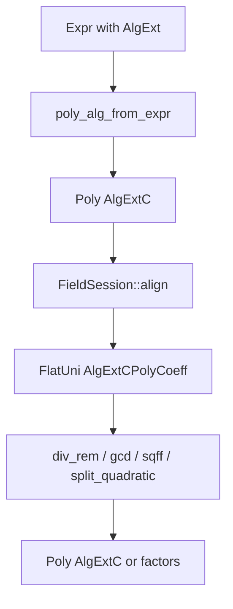

# GIAC-poly — flat K[var] 除法 / gcd 类型分层方案

**状态:** open  
**类型:** 架构 / 表示层  
**触发:** P1 `univ_wrt::univariate_div_rem_wrt` 常数除数死循环 — flat 域除法误抄 nested 环语义；`gcd(x²−2,x+√2)` 验收写错暴露 K[x] 语境未钉死  
**父项:** [GIAC-poly-nested-ring-types](GIAC-poly-nested-ring-types.md) §1.4、[GIAC-poly-algext-gcd-factor-priority](GIAC-poly-algext-gcd-factor-priority.md) T0–T1  
**Rust 落点:** `giac-poly::{poly_coeff, nested, univ_wrt, square_free}`、`giac-core::algebra::{field_session, poly_alg_ops}`  
**快照:** 2026-06-23（**L0-2a/b/c ✅ P0**）

---

## 1. 问题陈述

今天 `Poly<C>` + 裸 `univariate_div_rem_wrt(a,b,var)` 把 **三种不同数学对象** 压成同一签名：

| 数学环 | 除法语义 | 现有 Rust 入口 |
|--------|----------|----------------|
| **K[var]**，K 域（flat） | Euclidean；`deg r < deg b`；常数除数精确整除 | `univ_wrt::univariate_div_rem_wrt` |
| **ℚ[others][var]**，others 嵌套 | leading-term 商；`lc` 不可除则停；常数除数 **不 closed** | `subresultant::univariate_div_rem_wrt` |
| **多元展示环** | leading-monomial `Poly::div_rem` | `MultivariatePoly` / `Poly::div_rem` |

**缺口：**

1. **同名不同义** — 两个 `univariate_div_rem_wrt`；模块头有警告，类型系统不阻止混用。
2. **`PolyCoeff` 过宽** — 只表达环，不表达「K 是域」；Euclidean / Yun gcd 实际要求域。
3. **主元 / 一元性未绑定** — `var: &Var` 与 `a,b` 分离，入口不验 `is_univariate_in`。
4. **AlgExt 对齐语境在类型外** — `FieldSession::align` 是调用方纪律，函数签名看不出「须在共同 K 上」。
5. **`giac-poly-api-stability.md` 未索引 `univ_wrt`** — 文档层缺环列。

P1 已用 `FlatUni<C>` 部分缓解（绑定 main var），但 **仍 `C: PolyCoeff`**，且 `gcd_wrt` / `egcd_wrt` 等仍可从 crate 根裸调。

---

## 2. 设计目标

1. **环语境进类型** — 编译期区分 flat 域一元 vs nested 一元 vs 多元。
2. **除法 API 单入口** — 每种环一个「合法 `div_rem`」类型；禁止裸三元组 `(Poly, Poly, Var)` 作为 Stable 出口。
3. **契约可测** — pre/post 写进 doc + `debug_assert`；B 层测试锁欧几里得不变量。
4. **与 nested issue 对齐** — 不合并两条除法路径，只 **消歧命名 + 分家导出**。
5. **渐进迁移** — 不阻断 P2 factor；旧 API 可 deprecate 一版再 `pub(crate)`。

非目标（本方案不做）：

- 不把 `FieldSession` 塞进 `giac-poly`（仍留 giac-core）。
- 不统一 subresultant 与 Euclidean 为同一算法（数学上不同）。
- 不一次性改完 `factor/*` 全部 `div_rem`（见 nested issue 迁移表）。

---

## 3. 目标分层（类型塔）

```text
                    Poly<C>  （erased 稀疏载体，无除法）
                         │
         ┌───────────────┼───────────────┐
         │               │               │
         ▼               ▼               ▼
  MultivariatePoly   UnivariateIn<C>   FlatUni<C: FieldCoeff>
  （多元 leading）    （ℚ[others][main]） （K[var]，K 域）
         │               │               │
         │               ▼               ▼
         │      nested_div_rem_wrt      euclidean_div_rem
         │      pseudo / break on lc    gcd / egcd / sqff / monic
         │               │               │
         └───────────────┴───────────────┘
                         │
              禁止交叉调用 div_rem
```

### 3.1 系数 trait 分家

```rust
/// 环：加减乘、可能失败的 coeff_div（现有）
pub trait PolyCoeff: Clone + PartialEq + Debug { /* 不变 */ }

/// 域：非零元可逆。Euclidean gcd / flat sqff 仅在此 impl 上。
pub trait FieldCoeff: PolyCoeff {
    /// ponytail: default via coeff_div; override if cheaper.
    fn coeff_inv(&self) -> PolyResult<Self> {
        Self::coeff_one().coeff_div(self)
    }
    /// 文档契约：b ≠ 0 ⇒ coeff_div(a,b) 不失败（对 a 任意）。
    fn field_div(&self, b: &Self) -> PolyResult<Self> {
        self.coeff_div(b)
    }
}
```

**impl：**

| C | Trait |
|---|--------|
| `Ratio<BigInt>` | `FieldCoeff` |
| `AlgExtCPolyCoeff` | `FieldCoeff`（giac-core；系数已在 K） |
| 未来 `PolyMod` / 有限域 | `FieldCoeff` |
| nested 系数 `Poly`（ℚ[others] 元） | **仅** `PolyCoeff`，**不** impl `FieldCoeff` |

不在类型里 encode「已 align」——对齐仍是 giac-core `FieldSession` 职责；align 后 **构造** `FlatUni<AlgExtCPolyCoeff>` 即可。

### 3.2 一元 flat 载体 — `FlatUni<C: FieldCoeff>`

**变更：** 将现有 `FlatUni<C: PolyCoeff>` 收紧为 `FlatUni<C: FieldCoeff>`。

```rust
pub struct FlatUni<C: FieldCoeff = Ratio<BigInt>> {
    poly: Poly<C>,
    var: MainVar,
}

impl<C: FieldCoeff> FlatUni<C> {
    /// pre: poly 仅含 var 的幂；post: Self 携带一元 + 主元语境
    pub fn try_new(poly: Poly<C>, var: impl Into<MainVar>) -> PolyResult<Self>;

    pub fn div_rem(&self, d: &Self) -> PolyResult<(Self, Self)>;
    pub fn exact_quo(&self, d: &Self) -> PolyResult<Self>;
    pub fn monic(&self) -> PolyResult<Self>;
    pub fn gcd(&self, other: &Self) -> PolyResult<Self>;
    pub fn egcd(&self, other: &Self) -> PolyResult<(Self, Self, Self)>;
    pub fn square_free_part(&self) -> PolyResult<Self>;
    pub fn primitive_part(&self) -> PolyResult<Self>;
    // … content, derivative 等同理
}
```

**要点：**

- `div_rem` 返回 `FlatUni` 而非裸 `Poly` — **商与余式保留 var 语境**。
- `try_new` 内调用 `is_univariate_in`；失败返回 `TypeError`。
- **`FlatUni::new`（不验一元）** — L1 起 deprecate，新代码只用 `try_new`。
- `divisor.var()` 必须等于 `self.var()`（同型保证或 debug_assert）。

### 3.3 Nested 一元 — 重命名消歧

| 现名 | 目标名 | 可见性 |
|------|--------|--------|
| `subresultant::univariate_div_rem_wrt` | `nested::div_rem_wrt_in` 或 `nested_univariate_div_rem` | `pub(crate)` |
| `subresultant::quo_exact_wrt` | `nested::exact_quo_wrt_in` | `pub(crate)` |
| `UnivariateIn::divides` / `div_rem_wrt_aux_indep` | 不变，文档链到新名 | Stable |

**规则：** 文件名 / 模块名带 `nested` 或 `UnivariateIn` 的 API **不得** 调用 `univ_wrt::*`。

### 3.4 `univ_wrt` 模块定位

```text
univ_wrt.rs  →  实现层（算法细节）
FlatUni      →  Stable 边界（唯一对外 flat 除法/gcd 出口）
```

| 函数 | 迁移后 tier |
|------|-------------|
| `univariate_div_rem_wrt` | **Pipeline private**（或 `pub(crate)`） |
| `gcd_wrt`, `egcd_wrt`, `square_free_part_wrt`, … | 方法迁入 `FlatUni`；自由函数 deprecate |
| `is_univariate_in`, `scalar_coeff_wrt` | **Stable** 工具（无除法） |

### 3.5 giac-core 薄包装

```rust
// poly_alg_ops.rs — 对齐后一律经 FlatUni
pub fn div_rem_wrt_algext(...) -> ... {
    let (a, b) = align_algext_polys(session, a, b)?;
    let fa = FlatUni::try_new(a, MainVar::new(var.clone()))?;
    let fb = FlatUni::try_new(b, MainVar::new(var.clone()))?;
    let (q, r) = fa.div_rem(&fb)?;
    Ok((q.into_poly(), r.into_poly()))
}
```

`gcd_wrt_algext` 等同理 → `fa.gcd(&fb)`。不再从 giac-core 直接 re-export 裸 `gcd_wrt`。

---

## 4. 算法契约（写进 doc + debug）

### 4.1 `FlatUni::div_rem` — Euclidean over K[var]

**Pre：**

- `self`, `d` 已 `try_new`（一元于同一 `var`）。
- `K = C` 为域（`FieldCoeff`）。
- **`d = 0` → `Err(TypeError)`**（未定义除法；不再静默 `(0, self)`）。
- **`lc(d) = 0`（且 `deg(d) > 0`）→ `Err(TypeError)`**（与 `db=0` 同类，禁止静默 `(0, a)`）。

**Post（`d ≠ 0` 且 `lc(d) ≠ 0`）：**

- `self.poly = q.poly * d.poly + r.poly`（环等式）。
- `r.is_zero()` 或 `r.degree() < d.degree()`。
- 若 `d` 为非常数常数，则 `r = 0`。

**Debug：**

```rust
debug_assert!(d.degree() == 0 && !d.as_poly().is_zero() || r.is_zero() || r.degree() < d.degree());
```

### 4.2 与 nested 对照表（防再抄）

| 条件 | flat `FlatUni` | nested `UnivariateIn` |
|------|----------------|------------------------|
| `d = 0` | **`Err(TypeError)`** | 同左或调用方保证 |
| `deg(d)=0`, d≠0 | `r=0`，`q=a/d` | 通常 **不除**，返回 `(0,a)` |
| `lc(d)=0`, deg(d)>0 | **`Err(TypeError)`** | break / 伪余式路径 |
| `lc(d)` 不整除 `lc(r)` | `coeff_div` Err | break，保留部分余式 |
| gcd 引擎 | Euclidean + `FieldCoeff` | subresultant / pseudo |

---

## 5. 依赖与数据流（AlgExt 路径）



P2 `factor_univariate_over_k` 应接收 **`FlatUni<AlgExtCPolyCoeff>`**（或 `&FlatUni`），而非裸 `Poly` + `&Var`。

---

## 6. 审核结论与任务优先级

**审核结论（2026-06-23）：** 方向正确、可渐进落地；与 [GIAC-poly-nested-ring-types](GIAC-poly-nested-ring-types.md) 互补。P1 常数除数 bug 已修，本方案防 **结构性再犯**（同名 API、trait 过宽、契约未测）。

**方案缺口（已纳入下表）：**

| 缺口 | 处置 |
|------|------|
| `lc(b)=0` 仍静默 `(0,a)` | L0-2a 与 `d=0` 一并改为 `Err` |
| `FlatUni::new` 不验一元 | L1-1a deprecate，仅 `try_new` |
| `div_rem → (FlatUni, FlatUni)` churn | L1-1b 后置，不挡 T2-1 |
| L2 不必挡 P2 | L2 整体降为 P3 |
| L3-1 与 T2-1 | **合并实施**（见 §6.3） |

### 6.1 优先级总表

与 [GIAC-poly-algext-gcd-factor-priority](GIAC-poly-algext-gcd-factor-priority.md) **P2（T2-1）** 对齐：

| 优先级 | ID | 任务 | 理由 | 依赖 | 建议时机 |
|:--:|:--:|---|---|:---:|---|
| **P0** | **L0-2a** | `debug_assert` 欧几里得 post；**`d=0` / `lc=0` → `Err`** | 防死循环再现；零 runtime 成本（release） | — | ✅ |
| **P0** | **L0-2b** | B 测试：`gcd(x²−2,x+1)=1` on **ℚ**（常数除数 path） | P1 漏测根因；不依赖 AlgExt | — | ✅ |
| **P1** | **L0-2c** | `univ_wrt` doc：pre/post + §4.2 nested 对照 | 防再抄；无 API 变更 | L0-2a | ✅ |
| **P1** | **L0-1** | `FieldCoeff` trait + `Ratio` / `AlgExtCPolyCoeff` impl | 编译期钉死「K 是域」 | — | T2-1 前（小 PR） |
| **P1** | **L0-3** | `giac-poly-api-stability.md` 增 `univ_wrt` / `FlatUni` **环列** | 文档门禁 | L0-2c | 可并行 |
| **P2** | **L1-1a** | `FlatUni::try_new` 验一元；`gcd` / `sqff` **方法**（`div_rem` 可先仍返回 `Poly`） | T2-1 需 typed 入口 | L0-1 | **与 T2-1 同波** |
| **P2** | **L3-1** | `factor_univariate_over_k(&FlatUni<AlgExtCPolyCoeff>)` | P2 主路径（§5） | T1 ✅, L1-1a | **T2-1 本体** |
| **P2** | **L1-1b** | `div_rem → (FlatUni, FlatUni)`；`FlatUni<C: FieldCoeff>` 收紧 | API 清洁；`factor/*` 有 churn | L1-1a | T2-1 后或同 PR 局部 |
| **P2** | **L1-2** | giac-core `poly_alg_ops` 改走 `FlatUni` 方法 | 与 L1-1 同步 | L1-1a | 随 L1-1 |
| **P3** | **L1-3** | deprecate crate 根 `gcd_wrt` 等自由函数 | 减裸调 | L1-2 | T2-2 前后 |
| **P3** | **L2-1** | nested 除法重命名 + `univ_wrt` → `pub(crate)` | 纯 churn/消歧 | L1 稳定 | **P2 绿后再做** |
| **P3** | **L2-2** | Cursor rule / nested issue 交叉链接 | 纪律 | L2-1 | 随 L2 |
| **P4** | **L3-2** | `factor/*` 全量 `FlatUniQ`（nested issue 迁移表） | ℚ 路径清理 | L2-1 | 按需 / 与 nested §1.4 合并 |

### 6.2 推荐 PR 线

```text
PR-1（~0.5d）  L0-2a + L0-2b + L0-2c
PR-2（~1d）    L0-1 + L0-3
PR-3（~2–3d）  L1-1a + L3-1 + L1-2（T2-1）；可选同 PR：L1-1b
PR-4（P2 后）  L2-* + L1-3 + L3-2
```

### 6.3 与 P2 硬/软门禁

| 门禁 | 必须项 |
|------|--------|
| **开 T2-1 前** | L0-2a/b（测试 + post 断言 + `d=0`/`lc=0` 定案） |
| **T2-1 实施中** | L0-1 + L1-1a + **L3-1**（`FlatUni` 作 factor 入参） |
| **T2-2 eval_factor 前** | L1-2（core 不再裸调 `gcd_wrt`） |
| **不挡 P2** | L2 重命名、L3-2 `factor/*` 全量迁移、session token（§9 #2） |

### 6.4 原波次映射（归档）

| 原波次 | 现优先级 | 说明 |
|--------|----------|------|
| L0 契约加固 | P0 + P1 | 拆为 L0-2a/b（P0）与 L0-1/2c/3（P1） |
| L1 FlatUni 收口 | P2 + P3 | L1-1a/b/2 随 T2-1；L1-3 deprecate 后置 |
| L2 消歧 | P3 | 不前置 |
| L3 P2 接线 | P2 + P4 | L3-1 与 T2-1 合并；L3-2 后置 |

---

## 7. 验收

```bash
cd giac-rs
cargo test -p giac-poly nested::tests flat_uni
cargo test -p giac-poly --lib univ_wrt
cargo test -p giac-core --lib algebra::poly_alg_ops
cargo test -p giac-poly --lib   # 全量回归
```

| 检查项 | 标准 |
|--------|------|
| 常数除数 | `gcd(x²−2,x+1)` ℚ + AlgExt 均 <1s |
| 环分家 | `rg 'univ_wrt::univariate_div_rem' factor/` 仅 flat 上下文 |
| 类型 | 新建 flat gcd 代码无 `PolyCoeff` 约束的 `gcd_wrt` 裸调 |
| 文档 | api-stability 含「环」列：flat / nested / multivariate |

---

## 8. 开放问题

1. **`d=0` / `lc=0`** — ✅ **已定案**：flat 路径一律 **`Err(TypeError)`**（§4.1）；L0-2a 落地。
2. **`FlatUni` 是否存 `Arc<ExtensionField>` 标签** — 首版 **省略**；靠 giac-core `align` 纪律；P4 按需。
3. **deprecate 周期** — 一 release 保持 `#[deprecated(note="use FlatUni::gcd")]` 再收 `pub(crate)`（L1-3）。
4. **`FlatUni::new` vs `try_new`** — L1-1a 起新代码仅 `try_new`；`new` deprecate，不删至 L1-1b。

---

## 9. 任务 ID 速查

| ID | 内容 | 优先级 | PR 线 |
|----|------|:--:|:--:|
| L0-2a | post 断言 + `d=0`/`lc=0` → Err | P0 ✅ | PR-1 |
| L0-2b | ℚ `gcd(x²−2,x+1)` B 测试 | P0 ✅ | PR-1 |
| L0-2c | `univ_wrt` doc 契约 | P1 ✅ | PR-1 |
| L0-1 | `FieldCoeff` trait + impl | P1 | PR-2 |
| L0-3 | api-stability 环列 | P1 | PR-2 |
| L1-1a | `try_new` + `FlatUni::{gcd,sqff,…}` | P2 | PR-3 |
| L1-1b | `div_rem→FlatUni` + `C: FieldCoeff` | P2 | PR-3（可选） |
| L1-2 | giac-core → `FlatUni` | P2 | PR-3 |
| L1-3 | deprecate 自由函数 | P3 | PR-4 |
| L2-1 | nested 重命名 + `pub(crate)` | P3 | PR-4 |
| L2-2 | Cursor / nested 交叉链接 | P3 | PR-4 |
| L3-1 | `factor_univariate_over_k(FlatUni)` = **T2-1** | P2 | PR-3 |
| L3-2 | `factor/*` → `FlatUniQ` | P4 | PR-4 |
