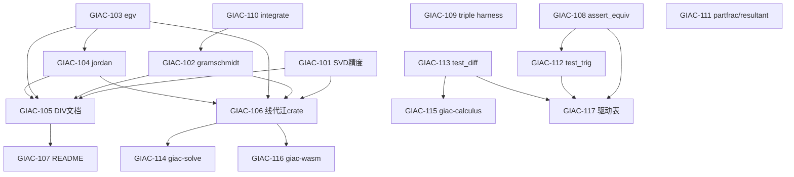

# Giac Rust 迁移 Issue 清单

基于 [rust-migration-plan.md](rust-migration-plan.md) 与当前 `giac-rs` 实现状态整理的**可独立领取**工作项。编号 `GIAC-101` 起为示意，发布到 tracker 时可替换为实际 ID。

**当前阶段：** Phase 3（线性代数）收尾 → Phase 4（求解/微积分）启动  
**门禁：** 每项合并前须 `cargo test --workspace` + `cargo ci-clippy` 全绿（见 [rust-migration-supplement.md §7](rust-migration-supplement.md#7-工程门禁)）

---

## 依赖关系

## 建议执行批次

| 批次 | Issues | 说明 |
|------|--------|------|
| Batch 1 | 101, 103, 108, 109, 110, 111 | 无阻塞，可并行 |
| Batch 2 | 102, 104, 112, 113 | 依赖 Batch 1 部分项 |
| Batch 3 | 105, 106, 107 | Phase 3 关门与文档 |
| Batch 4 | 114, 115, 116, 117 | Phase 4 / WASM 启动 |

---

## 里程碑 M3：Phase 3 关门（立即）

### GIAC-101 — 修复 SVD 有理数输出精度

| 字段 | 内容 |
|------|------|
| **类型** | AFK |
| **阶段** | P3 |
| **Blocked by** | 无 |
| **关联** | DIV-070（待新建，见 GIAC-105） |

#### What to build

`svd` / `lu` / `qr` 的 `f64 → Expr` 转换不再使用固定分母 `1_000_000`（见 `giac-core` 中 `f64_to_expr`）。改为可重构的有理数近似（连分数 / Stern-Brocot 等），或按 [conformance-testing.md §2.1](conformance-testing.md) 对数值输出做 `cas_floats` 规范化后再比对。

#### Acceptance criteria

- [ ] `svd([[1,2,1],[3,4,1],[1,5,6]])` 经 SymPy 重构 `U·Σ·Vᵀ ≈ A`（容差 ≤ 1e-5）
- [ ] `phase3_triple::test_linalg_decomp_triple` 可移除对 3×3 SVD 的 `is_known_numeric_gap` 跳过
- [ ] `giac-linalg` 单元测试覆盖 2×2 与 3×3 重构
- [ ] [known-divergences.md](known-divergences.md) 新增 DIV-070，修复后标 `accepted`

---

### GIAC-102 — 实现 `gramschmidt` 内积正交化

| 字段 | 内容 |
|------|------|
| **类型** | AFK |
| **阶段** | P3 |
| **Blocked by** | GIAC-110（建议先扩展 integrate；可并行但风险更高） |
| **关联** | DIV-071 |

#### What to build

完成 `bin/test_linalg_decomp` 用例  
`gramschmidt([1,1+x],(p,q)->integrate(p*q,x,-1,1))` 端到端路径：lambda 内积解析 → 定积分 → 开方归一化 → 正交向量输出。

#### Acceptance criteria

- [ ] `run_line("gramschmidt(...)")` 返回含 `sqrt` 或 `1/sqrt` 的合法结果
- [ ] SymPy 属性验证：正交性 `⟨v_i,v_j⟩=0`（i≠j）、归一性 `⟨v_i,v_i⟩=1`
- [ ] `phase3_triple` / `sympy_all` 移除 `gramschmidt` skip
- [ ] 内积为负时返回 `EvalError`，不 panic

---

### GIAC-103 — 补全 `egv` 3×3 与一般特征值

| 字段 | 内容 |
|------|------|
| **类型** | AFK |
| **阶段** | P3 |
| **Blocked by** | 无（`charpoly` 已有） |
| **关联** | DIV-072 |

#### What to build

`egv([[4,1,-2],[1,2,-1],[2,1,0]])` 等 3×3 用例：不可对角化时返回 giac 兼容信息；可对角化时返回特征值（及可选特征向量）。

#### Acceptance criteria

- [ ] `test_linalg_ext` 中 3×3 `egv` 不再 `NotImplemented`
- [ ] 可对角化矩阵：SymPy 验证 `det(A-λI)=0`
- [ ] 不可对角化：输出含 `Not diagonalizable` 或与 giac 参考一致
- [ ] `phase3_triple` 移除 `egv` skip

---

### GIAC-104 — 扩展 `jordan` 至 n>2

| 字段 | 内容 |
|------|------|
| **类型** | AFK |
| **阶段** | P3 |
| **Blocked by** | GIAC-103 |
| **关联** | DIV-072（部分重叠） |

#### What to build

在 2×2 已实现基础上，支持 `jordan([[1,1],[0,1]])` 及更大规模 Jordan 块检测与 `(J, P)` 输出。

#### Acceptance criteria

- [ ] `jordan([[1,1],[0,1]])` 输出与 giac 参考一致，或 SymPy 验证 `P⁻¹JP = A`
- [ ] n>2 非平凡 Jordan 块至少有 1 个单元测试
- [ ] `phase3_triple` 移除 `jordan` skip

---

### GIAC-105 — 登记 Phase 3 已知偏离（DIV-070–073）

| 字段 | 内容 |
|------|------|
| **类型** | AFK |
| **阶段** | P3 / 文档 |
| **Blocked by** | GIAC-101–104 完成后更新状态 |

#### What to build

在 [known-divergences.md](known-divergences.md) 落盘 Phase 3 缺口与处理策略，与 conformance skip 列表对齐。

#### Acceptance criteria

- [ ] **DIV-070**：3×3 SVD 有理数近似不可重构（修复后标 `accepted`）
- [ ] **DIV-071**：`gramschmidt` 内积/开方（修复后标 `accepted`）
- [ ] **DIV-072**：`egv` 3×3 一般情形（修复后标 `accepted`）
- [ ] **DIV-073**：`gauss` 合同变换 vs 字面等价（标 `accepted`，策略 `assert_equiv` / SymPy weak check）
- [ ] 每条含：输入、giac 输出、Rust 输出、验证方式、测试处理

---

### GIAC-106 — 符号线代迁入 `giac-linalg`

| 字段 | 内容 |
|------|------|
| **类型** | HITL（crate 边界决策） |
| **阶段** | P3 / 架构 |
| **Blocked by** | GIAC-101–104 建议先完成，避免搬迁冲突 |

#### What to build

将 `giac-core::linalg::{symbolic, eigen, gramschmidt}` 迁入 `giac-linalg`；`giac-core` 仅保留 eval 桥接与 `Expr::Matrix`。对齐 [rust-migration-plan.md §2](rust-migration-plan.md) crate 图与 [module-division.md](module-division.md)。

#### Acceptance criteria

- [ ] `giac-linalg` 导出 `rref` / `det` / `ker` / `image` / `charpoly` / `linsolve` / `gauss` 等符号 API
- [ ] `giac-core::eval` 通过 `giac-linalg` 调用，无循环依赖
- [ ] `cargo test --workspace` + `cargo ci-clippy` 全绿
- [ ] `phase3_*` conformance 无回归

---

### GIAC-107 — 更新 README 至 Phase 3 状态

| 字段 | 内容 |
|------|------|
| **类型** | AFK |
| **阶段** | 文档 |
| **Blocked by** | GIAC-105 |

#### What to build

更新 `giac-rs/README.md`，反映 Phase 0–3 能力、conformance 入口、已知 gap 链接。

#### Acceptance criteria

- [ ] Status 节列出 P3 API（`rref` / `lu` / `qr` / `svd` / …）
- [ ] 列出 conformance 测试命令（`phase3_triple`、`sympy_all` 等）
- [ ] 链接 [known-divergences.md](known-divergences.md) 与 [rust-migration-plan.md](rust-migration-plan.md)
- [ ] 移除「Phase 0–1 in progress」过时表述

---

## 里程碑 M3→M4：验证体系与 Phase 2 技术债（短期）

### GIAC-108 — 实现 `assert_equiv` 并接入 conformance

| 字段 | 内容 |
|------|------|
| **类型** | AFK |
| **阶段** | 测试基础设施 |
| **Blocked by** | 无 |

#### What to build

按 [conformance-testing.md §3](conformance-testing.md) 在 `giac-simplify`（或 `giac-core`）实现 `assert_equiv(a, b, ctx)`：`normal(sub(a,b))` 为零判定。conformance harness 在 golden 字面 diff 失败时先尝试等价判定。

#### Acceptance criteria

- [ ] `assert_equiv` 对 `x+1` vs `1+x`、`sqrt(2)/2` vs `1/sqrt(2)` 返回 true
- [ ] `giac_check_factor` 或 `cas_first_50` 至少 1 处改用 `assert_equiv`
- [ ] 单元测试覆盖 `sub` / `is_zero` 边界（分式、复数、`Mod`）
- [ ] 行为与 `conformance-testing.md` 规格一致

---

### GIAC-109 — 统一 triple 测试 harness

| 字段 | 内容 |
|------|------|
| **类型** | AFK |
| **阶段** | 测试基础设施 |
| **Blocked by** | 无 |

#### What to build

在 `tests/conformance/src/lib.rs` 提供 `triple_check_script_filtered(name, skip_fn)`，统一 phase2 / phase3 逐行跳过模式。

#### Acceptance criteria

- [ ] `phase2_triple.rs` 与 `phase3_triple.rs` 共用 filtered harness
- [ ] skip 逻辑集中或可按 phase 配置
- [ ] 行为与当前 `phase3_triple` 逐行逻辑等价
- [ ] 无测试回归

---

### GIAC-110 — 扩展 `integrate` 规则表

| 字段 | 内容 |
|------|------|
| **类型** | AFK |
| **阶段** | P1/P3 交界 |
| **Blocked by** | 无 |

#### What to build

扩展 `giac-core::integrate`：多项式积、基本有理式等，支撑 `gramschmidt` 内积与 Phase 4 积分。

#### Acceptance criteria

- [ ] `integrate(1,x)`、`integrate(x,x)`、`integrate(x^2,x)` 通过
- [ ] 定积分路径（若语法已支持）可用于 `gramschmidt` 内积
- [ ] SymPy 验证：`diff(integrate(f),x) = f`
- [ ] 文档或测试列出仍 `NotImplemented` 的规则

---

### GIAC-111 — 实现 `partfrac` 与高阶 `resultant`

| 字段 | 内容 |
|------|------|
| **类型** | AFK |
| **阶段** | P2 收尾 |
| **Blocked by** | 无 |

#### What to build

`giac-poly::resultant` 支持次数 >1 的 Sylvester 行列式；`eval_poly::partfrac` 对接实现。

#### Acceptance criteria

- [ ] `resultant` / `partfrac` 对应用例通过 SymPy 验证
- [ ] `giac-poly` 收窄或移除对应 `NotImplemented`
- [ ] `phase2_triple` 无新回归

---

### GIAC-112 — 接入 `test_trig` golden 子集

| 字段 | 内容 |
|------|------|
| **类型** | AFK |
| **阶段** | P2 延伸 |
| **Blocked by** | GIAC-108（建议先，处理等价不同形） |

#### What to build

新增 conformance 测试：解析并执行 `bin/test_trig` 前 N 行，SymPy 或 `assert_equiv` 验证 `normal` / `texpand` / `tlin` 等。

#### Acceptance criteria

- [ ] `test_trig` 可 `parse_program` 全文件
- [ ] 前 10 行 ≥8 行 SymPy 或 `assert_equiv` 通过
- [ ] 已知 gap 记入 [known-divergences.md](known-divergences.md)

---

### GIAC-113 — 接入 `test_diff` 先导（Phase 4 探针）

| 字段 | 内容 |
|------|------|
| **类型** | AFK |
| **阶段** | P4 先导 |
| **Blocked by** | 无 |

#### What to build

实现或补齐 `diff` / `derive` 最小规则表，对 `bin/test_diff` 前 5–10 行做 conformance + SymPy 验证。

#### Acceptance criteria

- [ ] `diff(x^2,x)` → `2*x` 等基础用例
- [ ] `test_diff` 前 10 行 ≥7 行 SymPy 验证通过
- [ ] 决策：`giac-core` 暂存或新建 `giac-calculus` 骨架（仅 `diff`）
- [ ] `cargo ci-clippy` 全绿

---

## 里程碑 M4：Phase 4 启动（中期）

### GIAC-114 — 新建 `giac-solve` crate 骨架

| 字段 | 内容 |
|------|------|
| **类型** | HITL（crate 边界） |
| **阶段** | P4 |
| **Blocked by** | GIAC-106（建议先稳定线代边界） |

#### What to build

创建 `giac-solve`：`solve`（多项式）、`linsolve`（迁移或 re-export）、`fsolve` / `sturm` / `realroot` 占位；接入 workspace 与 eval dispatch。

#### Acceptance criteria

- [ ] `giac-solve` 在 workspace，`#![deny(unsafe_code)]`，`[lints] workspace = true`
- [ ] `linsolve` 从 `giac-core` 迁出或 facade 转发
- [ ] `bin/test_solve` 可解析；至少 1 行端到端通过
- [ ] 无 `giac-solve` ↔ `giac-core` 循环依赖

---

### GIAC-115 — 新建 `giac-calculus` crate 骨架

| 字段 | 内容 |
|------|------|
| **类型** | HITL |
| **阶段** | P4 |
| **Blocked by** | GIAC-113 |

#### What to build

创建 `giac-calculus`：迁入 `integrate` / `diff` / `limit` / `series`；`giac-core::eval` 桥接。

#### Acceptance criteria

- [ ] `integrate` 从 `giac-core` 迁出
- [ ] `diff` 在 `giac-calculus` 实现（承接 GIAC-113）
- [ ] `cargo test -p giac-calculus` 有基础单元测试
- [ ] workspace 全绿

---

### GIAC-116 — `giac-wasm` 最小闭环

| 字段 | 内容 |
|------|------|
| **类型** | HITL（WASM ABI 决策） |
| **阶段** | WASM |
| **Blocked by** | GIAC-106（依赖链稳定） |

#### What to build

`wasm32-unknown-unknown` 下编译最小 CAS：暴露 `eval_to_string(input: &str) -> String`；`giac-cli` 用 `cfg(not(target_arch = "wasm32"))` 隔离。

#### Acceptance criteria

- [ ] `cargo build --target wasm32-unknown-unknown -p giac-wasm` 成功
- [ ] 可执行 `1+2` → `3`（浏览器或 `wasm-bindgen-test`）
- [ ] 无 C FFI 传递依赖
- [ ] 文档记录 WASM 构建步骤

---

### GIAC-117 — 53 CTest conformance 驱动表

| 字段 | 内容 |
|------|------|
| **类型** | AFK |
| **阶段** | 全阶段跟踪 |
| **Blocked by** | GIAC-108, GIAC-112, GIAC-113（逐步填表） |

#### What to build

维护 **41 bin + 10 check** 矩阵：脚本名 × 状态（未接入 / 部分 / SymPy / golden 全绿 / 已知偏离 DIV-*）。

#### Acceptance criteria

- [ ] 覆盖全部 53 CTest（见 [conformance-testing.md §1](conformance-testing.md)）
- [ ] 每项链接对应 Rust 测试或 `known-divergences` ID
- [ ] 与 [functional-coverage.md](functional-coverage.md) 口径一致
- [ ] 可选：CI 生成已接入/总数报告

---

## 明确不做（本清单范围外）

与 [rust-migration-plan.md §1.2](rust-migration-plan.md) 一致：

- GUI / FLTK / 绘图
- `gbasis` 完整 Groebner（仅 `greduce` 在 MVP）
- Maple / TI / RPN 兼容层
- Arena 分配、并行 `rayon`（profiling 前不引入）

---

## 维护

1. Issue 关闭时同步更新本文件对应条目的状态（或在 tracker 中链接本文）。
2. 新建 DIV 条目须同步更新 [known-divergences.md](known-divergences.md)。
3. Phase 3 全部关闭（101–107 accepted）后，可将本文档重命名为 `migration-issues.md` 并继续追加 Phase 4+ 条目。
