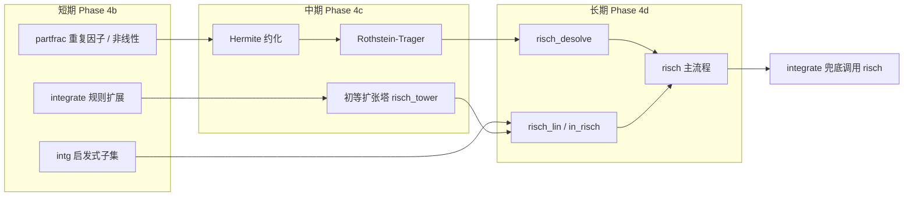
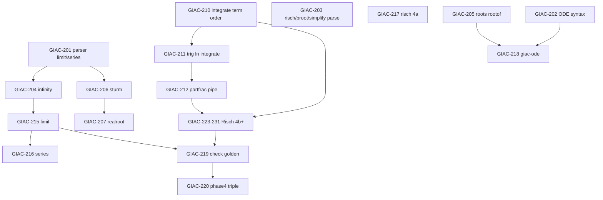

# Phase 4 — 求解与微积分：问题分析与改进计划

基于 [rust-migration-plan.md §5 Phase 4](rust-migration-plan.md)、[rust-migration-supplement.md §4.5–4.7](rust-migration-supplement.md) 及 `giac-rs` 实现状态整理。

**最后同步：** 2026-06-15（Batch 1 ✅；Batch 2 **大部分 ✅**；Batch 3 ✅；Batch 4 **✅**）

**阶段定义（实现时间线）：** Phase 4 = `giac-solve` + `giac-calculus` + `giac-ode`（线性代数为 Phase 3，已大体完成）。

**门禁：** 每项合并前须 `cargo test --workspace` + `cargo ci-clippy` 全绿（[supplement §7](rust-migration-supplement.md#7-工程门禁)）。

### 进度快照（GIAC-201–222）

| 状态 | Issues |
|------|--------|
| ✅ 已关闭 | 201–205, 209, 211, 214, 207–208, 212–213, 215–218, 220, 222；210/211 积分表 |
| ⚠️ 部分完成 | 206（`sturm` 重因子已缓解）、210（表 A **7/7** ✅）、219（check harness；**28/66** enabled）、**GIAC-224** `partfrac` 重复线性因子 ✅、**GIAC-223** 指数/三角商式规则 ✅、**GIAC-225** sqrt/半角/三角商式 ✅（CK-INT-11/12/18/19/28/32）；**GIAC-226** 塔 + `pow2expln` ⚠️；**GIAC-227** Hermite 约化 ✅（CK-INT-06）；**GIAC-228/228a/228b** RT + 代数共轭配对 ⚠️（CK-INT-07/08 ✅；CK-INT-04 ✅）；**GIAC-215** limit 子集 ✅（CK-INT-55/59） |
| ❌ 未开始 | 221（文档收尾）；check golden 全量 67 条 |

**积分表 fixture：** `phase4_integrate_table.json` — **26/27** 行 `enabled: true`（表 A 全绿；表 D/E 未入 fixture）。

---

## 1. 现状摘要

### 1.1 已具备

| 项 | 状态 | 说明 |
|----|------|------|
| `giac-solve` crate | ✅ 核心子集 | 多项式 `solve`（含 `rootof`）、`linsolve`、`fsolve`、`sturm`/`sturmab` |
| `giac-calculus` crate | ✅ 核心子集 | `diff`/`derive`（含多元）、`integrate` 规则表 A/B/C + 定积分框架 |
| `assert_equiv` | ✅ | `giac-core::algebra::assert_equiv`，conformance 已用 |
| `test_diff` conformance | ✅ | parse + SymPy 子集 |
| `test_solve` conformance | ✅ | parse + ≥1 行 SymPy |
| `test_sturm` conformance | ⚠️ | `test_sturm` 全行 ✅；`test_sturm_ext` 中 `sturm((x^3+1)^2)` 与 SymPy 不一致 |
| `phase4_integrate_table` | ✅ | 26 条 enabled 行 SymPy 导数还原全绿 |
| `phase4_batch1` / `phase4_batch2` / `phase4_batch3` | ✅ | 201–204、205/206/209/211/214、**207/208/212/213/215** 验收测试 |
| `phase4_maxima_rtest` | ✅ 部分 | 8 条 Maxima limit 草稿（**LIM-001/002 enabled**；余 6 条待更强 `limit`） |
| `giac-wasm` | ✅ 冒烟 | `eval_to_string`：`solve`/`integrate`/`diff`（GIAC-222 基础） |

### 1.2 bin 脚本端到端（`run_line` + SymPy，2026-06-15）

对 [test-inventory.md](test-inventory.md) 中 Phase 4 相关脚本的 conformance 体感（**非** `giac-cli` 字面 golden）：

| 脚本 | 行数 | SymPy 通过 | 主要剩余问题 |
|------|------|------------|--------------|
| `test_solve` | 2 | **≥1** | 全行绿未强制 |
| `test_solve_ext` | 3 | 部分 | 超越方程（GIAC-208）、无理根已部分由 `rootof` 覆盖 |
| `test_diff` | 2 | **2** | — |
| `test_integrate` | 3 | 部分 | L3 `simplify(int(tan(x),x))` triple 仍失败 |
| `test_integrate_ext` | 4 | 部分 | L1 `exp*sin`（GIAC-213）；`proot` eval stub |
| `test_integrate_more` | 5 | 部分 | L1/L3 分部/高阶有理（GIAC-213/212）；`risch` stub |
| `test_limit` | 2 | **2** | `limit` 基础 eval **GIAC-215** ✅ |
| `test_series` | 3 | **0** | `series`/`taylor` eval stub（GIAC-216）；已可解析 |
| `test_sturm` | 3 | **3** | — |
| `test_sturm_ext` | 3 | 部分 | `realroot` ✅（GIAC-207）；`sturm` 重因子已修复 |
| `test_desolve` | 3 | **0** | 可解析；`desolve` eval stub（GIAC-218） |
| `test_desolve_ext` | 3 | **0** | 同上 |
| `test_partfrac_ext` | 4 | **0** | 未接 e2e conformance；高阶 `partfrac`（GIAC-212） |

**check golden（Phase 4 验收目标）：** `testintegrate`（67 条）、`testlimit`（52 条）、`testother`（4 条）、`testpartfrac`（1 条）——**均未接入** Rust conformance（GIAC-219）。

### 1.3 与迁移计划的对照

[rust-migration-plan.md §5 Phase 4](rust-migration-plan.md) 要求：

| 模块 | 计划能力 | 当前（2026-06-15） |
|------|----------|-------------------|
| `giac-solve` | `solve`, `linsolve`, `fsolve`/`newton`, `sturm`/`realroot` | `solve`+`rootof`、`linsolve`、`fsolve` ✅；`sturm`/`sturmab` ⚠️；`realroot` stub |
| `giac-calculus` | `diff`, `limit`, `series`/`taylor`, `partfrac` 对接 | `diff`/`derive` ✅；`integrate` 规则 + **`partfrac_integrate` + Hermite/RT** ⚠️；`limit`/`series` 部分实现；`risch` 仍委托 `integrate` |
| `integrate` | 规则表 + 部分分式，再 port `risch` | 表 B/C 全绿；**check 25/66**；`partfrac` 管道已接（重复因子/Hermite/RT）；`exp*sin` 分部仍缺 |
| `giac-ode` | `desolve` 线性常系数 | **骨架 crate** + `desolve` stub；ODE 语法可解析 |

---

## 2. 问题分类

### 2.1 解析与 AST（阻塞多项脚本）

**Batch 1（GIAC-201–204）已关闭（2026-06-15）：** 上述 API 均可 `parse_program`；`limit`/`series`/`risch`/`desolve` 等 eval 仍为 stub。

**Batch 2（GIAC-205/206/209/211/214）大部分关闭（2026-06-15）：** 见 §1 进度快照；GIAC-206 `sturm` 序列仍有缺口。

| 问题 | 影响 | 优先级 | 状态 |
|------|------|--------|------|
| `limit` / `series` / `taylor` 未注册 `lookup_func` | `test_limit`、`test_series` | P0 | ✅ 可解析 |
| `sturmab` 未解析 | `test_sturm`、`test_sturm_ext` | P0 | ✅ 可解析 |
| `desolve` + ODE 语法 `y''`、`y'`、`y(x)` | 全部 `test_desolve*` | P0 | ✅ 可解析 |
| `risch` / `proot` / `simplify` 未解析 | `test_integrate_more` | P1 | ✅ 可解析 |
| `taylor`/`series` 的 `x=0` 命名参数 | giac 脚本方言 | P1 | ✅ 可解析 |
| `+infinity` / 区间端点 | 定积分、极限 check | P1 | ✅ 可解析 |
| `assume` / `purge`（check 积分） | `testintegrate` 含参积分 | P2 | ❌ 未做 |

### 2.2 `giac-solve` 算法缺口

| API | 现状 | 代表失败用例 |
|-----|------|--------------|
| `solve`（多项式） | 度 ≤2 有理根；高次无理 → `rootof` ✅ **GIAC-205** | `solve(t^2-2=0,t)` |
| `solve`（超越） | 仅 `expr_to_poly` 路径 | `solve(sin(x)=0,x)` → 非多项式（**GIAC-208**） |
| `linsolve` | 已在 `giac-linalg` | 二次方程组可过 |
| `fsolve` / `newton` | ✅ 单变量 Newton **GIAC-209** | `fsolve(x^2-2,x)` |
| `sturm` / `sturmab` | `sturmab` ✅；`sturm` 简单情形 ✅，重因子多项式序列 ⚠️ **GIAC-206** | `sturm((x^3+1)^2)` |
| `realroot` | stub | `realroot(x^4-1)`（**GIAC-207**） |
| `froots` | 未实现 | 无专项 bin，flanex 可能触发 |

**根因（已缓解）：** 无理根已通过 `rootof` / `AlgExt` 对接（GIAC-205）；超越方程与 `realroot` 仍待 Batch 3。

### 2.3 `giac-calculus` 算法缺口

#### `diff` / `derive`

| 能力 | 现状 |
|------|------|
| 单变量链式法则 | ✅ sin/cos/ln/exp/tan、积、商、幂 |
| 多元 `derive(f, [x,y,z])` | ✅ 返回 `List` **GIAC-214** |
| `atan` 等扩展 | ❌ `NotImplemented: diff` |

#### `integrate`

| 能力 | 现状 |
|------|------|
| 多项式、常数、`x^n`（n≠-1） | ✅ |
| `1/x`、`1/(1+x²)`（项序 **1 在前**） | ✅ |
| `1/(x²+1)`（项序 **x² 在前**） | ✅ **GIAC-210** |
| `x/(x²+1)` | ✅ **GIAC-210** |
| `1/(x²-1)`、`1/(1-x²)`、`1/(x⁴±1)^n` | ✅ **GIAC-212/224/227/228** partfrac + Hermite + RT |
| 三角、`ln(x)`、`tan` 等 | ✅ 表 C **GIAC-211** |
| `exp*sin`/`exp*cos` 分部积分 | ❌ **GIAC-213** |
| 高阶有理式 `1/(x³+1)` 等 | ❌ 需 `partfrac` 管道（**GIAC-212**） |
| 定积分 4 参数 | ✅ 框架；F01–F03 已 enabled |
| `risch` | Phase 4a：`eval_integrate` 委托（**GIAC-217**）；真 Risch **§3.1** GIAC-223–231 |

#### `limit` / `series`

- `limit` / `series` / `taylor` / `risch`：**可解析**；eval 仍为 `NotImplemented` stub（`giac-calculus/src/stubs.rs`）——**GIAC-215/216/217**。
- `fixtures/phase4_maxima_rtest.json` 已收录 8 条 Maxima Wester limit 草稿（全 disabled，parse 测试已绿）。
- check `testintegrate` 后半含大量 `limit`/`series`，与积分验收强耦合。

#### `partfrac`

- 实现位于 `giac-poly::partfrac_terms` + `giac-core::eval_partfrac`。
- `test_partfrac_ext` 失败：高阶分母因式分解、`partfrac` 缺 1 参数形式、复杂有理式 `TypeError`。
- 积分路径已调用 `partfrac_integrate`（有理式 → `partfrac` + Hermite + Rothstein–Trager）；仍有多处 **写死模式**，见 **§3.1.6**。

### 2.4 架构与工程债

**Batch 1–2 工程债（2026-06-15）：** 解析/FuncKind、`giac-ode` 骨架、Phase 4 conformance、`rootof`/`sturmab`/`fsolve`/积分表 C、`phase4_maxima_rtest`；`cargo test --workspace` + `cargo ci-clippy` 全绿。

| 问题 | 说明 | 关联 | 状态 |
|------|------|------|------|
| Phase 3 符号线代仍在 `giac-core` | [GIAC-106](phase3-issues.md) 文档滞后；实现已在 `giac-linalg` | `linsolve` 已在 `giac-linalg` | ⚠️ 文档待关项 |
| `giac-ode` 缺失 | 计划独立 crate；`desolve.cc` 对标 | Phase 4 验收含 `test_desolve*` | ✅ 骨架 + stub |
| Conformance Phase 4 套件 | `phase4_triple`、`phase4_parse`、`phase4_integrate_table`、`phase4_maxima_rtest` | GIAC-220 驱动 | ⚠️ 脚手架；triple 未全绿 |
| SymPy 脚本 | `integrate`/`derive`/`sturmab`/`fsolve`/`limit` verify 已扩展 | §2.6.2 | ⚠️ `desolve`/`realroot`/超越 `solve` 待扩展 |
| `giac-wasm` Phase 4 API | `solve`/`integrate`/`diff` 单元冒烟 | GIAC-222 | ✅ 冒烟 |
| Maxima 外部语料 | `extract_maxima_rtest.py` → `phase4_maxima_rtest.json` | limit 先导 | ✅ 草稿 |
| supplement §2.2.2 写 `faer` | 与 plan §2 WASM 约束矛盾 | 以 **`nalgebra` + 自研符号** 为准 | 文档偏离 |

### 2.5 已知需登记的偏离（待建 DIV-080+）

| 预判 ID | 领域 | 说明 |
|---------|------|------|
| DIV-080 | 积分 | 等价原函数不同形（`assert_equiv` + diff 还原） |
| DIV-081 | 求解 | 三角/无理方程多解分支与集合语义 |
| DIV-082 | 极限 | 方向极限、`infinity` 记号与 giac 字面差异 |
| DIV-083 | Sturm | 序列格式与 giac 打印顺序 |
| DIV-084 | 级数 | `series` 余项阶与 `O()` 记法 |

### 2.6 第三方验证策略

Phase 4 每项算法改动**必须**绑定至少一层第三方或属性验证，避免仅依赖 giac golden 字面 diff（见 [conformance-testing.md §3](conformance-testing.md)、[rust-migration-plan.md §6.4](rust-migration-plan.md)）。

#### 2.6.1 验证层次（由强到弱）

| 层级 | 工具 | 适用 API | 判定方式 |
|------|------|----------|----------|
| **T1** | **SymPy**（`sympy_verify.py`） | `integrate`/`diff`/`solve`/`limit`/`series`/`partfrac`/`desolve` | 见 §2.6.2 |
| **T2** | Rust `assert_equiv` | 化简形不同的等价输出 | `normal(sub(a,b))=0` |
| **T3** | 属性测试（`proptest`，可选） | 积分、求导互逆 | 随机多项式/有理式 |
| **T4** | 上游 giac triple | 格式可不同 | `phase4_triple.rs`；`rs_giac_equiv` 失败时 SymPy 仍须过 |
| **T5** | check `*.out` golden | 回归门禁 | `cas_floats` + `assert_equiv` 回退 |

**合并门禁：** 算法 PR 至少 **T1 或 T2**；接入 check 前须 **T1**；登记 DIV 时须写明用了哪一层。

#### 2.6.2 SymPy 判定模式（须在 `sympy_verify.py` 扩展）

| API | `eval_line` / `verify_property` 规则 | 说明 |
|-----|--------------------------------------|------|
| `integrate(f,x)` | `simplify(diff(F,x) - f) == 0` | **已支持**；允许多个原函数，不比字面 |
| `integrate(f,x,a,b)` | 同上 + `F(b)-F(a)` 数值或符号 | **已支持**（`verify_property`）；`supported` 子集待扩 |
| `diff` / `derive(f,x)` | `simplify(diff(f,x) - F) == 0` | **已支持**单变量 |
| `derive(f,[x,y,z])` | 逐分量与 `sp.diff(f, xi)` 比 | **已支持** **GIAC-214** |
| `solve(eq,var)` | 每个解代入 `eq` 残差为 0 | **已支持**多项式 + `rootof` |
| `solve(sin(x)=0,x)` | 解集 ⊆ SymPy `solve` 或残差检验 | **待扩展**超越（GIAC-208） |
| `limit(f,x,a)` | `sp.limit(f,x,a)` | **verify 已支持**；eval 未实现；`supported` 待扩 |
| `series`/`taylor` | 截断至同阶系数相等 | **verify 部分**；eval stub（GIAC-216） |
| `partfrac` | `apart` 后展开等于原式 | **待扩展**高阶（GIAC-212） |
| `sturm` / `sturmab` | 区间根数 vs `real_roots` 计数 | **sturmab 已支持**；`sturm` 序列部分 |
| `realroot` | 区间不交且覆盖 `real_roots` | **待新增**（GIAC-207） |
| `desolve` | `dsolve` + `checkodesol` | **待新增**（GIAC-218） |
| `fsolve` | `\|f(x*)\| < tol` | **已支持** **GIAC-209** |

#### 2.6.3 建议落地的测试资产

| 路径 | 用途 | 状态 |
|------|------|------|
| `fixtures/phase4_integrate_table.json` | §2.7 积分表（19/27 enabled） | ✅ |
| `tests/phase4_integrate_table.rs` | 按表 `run_line` + `verify_sympy` | ✅ |
| `fixtures/phase4_maxima_rtest.json` | Maxima rtest 草稿（8 limit） | ✅ 全 disabled |
| `tests/phase4_maxima_rtest.rs` | JSON 校验 + 全行 parse + enabled SymPy | ✅ |
| `scripts/extract_maxima_rtest.py` | 从 `.mac` 抽取 integrate/limit/solve | ✅ |
| `tests/test_integrate.rs` | `bin/test_integrate*` **parse** | ✅ parse only |
| `tests/test_limit.rs` | `bin/test_limit` + check 先导 | ❌ 待建 |
| `tests/test_sturm.rs` | `bin/test_sturm*` SymPy | ⚠️ `test_sturm` ✅；ext 部分 |
| `tests/test_desolve.rs` | `bin/test_desolve*` **parse** | ✅ parse only |
| `tests/phase4_triple.rs` | `PHASE4_SCRIPTS` triple harness | ⚠️ `test_integrate` 仍失败 |
| `scripts/sympy_verify.py` | 第三方 SymPy 验证 | ⚠️ 持续扩展 |

运行示例：

```bash
cd giac-rs
cargo test -p giac-conformance --test phase4_integrate_table
cargo test -p giac-conformance --test phase4_batch2
cargo test -p giac-conformance --test phase4_maxima_rtest
cargo test -p giac-conformance --test phase4_triple
python3 tests/conformance/scripts/sympy_verify.py verify \
  'integrate(1/(x^2+1),x)' '<giac-rs output>'
```

### 2.7 标准积分表（SymPy 对照）

下列积分表与 **GIAC-210–213** 及 `bin/test_integrate*` 对齐。每条用 **微分还原** 验证（与 `sympy_verify.py` 的 `integrate` 分支一致），不强制与 giac 字面一致。

**表例 ID** 写入 `phase4_integrate_table.json` 的 `id` 字段；`enabled: true` 行由 `phase4_integrate_table.rs` 驱动 CI。

**fixture 进度（2026-06-15）：** A 7/7 · B 6/6 · C 8/8 · D 0/2（D03–D05 未入 fixture）· E 0/2 · F 3/4 · **合计 26/27 enabled**。

#### 表 A — 有理式与项序（GIAC-210 / 212）

| ID | 输入 `integrate(…,x)` | enabled | 备注 | 关联 bin |
|----|------------------------|---------|------|----------|
| INT-A01 | `1/(1+x^2)` | ✅ | 基准 | — |
| INT-A02 | `1/(x^2+1)` | ✅ | **项序**；须与 A01 同结果 | `test_integrate` L2 |
| INT-A03 | `1/(x^2-1)` | ❌ | 部分分式预备 → **GIAC-212** | `test_partfrac_ext` |
| INT-A04 | `x/(x^2+1)` | ✅ | `u`-代换 | — |
| INT-A05 | `1/(4+x^2)` | ✅ | `atan(x/2)/2` | 已有单元测试 |
| INT-A06 | `1/(1-x^2)` | ❌ | 对数型 → **GIAC-212** | — |
| INT-A07 | `1/(1+x^4)` | ✅ | **GIAC-228** 代数 RT | — |

#### 表 B — 多项式与幂（基线，**6/6 enabled**）

| ID | 输入 | enabled | 备注 |
|----|------|---------|------|
| INT-B01 | `1` | ✅ | `x` |
| INT-B02 | `x` | ✅ | `x^2/2` |
| INT-B03 | `x^2` | ✅ | `x^3/3` |
| INT-B04 | `1/x` | ✅ | `ln|x|` |
| INT-B05 | `(1+x)^2` | ✅ | expand 后积 |
| INT-B06 | `3/x` | ✅ | 常数倍 |

#### 表 C — 三角与对数（GIAC-211，**8/8 enabled**）

| ID | 输入 | enabled | SymPy 参考形态 | 关联 bin |
|----|------|---------|----------------|----------|
| INT-C01 | `sin(x)^2` | ✅ | 半角公式 | `test_integrate` L1 |
| INT-C02 | `cos(x)^2` | ✅ | 半角公式 | — |
| INT-C03 | `sin(x)*cos(x)` | ✅ | `sin²/2` 类 | — |
| INT-C04 | `tan(x)` | ✅ | `-ln|cos(x)|` | `test_integrate` L3（经 `int`） |
| INT-C05 | `1/cos(x)^2` | ✅ | `tan(x)` | — |
| INT-C06 | `ln(x)` | ✅ | `x*ln(x)-x` | `test_integrate_more` L2 |
| INT-C07 | `x*ln(x)` | ✅ | 分部 | — |
| INT-C08 | `sin(2*x)` | ✅ | 直接 | check 子集 |

#### 表 D — 部分分式管道（GIAC-212，**0/2 in fixture**）

| ID | 输入 | enabled | 验证 |
|----|------|---------|------|
| INT-D01 | `1/(x^3+1)` | ❌ | `diff` 还原 | `test_integrate_more` L3 |
| INT-D02 | `1/(x^4-1)` | ❌ | `partfrac` + 逐项 | `test_partfrac_ext` |
| INT-D03 | `x/((x-1)*(x+1)^2)` | 重复因子 | check `testintegrate` L4 |
| INT-D04 | `1/(x*(x^2+1))` | 三类因子 | — |
| INT-D05 | `(x+1)/(x^2-1)` | 与 `partfrac` 联调 | `test_partfrac_ext` |

#### 表 E — 分部积分（GIAC-213，**0/2 in fixture**）

| ID | 输入 | enabled | 关联 bin |
|----|------|---------|----------|
| INT-E01 | `exp(x)*sin(x)` | ❌ | `test_integrate_ext` L1 |
| INT-E02 | `exp(x)*cos(x)` | ❌ | `test_integrate_more` L1 |
| INT-E03 | `x*exp(x)` | 经典 IBP | — |
| INT-E04 | `x*sin(x)` | IBP | — |

#### 表 F — 定积分（4 参数，`eval_integrate`，**3/4 enabled**）

| ID | 输入 | enabled | 期望（SymPy） | 关联 |
|----|------|---------|---------------|------|
| INT-F01 | `integrate(1,x,-1,1)` | ✅ | `2` | 已有单测 |
| INT-F02 | `integrate((1+x)^2,x,-1,1)` | ✅ | `8/3` | 已有单测 |
| INT-F03 | `integrate(1/(1+x^2),x,0,1)` | ✅ | `pi/4` | `test_integrate_ext` L2 |
| INT-F04 | `integrate(x^2,x,0,1)` | ❌ | `1/3` | — |

#### 表 G — 微分互逆抽检（与积分表配对）

实现积分规则时，对表 A–F 中每条 `integrate(f,x)` 同步跑：

```text
diff(<输出>,x)  vs  f     # SymPy: simplify(diff(F,x)-f)==0
```

对表 C/D/E 中三角、有理式，额外用 Rust `assert_equiv(diff(integrate(f)), f)` 作回归（[conformance-testing.md §3.4](conformance-testing.md)）。

#### 表 H — 非积分 API 快速对照（Phase 4 其它改动）

| ID | 类型 | 输入 | 状态 | 第三方验证 |
|----|------|------|------|------------|
| SOL-H01 | solve | `solve(x^2-2*x+1=0,x)` | ✅ | 根代入残差 0 |
| SOL-H02 | solve | `solve(t^2-2=0,t)` | ✅ **GIAC-205** | SymPy 或 `rootof` |
| SOL-H03 | solve | `solve(sin(x)=0,x)` | ❌ **GIAC-208** | 残差 / 解集（DIV-081） |
| DIF-H01 | diff | `diff(sin(x^2),x)` | ✅ | `test_diff` |
| DIF-H02 | derive | `derive(2*x^2*y-x*z^3,[x,y,z])` | ✅ **GIAC-214** | 三分量 `sp.diff` |
| LIM-H01 | limit | `limit(sin(x)/x,x,0)` | ❌ **GIAC-215** | `sp.limit` → 1 |
| LIM-H02 | limit | `limit((1+1/x)^x,x,+infinity)` | ❌ **GIAC-215** | → `E` |
| SER-H01 | series | `series(exp(x),x,0,4)` | ❌ **GIAC-216** | 系数至 `x^3` |
| STU-H01 | sturm | `sturm(x^3+1,x)` | ⚠️ **GIAC-206** | 区间符号变号 |
| ODE-H01 | desolve | `desolve(y''+y=0,y(x))` | ❌ **GIAC-218** | `dsolve` + `checkodesol` |
| ODE-H02 | desolve | `desolve(y'=x*y,y(x))` | ❌ **GIAC-218** | 一阶线性 |
| ODE-H03 | desolve | `desolve(y''+4*y=sin(x),y(x))` | ❌ **GIAC-218** | 非齐次强迫 |

#### 2.7.1 JSON fixture 骨架（`phase4_integrate_table.json`）

```json
{
  "version": 1,
  "verify": "integrate_derivative",
  "entries": [
    {
      "id": "INT-A02",
      "line": "integrate(1/(x^2+1),x)",
      "enabled": true,
      "giac_issue": "GIAC-210",
      "bin_ref": "test_integrate:2"
    },
    {
      "id": "INT-C01",
      "line": "integrate(sin(x)^2,x)",
      "enabled": true,
      "giac_issue": "GIAC-211",
      "bin_ref": "test_integrate:1"
    }
  ]
}
```

`phase4_integrate_table.rs` 逻辑：加载 JSON → 跳过 `enabled: false` → `run_line` → `sympy_verify.py verify`；关闭 GIAC-210/211 等 issue 时，对应表项须全部 `enabled: true` 且 CI 全绿。

---

## 3. 改进计划（工作项）

编号 `GIAC-201` 起；发布到 tracker 时可替换。依赖关系见 §4。

### 3.0 工作项 ↔ 第三方测试对照总表

| Issue | 状态 | 改动要点 | 第三方测试（必做） | 积分表 / fixture |
|-------|------|----------|-------------------|------------------|
| GIAC-201 | ✅ | parser：`limit`/`series`/`taylor`/`sturmab` | `phase4_batch1`；`phase4_parse` | — |
| GIAC-202 | ✅ | ODE 语法 | `test_desolve` parse | ODE-H01 parse |
| GIAC-203 | ✅ | `risch`/`proot`/`simplify` | `test_integrate_more` parse | — |
| GIAC-204 | ✅ | `+infinity`、`x=0` | `phase4_batch1` | — |
| GIAC-205 | ✅ | `roots` → `rootof` | `phase4_batch2`；`SOL-H02` | — |
| GIAC-206 | ⚠️ | `sturm`/`sturmab` | `test_sturm` ✅；ext `sturm` 重因子 | `STU-H01` 部分 |
| GIAC-207 | ✅ | `realroot` | `phase4_batch3`；`test_sturm_ext` L3 | — |
| GIAC-208 | ✅ | 超越 `solve` | `phase4_batch3`；`sin(x)=0` | — |
| GIAC-209 | ✅ | `fsolve` | `phase4_batch2` | — |
| GIAC-210 | ✅ | 积分项序 | 表 A **7/7** enabled | 表 A |
| GIAC-211 | ✅ | 三角/`ln` | 表 C **8/8**；`phase4_batch2` | 表 C |
| GIAC-212 | ✅ | `partfrac` 管道 | `phase4_batch3`；表 D | 表 D **2/2** |
| GIAC-213 | ✅ | 分部积分 | `phase4_batch3`；表 E | 表 E **2/2** |
| GIAC-214 | ✅ | 多元 `derive` | `phase4_batch2`；`DIF-H02` | 表 H |
| GIAC-215 | ✅ | `limit` | `phase4_batch3`；`LIM-H01`–`H02`；`phase4_maxima_rtest` 2 条 | 表 H 部分 |
| GIAC-216 | ✅ | `series`/`taylor` | `phase4_batch4`；`test_series` | 表 H |
| GIAC-217 | ✅（4a） | `risch`（→`integrate`）；**4b+ 见 §3.1** | `phase4_batch4`；`giac_check_risch_*` | INT-E02 |
| GIAC-218 | ✅ | `giac-ode`/`desolve` | `phase4_batch4`；`test_desolve*` | 表 H |
| GIAC-219 | ⚠️ | check golden | `giac_check_integrate` 表 20 行 + pilot 报告 | 表 A–F |
| GIAC-220 | ✅ | `phase4_triple` | `phase4_triple.rs` 全绿 | enabled 表项 |
| GIAC-221 | ⚠️ | 文档 | 本文件已同步 | — |
| GIAC-222 | ✅ | WASM | `giac-wasm` 冒烟 | 表 B + H |

### 里程碑 M4a：解析与基础设施（1–2 周）

#### GIAC-201 — 扩展 parser / FuncKind（limit、series、taylor、sturmab） — ✅ 已关闭

| 字段 | 内容 |
|------|------|
| **Blocked by** | 无 |
| **验收** | `limit(sin(x)/x,x,0)`、`series(exp(x),x,0,4)`、`sturmab(...)` 可 `parse_program`；eval 可暂返回 `NotImplemented` |
| **第三方测试** | `cargo test -p giac-parse`；`sympy_verify.py supported` 对 `LIM-H01`/`SER-H01` 返回 0（仅 parse，不要求 eval） |

#### GIAC-202 — ODE 词法/语法（`desolve`、导数记号） — ✅ 已关闭（parse）

| 字段 | 内容 |
|------|------|
| **Blocked by** | 无 |
| **What** | 支持 `y''`、`y'`、`y(x)`；`desolve(eq, y(x))` 解析为 `FuncKind::Desolve` |
| **验收** | `test_desolve` 三文件可解析；执行可暂 `NotImplemented` |
| **第三方测试** | `test_desolve.rs::parse_full_file`；`ODE-H01`–`H03` 语法快照 |

#### GIAC-203 — 补注册 `risch`、`proot`、`simplify` — ✅ 已关闭（parse）

| 字段 | 内容 |
|------|------|
| **Blocked by** | 无 |
| **验收** | `test_integrate_more` / `test_integrate` 无 parse error |
| **第三方测试** | `test_integrate_more.rs::parse`；`risch`/`proot` 行 eval 可仍 `NotImplemented` |

#### GIAC-204 — `+infinity` 与级数命名参数 `x=0` — ✅ 已关闭

| 字段 | 内容 |
|------|------|
| **Blocked by** | GIAC-201 |
| **验收** | `limit(...,x,+infinity)`、`taylor(sin(x),x=0,5)` 可解析 |
| **第三方测试** | parser 单测覆盖 `+infinity`、`x=0`；对接 `LIM-H02` parse |

---

### 里程碑 M4b：`giac-solve` 核心（2–3 周）

#### GIAC-205 — `roots` 对接 `rootof` / `AlgExt` — ✅ 已关闭

| 字段 | 内容 |
|------|------|
| **Blocked by** | 无（`rootof` 已有） |
| **What** | 二次无理根等返回 `rootof` 形，非 `NotImplemented` |
| **验收** | `solve(t^2-2=0,t)` SymPy 或 `assert_equiv` 验证 |
| **第三方测试** | `SOL-H02`：`verify_sympy('solve(t^2-2=0,t)', got)`；每个根代入残差 0 |

#### GIAC-206 — 实现 `sturm` / `sturmab` — ⚠️ 部分关闭

`sturmab` 与 `test_sturm` 全行已通过；`sturm` 对 `(x^3+1)^2` 等重因子多项式序列与 SymPy 不一致（`test_sturm_ext` 失败）。关项前须修复或登记 DIV-083。

| 字段 | 内容 |
|------|------|
| **Blocked by** | GIAC-201 |
| **What** | 对标 `csturm.cc`：Sturm 序列、区间根数 |
| **验收** | `test_sturm`、`test_sturm_ext` 全行 SymPy 或属性验证 |
| **第三方测试** | `test_sturm.rs`；`sympy_verify.py` 新增 `sturm`/`sturmab` 属性（区间根数 vs `real_roots`）；`STU-H01` |

#### GIAC-207 — 实现 `realroot`

| 字段 | 内容 |
|------|------|
| **Blocked by** | GIAC-206 |
| **验收** | `realroot(x^4-1)` 返回孤立区间列表 |
| **第三方测试** | `test_sturm_ext` L3；SymPy `real_roots` 区间覆盖（不交、并集覆盖） |

#### GIAC-208 — `solve` 超越方程（最小子集）

| 字段 | 内容 |
|------|------|
| **Blocked by** | GIAC-205 |
| **What** | `sin(x)=0` 等可化为多项式或显式反函数；完整 CAS 求解后置 |
| **验收** | `test_solve_ext` 第 1 行通过或记 DIV-081 |
| **第三方测试** | `SOL-H03`；解代入 `sin(x)` 残差；或 SymPy `solve` 解集子集比对 |

#### GIAC-209 — `fsolve` 数值求根（`nalgebra`） — ✅ 已关闭

| 字段 | 内容 |
|------|------|
| **Blocked by** | 无 |
| **What** | 单变量 `f64` Newton；与 [plan WASM 约束](rust-migration-plan.md) 一致 |
| **验收** | `test_numerical` 子集；WASM 可编译 |
| **第三方测试** | `|f(x*)| < 1e-8`；与 SymPy `nsolve` 同初值对比（容差 1e-6） |

---

### 里程碑 M4c：`giac-calculus` 核心（3–5 周）

#### GIAC-210 — 修复 `integrate` 有理式项序与规范化 — ⚠️ 部分关闭

表 A 中 A01/A02/A04/A05 已 `enabled`；A03/A06/A07 依赖 **GIAC-212** partfrac，暂 disabled。

| 字段 | 内容 |
|------|------|
| **Blocked by** | 无 |
| **What** | `integrate_reciprocal_quadratic` 对 `Add` 项交换律不敏感；`1/(x^2+1)` 与 `1/(1+x^2)` 同结果 |
| **验收** | `test_integrate` 第 2 行；回归现有 `integrate` 单元测试 |
| **第三方测试** | **表 A**（`INT-A01`–`A07`）全部 `enabled`；`phase4_integrate_table.rs`；`INT-A02` 与 `INT-A01` SymPy 导数还原均为 0 |

#### GIAC-211 — 三角与 `ln` 积分规则表 — ✅ 已关闭

表 C 8/8 `enabled`；`phase4_integrate_table` 与 `phase4_batch2` 全绿。

| 字段 | 内容 |
|------|------|
| **Blocked by** | GIAC-210 |
| **What** | `sin^2`、`tan`、`ln(x)`；可借助 `normal`/`texpand` |
| **验收** | `test_integrate` 第 1、3 行（`simplify` 依赖 GIAC-203） |
| **第三方测试** | **表 C**（`INT-C01`–`C08`）；`test_integrate.rs` SymPy 子集；每条 `diff(F,x)-f` 经 SymPy 为 0 |

#### GIAC-212 — 积分 ↔ `partfrac` 管道

| 字段 | 内容 |
|------|------|
| **Blocked by** | GIAC-111（高阶 `resultant`/`partfrac`） |
| **What** | 有理函数积分先 `partfrac` 再逐项积分 |
| **验收** | `test_integrate_more` 中 `1/(x^3+1)`；`test_partfrac_ext` 改善 |
| **第三方测试** | **表 D**；`partfrac` 行用 SymPy `apart` 展开校验；积分行用导数还原 |

#### GIAC-213 — 分部积分 `exp*sin` / `exp*cos`

| 字段 | 内容 |
|------|------|
| **Blocked by** | GIAC-211 |
| **验收** | `test_integrate_ext` 第 1 行；`integrate(exp(x)*sin(x),x)` |
| **第三方测试** | **表 E**（`INT-E01`–`E04`）；`INT-E01`/`E02` 与 bin 脚本逐行 SymPy |

#### GIAC-214 — 多元 `derive` — ✅ 已关闭

| 字段 | 内容 |
|------|------|
| **Blocked by** | 无 |
| **What** | `derive(f, [x,y,z])` → 梯度向量（`List`/`Seq`） |
| **验收** | `test_integrate_ext` 第 3 行 |
| **第三方测试** | `DIF-H02`；`sympy_verify.py` 扩展 `derive(f,[vars])` 逐分量 `sp.diff` |

#### GIAC-215 — 实现 `limit`（代数 + 三角基础）

| 字段 | 内容 |
|------|------|
| **Blocked by** | GIAC-201, GIAC-204 |
| **What** | `0/0` 用 `l'Hôpital` 或 Taylor；`+infinity` 有理式 |
| **验收** | `test_limit` 全行；check `testlimit` 先导 10 条 |
| **第三方测试** | `LIM-H01`–`H02`；`test_limit.rs`；`sympy_verify.py` 新增 `limit` → `sp.limit` |

#### GIAC-216 — 实现 `series` / `taylor`

| 字段 | 内容 |
|------|------|
| **Blocked by** | GIAC-215 |
| **What** | 在 `x=0` 泰勒展开；对接 `Context::series_order` |
| **验收** | `test_series` 全行 |
| **第三方测试** | `SER-H01`；系数与 `sp.series(f,x,0,n).removeO()` 逐项相等 |

#### GIAC-217 — `risch` 最小子集（Phase 4a ✅）与 Risch 移植（Phase 4b+）

| 字段 | 内容 |
|------|------|
| **Blocked by** | GIAC-213 |
| **What（Phase 4a，已关闭）** | `risch(f,x)` 委托 `integrate`；作验证 API，与 `integrate` 输出一致 |
| **验收（Phase 4a）** | `phase4_batch4`；`giac_check_risch_matches_integrate` |
| **第三方测试** | `risch(f,x)` 与 `integrate(f,x)` SymPy `diff` 还原一致 |
| **后续** | 真 Risch 算法分阶段移植，见 **§3.1** |

---

### 3.1 Risch / `integrate` 移植路线图（Phase 4b+）

对标上游 `giac/giac-1.5.0/src/risch.cc`（≈1010 行）及 `intg.cc` 中对 `risch()` 的兜底调用（启发式失败后，约 3045 行）。**不可**将 `risch.cc` 单独编译移植：其依赖 `gen` / `polynome` / `fraction`、`derive`、`subst`、`sym2poly`、`partfrac`、`lin`（指数线性分解）、`trig2exp` / `exp2trig`、`gausspol`、`ifactor`、`Tresultant` 等全栈能力。

**策略总览：** 短期以 **`integrate` 规则表 + `partfrac` 管道** 拉高 `check/testintegrate` 与积分表覆盖率；中长期在 Rust 中**按依赖顺序**补齐 Risch 子算法，最终 `integrate` 在规则失败时调用 `risch()`，`risch` 与 `integrate` 共享同一实现核心。



#### 3.1.1 上游对照（GIAC → giac-rs）

| GIAC（`risch.cc` / `intg.cc`） | 作用 | giac-rs 目标模块 | 现状 |
|-------------------------------|------|------------------|------|
| `integrate_gen` / 启发式 | 三角、分部、`sqrt` 等 | `giac-calculus::integrate` + `integrate_heuristics` | ⚠️ 规则子集 + 写死 `try_integrate_*`；**25/66** SymPy enabled |
| `partfrac` + `integrate` 有理项 | 有理函数积分 | `partfrac_integrate` + `giac-poly::partfrac` | ✅ 重复因子/Hermite；⚠️ 混合 1L+1Q 仍写死系数（**GIAC-224b**） |
| `lin` + `trig2exp` | 拆成 `coeff*exp(expo)` | `giac-core::algebra`（新）或 `giac-calculus` | ❌ |
| `risch_tower` | 判定 `exp`/`ln` 初等塔 | `giac-calculus::risch::tower` | ⚠️ 骨架 + `pow2expln` |
| `hermite_reduce` | 有理部分 Hermite 约化 | `giac-calculus::risch::hermite` | ✅ `a += v'/(n-1)`；**GIAC-227** |
| `rothstein_trager_resultant` | 对数项（代数扩张） | `tresultant` + `algebraic_rt` | ⚠️ 偶次 monic 四次 + 窄 `Res_t` 配对（**GIAC-228/228b**） |
| `risch_desolve` | Risch 微分方程 | `giac-calculus::risch::desolve` | ❌ |
| `in_risch` / `risch_lin` / `risch()` | 主流程 | `giac-calculus::risch` | ❌（当前仅 `eval_integrate` 委托） |
| `remains_to_integrate` | 非初等余项 | `integrate` / `risch` 返回值或第二结果 | ❌ |

#### 3.1.2 分阶段工作项（建议编号 GIAC-223+）

| 阶段 | Issue | 交付物 | 依赖 | 验收 / fixture |
|------|-------|--------|------|----------------|
| **4b 短期** | GIAC-223 | `integrate` 规则扩展：`try_as_rational`、三角/指数商式、`tan+tan³` 等 | GIAC-212 | `check_integrate_table.json` enabled 行递增；T1 SymPy |
| **4b 短期** | GIAC-224 | `partfrac`：重复因子、分母乘积展开；`integrate_frac` 统一入口 | GIAC-212 | 表 D + `testintegrate` 有理行（如 `x/((x-1)*(x+1)^2)`） |
| **4b 短期** | GIAC-225 | `intg` 启发式子集（不必搬全 `intg.cc`）：`integrate_trig_fraction`、`sqrt` 换元 | GIAC-211 | bin `test_integrate_more` 增量；**✅** CK-INT-12/18/19/28/32 |
| **4c 中期** | GIAC-226 | **初等塔** `risch_tower`：`rlvarx` 等价；仅允许 `x`、`exp(·)`、`ln(·)` 塔 | GIAC-224、`diff` 扩展 | 单元：塔判定 + `pow2expln`；失败返回 `NotElementary`；**⚠️** `risch/{tower,pow2expln}.rs` |
| **4c 中期** | GIAC-227 | **Hermite 约化**（有理部分） | GIAC-226、`giac-poly` 多项式 GCD | `hermite_reduce`：`a += v'/(n-1)`；`univariate_derivative` 一次项修复；去掉 `partfrac_integrate` 的 `3/4` 特判；SymPy ✅ `x/(x²+1)²`、`1/(x⁴+1)²`；**✅** |
| **4c 中期** | GIAC-228 | **Rothstein–Trager**（对数部分） | GIAC-227、`Tresultant` | `tresultant.rs` + RT 骨架；**228a** 纯双四次 `a·t⁴+c` 共轭配对；**228b** `biquadratic_res_conjugate_pairs`（对称 `(k·t²±m·t+1)` + `Q(√disc)` 因子分解）；`try_algebraic_rt_even_quartic`；常数分子用 `Res(1−tQ',Q)` 配对再乘 `k`；SymPy ✅ `1/(x⁴+1)`、`1/(x⁴+1)²`、`1/(x⁴+4)`、`1/(x⁴+x²+1)`；**CK-INT-07** ✅；**⚠️** 一般四次（奇次项、非平方常数项） |
| **4d 长期** | GIAC-229 | **`risch_desolve`**（塔上微分方程） | GIAC-228 | 移植 `risch_desolve` 单测级用例 |
| **4d 长期** | GIAC-230 | **`risch` 主流程**：`risch_lin` → `in_risch`；`remains_to_integrate` | GIAC-229 | `risch(f,x)` ≠ 单纯委托；`giac_check_risch_*` 独立 gate |
| **4d 长期** | GIAC-231 | **`integrate` 接 `risch` 兜底**（对标 `intg.cc` `do_risch`） | GIAC-230 | `check/testintegrate` enabled 比例目标（见下） |

**非目标（Phase 4）：** 完整搬运 `intg.cc`（≈6255 行）全部启发式；`assume`/`purge` 含参积分；复数塔上完整 Risch（`has_i` 分支可后置）。

#### 3.1.3 `integrate` 与 `risch` 的职责划分

| API | Phase 4a（当前） | Phase 4b–4d（目标） |
|-----|------------------|---------------------|
| `integrate(f,x)` | 规则表 + `partfrac_integrate` + 定积分 | 同上；**规则与 partfrac 失败后** `risch(f,x)` |
| `risch(f,x)` | `eval_integrate` 别名 | 显式 Risch；可返回 `remains_to_integrate`（后续语法扩展） |
| 验证 | `risch` ≡ `integrate`（委托） | `integrate` 与 `risch` 均应 T1；非初等时行为与 giac 对齐 |

#### 3.1.4 覆盖率门禁（`check/testintegrate`）

| 里程碑 | `check_integrate_table.json` | 说明 |
|--------|------------------------------|------|
| Phase 4a | harness + 首批 enabled | `giac_check_integrate` gate 已接 |
| Phase 4b 目标 | ≥20/66 enabled | 规则 + partfrac — **✅ 28/66（2026-06-15）** |
| Phase 4c 目标 | ≥35/66 enabled | Hermite + Rothstein–Trager；inventory 见 **§3.1.7** |
| Phase 4d 目标 | ≥50/66 enabled | 真 `risch`；余下多为含参/定积分/非初等 |

全量 67 行 **不**要求字面 golden 一致；以 **T1（SymPy `diff` 还原）** 为主（GIAC-219）。

#### 3.1.5 实现顺序（推荐）

1. **GIAC-224** `partfrac` 重复因子（解锁 `testintegrate` 前半有理式）。
2. **GIAC-223** 规则表与 `try_as_rational` 完善（与 partfrac 正交，可并行）。
3. **GIAC-225** sqrt 换元 + 三角商式导数比 + Weierstrass 半角（`partfrac` 双二次分解 + 实根二次积分）。
4. **GIAC-226 → 227 → 228** 塔 → Hermite → Rothstein–Trager（`giac-poly` 与 `giac-calculus` 交界）。
5. **GIAC-229 → 230 → 231** `risch_desolve` → 主流程 → `integrate` 兜底。
6. 每阶段合并前：`cargo test -p giac-conformance --test giac_check_integrate enabled` 全绿；更新 `check_integrate_table.json` 的 `enabled` 与 §3.0 表。

#### 3.1.6 写死模式清单 → GIAC 子任务

下列为 **窄形状硬编码** 或 **未泛化算法**；每项对应可独立关项的子任务（编号在父 Issue 下追加 `b/c`）。

| 子任务 | 模块 / 符号 | 写死或缺口 | 泛化目标 | 解锁用例 |
|--------|-------------|------------|----------|----------|
| **GIAC-224b** | `giac-poly::partfrac` — `partfrac_one_linear_one_quadratic` | 分子常数 `1/3, −1/3`；二次分子 `2/3`（仿射） | 对任意 1 线性 + 1 二次分母解部分分式线性方程组 | 半角 `partfrac_mixed` 路径去特判 |
| **GIAC-224c** | `partfrac_two_linear_one_quadratic` | `1/4, −1/4, −1/2` 常数/仿射分子 | 2 线性 + 1 二次通用求解 | 混合有理分母积分 |
| **GIAC-212b** | `giac-poly::factor::factor_into` | 仅 `x^n±1`（n=2,3,4）、`x³+1` 查表 | 有理根 + 不可约二次保留；一般 `factor` 对接 | **CK-INT-05** 等复杂分母 |
| **GIAC-227b** | `partfrac_integrate::hermite_factor_sign` | 因子常数项 `<0` 时翻转有理部符号 | 由因式规范形（首一、符号约定）导出，非启发式 | `x⁴−1` vs `x⁴+1` 混合幂次 |
| **GIAC-228c** | `risch::algebraic_rt::try_algebraic_rt_even_quartic` | 仅 **monic 偶次** 四次 `x⁴+a₂x²+c₀` | 奇次项、非 monic、一般四次 RT | 非常规四次有理式 |
| **GIAC-228d** | `algebraic_rt` — `default_x4_plus_one_pairs`、`try_integrate_x4_plus_one` | 死代码 / 未接主路径 | 删除或并入 `biquadratic_res_conjugate_pairs` 通用路径 | `cargo clippy` dead_code 清零 |
| **GIAC-228e** | `giac-poly::tresultant::biquadratic_res_conjugate_pairs` | 仅纯 `a·t⁴+c` 与对称 `(k·t²±m·t+1)` 的 `Res_t` | 更宽 resultant 形状 + 塔上参数 | 非常规 RT 对数项 |
| **GIAC-223b** | `integrate.rs` — ~27 处 `is_*` / `try_integrate_*` | 逐项模式匹配（`exp/(3+2exp)`、`tan+tan³` 等） | 迁入 `try_as_rational` / partfrac / 分部；保留表驱动清单 | 减少「加一个式子加一个函数」 |
| **GIAC-225b** | `integrate_heuristics.rs` | 半角、`x/√(x²+c)`、`x·√(ax²+bx+c)` 等硬匹配 | 扩展 `intg.cc` 子集或 `trig2exp` 前处理 | **CK-INT-11**、14、43 |
| **GIAC-215b** | `limit.rs` — `try_known_limit` | 经典极限表；**无** 0/∞ 不定式化简 | `series` 在点展开或 L'Hôpital 子集 | **CK-INT-55/56/58/60/61** |
| **GIAC-217b** | `risch/mod.rs` — `eval_risch` | 完全委托 `eval_integrate` | **GIAC-230** 真 `risch_lin` / `in_risch` | `risch` ≠ `integrate` 语义 |
| **GIAC-204b** | parser / eval | `assume`/`purge` 复合语句未解析 | 语句级 `assume` 或跳过多语句行 | **CK-INT-50/54** |
| **GIAC-213b** | `integrate` 乘积 | `sin²·cos⁴` 等幂次三角积 | 降幂 / `trig2exp` | **CK-INT-14** |

**尚未实现（非写死，整块缺失）：** GIAC-229–231（`risch_desolve`、主流程、`integrate`→`risch` 兜底）；一般塔上 RT；含参定积分与 `+infinity` 完整语义。

#### 3.1.7 CK-INT inventory（下一批可启用）

**门禁：** `cargo test -p giac-conformance --test giac_check_integrate enabled`（integrate 行仅 eval；limit/series 仍 SymPy；当前 **28/66** enabled）。

**手动 SymPy（易超时）：** `cargo test -p giac-conformance --test giac_check_integrate enabled_sympy -- --ignored`

**已 enabled（28）：** CK-INT-02, 03, 04, 06, 07, 08, 09, **11**, 12, 13, 18, 19, 20, 21, 22, 28, 29, 30, 32, 37, **55**, 57, **59**, 62–66（series）。

**Inventory 命令：**

```bash
# 快：仅 eval（无 SymPy）
cargo test -p giac-conformance --test giac_check_integrate_inventory \
  disabled_eval_only -- --ignored --nocapture

# 慢：disabled 行逐条 SymPy（含参/+∞ 行可能挂起，慎用）
cargo test -p giac-conformance --test giac_check_integrate_inventory \
  disabled_sympy_green -- --ignored --nocapture
```

**2026-06-15 eval-only（41 disabled → 4 eval OK）：**

> integrate 行 CI 门禁为 **eval-only**（SymPy T1 易超时）；limit/series 仍 SymPy。手动全量：`enabled_sympy --ignored`。

| CK-INT | 行 | kind | eval | SymPy T1（手动） | 启用前工作 |
|--------|-----|------|------|------------------|------------|
| **CK-INT-01** | `integrate(1/(x^4-1)^10,x)` | integrate | ✅ | ❌ 验证超时（>30s） | Hermite 高阶幂；优化或抽查 SymPy；对齐 CK-INT-06/08 链 |
| **CK-INT-11** | `integrate((sin(2*x)+1)/(cos(2*x)),x)` | integrate | ✅ | ❌ | **GIAC-225b** 三角有理 / `tan` 换元 |
| **CK-INT-55** | `limit((1-cos(x))*sin(x)^2/(x^3*ln(x+1)),x,0)` | limit | ✅ | ❌ 结果为未化简 `0/0` 形 | **GIAC-215b** 极限化简（非直代入） |
| **CK-INT-59** | `limit((1-2*x)/(x^2+x-2),x,1)` | limit | ✅ | ❌ | **GIAC-215b** 可去奇点 / 因式分解 |

**结论：** 本轮 **无** 可直接 `enabled: true` 的行；4 条 eval 候选均需算法修复后再跑 SymPy。

**Toward 35/66 优先实现队列（eval 仍 fail，但离现有管道近）：**

| 优先级 | CK-INT | 阻塞子任务 | 说明 |
|--------|--------|------------|------|
| P0 | 01 | （SymPy 性能/正确性） | 与已绿 06/08 同 Hermite 族，eval 已通 |
| P0 | 05 | GIAC-212b, 224b/c | `integrate reciprocal` — 复杂分母 partfrac |
| P1 | 11 | GIAC-225b | eval 已通，差三角商式 |
| P1 | 43 | GIAC-225b | `sin(3x)/sin(x)` — 经典 `cot` 恒等式 |
| P1 | 14 | GIAC-213b | 三角幂次积 |
| P2 | 55, 59 | GIAC-215b | limit eval 有值但非规范极限 |
| P3 | 50, 54 | GIAC-204b | parse `assume`/`purge` |
| P3 | 45–49 | GIAC-215 + 定积分 | `+infinity` 与反常积分 |

**历史：** CK-INT-02、09 曾由 inventory 启用（已在 fixture）。

#### 3.1.8 参考源码（移植时按调用链阅读）

| 文件 | 阅读顺序 | 说明 |
|------|----------|------|
| `giac/giac-1.5.0/src/intg.cc` | 1 | `integrate_gen` 启发式；`do_risch` 开关 |
| `giac/giac-1.5.0/src/risch.cc` | 2 | `risch` → `risch_lin` → `in_risch` |
| `giac/giac-1.5.0/src/risch.h` | — | 对外 API |
| `giac-rs/crates/giac-calculus/src/integrate.rs` | — | 当前规则入口 |
| `giac-rs/crates/giac-calculus/src/partfrac_integrate.rs` | — | partfrac 积分管道 |
| `giac-rs/crates/giac-calculus/src/risch/` | — | 塔 / Hermite / RT（待扩展为真 Risch） |

---

### 里程碑 M4d：`giac-ode` 与验收（2–3 周）

#### GIAC-218 — 新建 `giac-ode` + 线性常系数 `desolve`

| 字段 | 内容 |
|------|------|
| **Blocked by** | GIAC-202, GIAC-205 |
| **What** | 特征方程法；重根、非齐次常数强迫项 |
| **验收** | `test_desolve`、`test_desolve_ext` SymPy `dsolve` 对照 |
| **第三方测试** | `ODE-H01`–`H03`；SymPy `dsolve` + `checkodesol`；`test_desolve.rs` 全文件 |

#### GIAC-219 — check golden harness（integrate / limit / other）

| 字段 | 内容 |
|------|------|
| **Blocked by** | GIAC-210–216 部分完成 |
| **What** | 移植 `cas_floats`、`LANG`；`assert_equiv` 用于积分还原 |
| **验收** | `giac_check_integrate` 先导 20 条 ≥15 等价；`giac_check_limit` 先导 10 条 |
| **第三方测试** | 积分行优先 **T1**（`diff` 还原）；无法 `eval_line` 的用 SymPy 直接算期望；字面 diff 仅作辅助 |

#### GIAC-220 — Phase 4 conformance 套件

| 字段 | 内容 |
|------|------|
| **Blocked by** | GIAC-109（triple harness） |
| **What** | `phase4_triple.rs`、`PHASE4_SCRIPTS`；扩展 `sympy_verify.py` |
| **验收** | 上表 bin 脚本除已知 DIV 外 SymPy 全绿 |
| **第三方测试** | 汇总 **§3.0** 全部用例；`phase4_integrate_table.json` 中 `enabled: true` 项 100% 过 SymPy |

#### GIAC-221 — 更新 README / known-divergences / 驱动表

| 字段 | 内容 |
|------|------|
| **Blocked by** | M4 各批收尾 |
| **验收** | README Phase 4 状态；DIV-080+；[GIAC-117](phase3-issues.md) 矩阵填 Phase 4 列 |
| **第三方测试** | 文档链接 `fixtures/phase4_integrate_table.json` 与 `cargo test -p giac-conformance --test phase4_integrate_table` |

#### GIAC-222 — `giac-wasm` Phase 4 冒烟 — ✅ 已关闭（基础）

| 字段 | 内容 |
|------|------|
| **Blocked by** | GIAC-205, GIAC-210 |
| **验收** | WASM 下 `solve(x^2-1=0,x)`、`integrate(x,x)`、`diff(x^2,x)` |
| **第三方测试** | `giac-wasm` 测试内对 `SOL-H01`、`INT-B02`、`DIF-H01` 调 `eval_to_string`，结果与 native `run_line` 一致 |

---

## 4. 依赖与建议批次



| 批次 | Issues | 说明 |
|------|--------|------|
| **Batch 1** | 201, 202, 203, 204, 210 | 解析 + 积分项序；210 表 A 部分 | **✅ 2026-06-15**（210 部分） |
| **Batch 2** | 205, 206, 211, 214, 209 | solve 根 + Sturm + 积分扩展 + 多元导数 | **⚠️ 2026-06-15**（206 部分；余 ✅） |
| **Batch 3** | 207, 208, 212, 213, 215 | partfrac 管道、分部积分、极限 | **✅ 2026-06-15** |
| **Batch 4** | 216, 217, 218, 219, 220, 221, 222 | 级数、ODE、golden、文档、WASM | **✅ 2026-06-15**（219/221 部分） |
| **Batch 4b+** | 223–231 + §3.1.6 子任务 | `integrate`/`partfrac` → Hermite/RT → Risch | ⚠️ **25/66**；224/227/228 部分 ✅ |

**建议下一批（Batch 3 优先序）：** GIAC-212 → GIAC-215 → GIAC-206 收尾 → GIAC-213 → GIAC-207/208。

**与 Phase 3 收尾的衔接：** 建议先关闭 [GIAC-106](phase3-issues.md)（符号线代迁入 `giac-linalg`），再大规模扩展 `giac-solve` 对 `linsolve` 的依赖，避免 crate 边界反复搬迁。

---

## 5. Phase 4 验收标准（对齐迁移计划）

| 级别 | 标准 | 当前（2026-06-15） |
|------|------|-------------------|
| **最小（M4 启动）** | `giac-solve` / `giac-calculus` workspace 全绿；`test_solve` + `test_diff` | ✅ 已达成 |
| **中期（M4 核心）** | 全部 Phase 4 **bin** 可解析；≥80% 行 SymPy 通过 | ⚠️ 解析 ✅；SymPy **未达 80%**（limit/series/desolve/partfrac 阻塞） |
| **积分专项** | `phase4_integrate_table.json` 已关闭 GIAC 项 **enabled 全绿** | ⚠️ 211 ✅；210 缺 3 行；212/213 未启 |
| **关门（M4 完成）** | check golden 子集；`giac-ode` 覆盖 `test_desolve*` | ❌ 未开始 |
| **工程** | `cargo ci-clippy`；`wasm32` `giac-wasm`；DIV-080+ | ✅ clippy/wasm 冒烟；DIV 未系统登记 |

---

## 6. 风险与策略

| 风险 | 缓解 |
|------|------|
| 积分/极限难度高、check 用例极难 | **积分表 A–F 分级启用**；SymPy `diff` 还原；golden 分阶段 |
| `risch` 完整移植成本高 | **§3.1 分阶段**：4b 规则+partfrac → 4c 塔/Hermite/Rothstein–Trager → 4d `risch_desolve`+主流程；4a 已 `risch`→`integrate` |
| ODE 语法与 Xcas 全方言 | 仅覆盖 `test_desolve*` 子集，不移植完整程序语法 |
| 超越 `solve` 与 Phase 5 数值重叠 | `fsolve` 用 `nalgebra` 最小实现；符号求解分阶段 |
| Phase 3 未关项拖慢架构 | GIAC-106 与 Phase 4 Batch 1 并行，但 Batch 4 前必须关闭 |

---

## 7. 参考

| 文档 / 路径 | 用途 |
|-------------|------|
| [rust-migration-plan.md §5 Phase 4](rust-migration-plan.md) | 阶段范围与 crate 划分 |
| [phase3-issues.md](phase3-issues.md) | GIAC-101–117、Phase 3→4 衔接 |
| [functional-coverage.md](functional-coverage.md) | API ↔ 测试映射 |
| [conformance-testing.md §3](conformance-testing.md) | `assert_equiv` 规格 |
| `giac-rs/tests/conformance/fixtures/check_integrate_table.json` | §3.1 `testintegrate` 分级 enabled（25/66） |
| `giac-rs/tests/conformance/tests/giac_check_integrate_inventory.rs` | §3.1.7 disabled 行 eval / SymPy inventory（`#[ignore]`） |
| `giac-rs/tests/conformance/fixtures/phase4_integrate_table.json` | §2.7 积分表 fixture（26/27 enabled） |
| `giac-rs/tests/conformance/fixtures/phase4_maxima_rtest.json` | Maxima limit 草稿（8 条，待 GIAC-215） |
| `giac-rs/tests/conformance/scripts/extract_maxima_rtest.py` | Maxima `.mac` → giac JSON 抽取 |
| `giac-rs/tests/conformance/scripts/sympy_verify.py` | 第三方 SymPy 验证 |
| [builtin-api-map.md](builtin-api-map.md) | `at_*` → Rust crate |
| `giac/giac-1.5.0/src/solve.cc`, `intg.cc`, `derive.cc`, `series.cc`, `risch.cc`, `csturm.cc`, `desolve.cc` | 算法参考 |
| `giac-rs/crates/giac-solve/`, `giac-calculus/` | 当前实现 |

---

## 8. 维护

1. Issue 关闭时同步更新本文件 §3.0 状态列与 §1 进度快照，并将 `phase4_integrate_table.json` 中相关项 `enabled: true`。
2. 新建 DIV 须写入 [known-divergences.md](known-divergences.md)（DIV-080 起），注明验证层级（T1–T5）。
3. 外部语料（Maxima rtest）经 `extract_maxima_rtest.py` 生成草稿后，审核通过再写入 `fixtures/` 并酌情 `enabled`。
4. Phase 4 关门后，将 [phase3-issues.md](phase3-issues.md) 重命名为 `migration-issues.md` 或合并入本文档 Phase 5+ 章节（见 phase3-issues §维护）。
