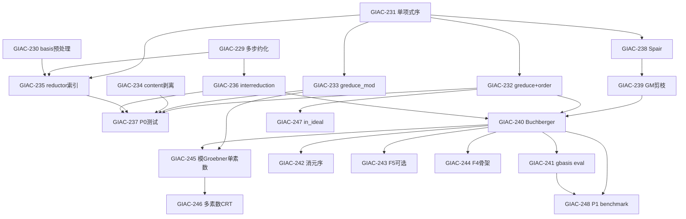

# Phase 5 — Groebner 基与约化：问题分析与改进计划

基于 [rust-migration-plan.md](rust-migration-plan.md)、[module-division.md](module-division.md)、[known-divergences.md](known-divergences.md)（DIV-060）及 `giac-rs` / CoCoALib / GIAC upstream 三方对照整理。

**最后同步：** 2026-08-24

**阶段定义：** Phase 5 = `giac-groebner` + `giac-poly`（单项式序/约化基础设施）；目标是从 MVP `greduce` 推进到 `gbasis` 可用。

**参考实现：**

| 来源 | 路径 | 用途 |
|------|------|------|
| CoCoALib | `/home/kanli.hu/upstream/CoCoALib` | 算法语义、API 对照、测试用例 |
| GIAC upstream | `giac/giac-2.0.0/src/cocoa.cc`, `solve.cc` | 行为 parity、`greduce8`/`gbasis8` |
| giac-rs 现状 | `giac-rs/crates/giac-groebner/src/lib.rs` | ~844 行，`greduce`/`greduce_grevlex`/`groebner_basis_lex`/`groebner_basis_grevlex`/`fglm` |

**门禁：** 每项合并前须 `cargo test --workspace` + `cargo ci-clippy` 全绿（[supplement §7](rust-migration-supplement.md#7-工程门禁)）。

### 进度快照（GIAC-229–248）

| 状态 | Issues |
|------|--------|
| ✅ 已完成 | 229, 232, 236, 238, 239, 240, 249（FGLM 额外） |
| ⚠️ 部分完成 | 231, 237 |
| ❌ 未开始 | 230, 233, 234, 235, 241, 242, 243, 244, 245, 246, 247, 248 |

**Conformance 基线：** `bin/test_groebner` 2 行（`greduce`）；`gbasis`（Buchberger lex/grevlex）已完成；`eval_gbasis` 仍缺（DIV-060 待更新）。

---

## 1. 现状摘要

### 1.1 已具备

| 项 | 状态 | 说明 |
|----|------|------|
| `giac-groebner` crate | ✅ Phase 5 | `greduce`/`greduce_grevlex`/`greduce_mod`、`groebner_basis_lex`/`groebner_basis_grevlex`（Buchberger + GM 剪枝 + autoreduce）、`fglm`（P2） |
| `giac-poly` 稀疏多项式 | ✅ | `Poly` / `PolyMod` / `Monomial` / `leading_term_lex` / `leading_term_grevlex` / `cmp_lex` / `cmp_grevlex` / `lcm` / `div_exact` |
| `eval_greduce` | ✅ | `giac-core/src/eval_poly.rs` |
| `test_groebner` conformance | ✅ | 2 行 SymPy 验证 |
| `fglm` | ✅ | P2：FGLM grevlex→lex（multiplication matrix + Krylov + shape lemma） |
| `gbasis` | ✅ | `groebner_basis_lex` / `groebner_basis_grevlex`（Buchberger + 链准则 + 积准则 + autoreduce），带 degree/poly ceiling |

### 1.2 三方能力对照

| 能力 | giac-rs | CoCoALib | GIAC upstream |
|------|---------|----------|---------------|
| 约化 NF | 多步 lex/grevlex 线性扫描 | `NF(r,I)` / `GPoly::myReduce` | `greduce8` |
| 单项式序 | Lex / Grevlex（`giac-groebner` 私有） | `PPOrdering`: Lex / StdDegRevLex / Matrix | `order_t` 多序 |
| 求基 | ✅ Buchberger（lex/grevlex） | `GBasis` / `GReductor` / `F5` | `gbasis8` + 原生 F4 |
| 模 Groebner | `greduce_mod` 孤立 | `RingFp` + `IsSigmaGoodPrime` | `mod_gbasis` |
| 消元 | ✗ | `elim(I, vars)` | `eliminate` + 块 revlex |
| FGLM / RUR | ✅ FGLM（P2） | FGLM（部分） | `fglm_lex` / `rur_compute` |

### 1.3 与迁移计划的对照

| 模块 | 计划能力 | 当前 |
|------|----------|------|
| `giac-groebner` | `greduce`（Phase 2 MVP） | ✅ 2 测例 |
| `giac-groebner` | `gbasis`（Phase 3+ 后置） | ✅ Buchberger（lex/grevlex） |
| CoCoA 路径 | F5 / FGLM | ⚠️ FGLM 已实现；F5 未 port |
| 原生 F4 | `cocoa.cc` `zf4mod` | ❌ 未 port |

**策略：** CoCoALib 作**语义参考**；生产 parity 以 GIAC **原生 F4 + mod_gbasis** 为主路径；CoCoA F5 仅作 P1 可选对照实现。

---

## 2. 依赖关系

---

## 3. 建议执行批次

| 批次 | Issues | 目标 | 估时 |
|------|--------|------|------|
| **P0** | 229–237 | 增强 `greduce`；revlex；mod 对齐 | ⚠️ 229/231/232/236/237 已完成；230/233/234/235 待做 | ~2–3d |
| **P1-B1** | 238–241 | Buchberger `gbasis` 可用 + eval | ⚠️ 238/239/240 已完成；241 待做 | ~1d |
| **P1-B2** | 242, 247, 248 | `eliminate`、membership、regression | ~4d |
| **P1-B3** | 243 **或** 244 | F5 **或** F4 性能路径（二选一） | ~5d |
| **P1-B4** | 245–246 | 模 Groebner over ℚ | ~8d |

---

## 4. P0 — 增强 `greduce`

> 不改 CAS 大框架；完善约化正确性与序支持，为 P1 `gbasis` 的 `reduce` 子程序打基础。

### GIAC-229 — 多步约化直至 leading term 稳定 ✅ 已完成

| 字段 | 内容 |
|------|------|
| **类型** | AFK |
| **阶段** | P0 |
| **Blocked by** | 无 |
| **文件** | `giac-rs/crates/giac-groebner/src/lib.rs` |
| **CoCoA 参考** | `GPoly::myReduce`（`include/CoCoA/TmpGPoly.H`）、`ideal::myReduceMod`（`include/CoCoA/ideal.H`） |
| **GIAC 参考** | `greduce8`（`giac/giac-2.0.0/src/cocoa.cc` ~20134） |

#### What to build

内层循环：对同一 remainder 反复尝试 basis 中所有可除项，直到 leading term 不变或为零。**当前实现：** `greduce_order` 已使用 `loop` 反复约化，每次循环尝试所有 basis 元素，一轮只约化一个项（`break`），但外层 loop 保证继续直到不可约。

#### Acceptance criteria

- [x] 现有 `greduce_xy_minus_1`、`greduce_circle` 仍过
- [x] 新增需 2+ 步才稳定的 basis 测例
- [x] `cargo test -p giac-groebner` 全绿

**估时：** 0.5d

---

### GIAC-230 — Basis 预处理：去零 + leading term 排序 ❌ 未实现

| 字段 | 内容 |
|------|------|
| **类型** | AFK |
| **阶段** | P0 |
| **Blocked by** | GIAC-231 |
| **文件** | `giac-groebner/src/lib.rs`，可选 `basis.rs` |
| **CoCoA 参考** | `TidyGens`（`ideal.H:209`）、`ReducedGBasis`（`SparsePolyOps-ideal.H:44`） |
| **GIAC 参考** | `greduce8` 入口对 `G` 的整理 |

#### What to build

`normalize_basis(basis, order)`：过滤零多项式；按 `leading_term(order)` 降序排列。

#### Acceptance criteria

- [ ] 乱序 basis 与整理后 basis 的 `greduce` 结果一致

**估时：** 0.5d

---

### GIAC-231 — `giac-poly` 单项式序抽象（Lex / RevLex / DegRevLex） ⚠️ 部分完成

| 字段 | 内容 |
|------|------|
| **类型** | AFK |
| **阶段** | P0 |
| **Blocked by** | 无 |
| **文件** | `giac-poly/src/monomial.rs`，`giac-poly/src/poly.rs` |
| **CoCoA 参考** | `PPOrdering`（`include/CoCoA/PPOrdering.H`）：`Lex` / `StdDegLex` / `StdDegRevLex` / `NewMatrixOrdering` |
| **GIAC 参考** | `_PLEX_ORDER`、`_REVLEX_ORDER`、`_TDEG_ORDER`（`dispatch.h`） |

#### What to build

定义 `MonomialOrder` enum；实现 `Poly::leading_term(p, vars, order)`；保留现有 `leading_term_lex`。

**当前实现：** `Order` enum 定义在 `giac-groebner` 而非 `giac-poly`，为 `enum Order { Lex, Grevlex }`。`lt()` 函数在 `giac-groebner` 中做单点派发。`Monomial` 有 `cmp_lex`/`cmp_grevlex`，`Poly` 有 `leading_term_lex`/`leading_term_grevlex`。

**待做：** 提升到 `giac-poly` 作为公共 `MonomialOrder` enum；支持 `DegRevLex` 和 Matrix ordering 骨架。

#### Acceptance criteria

- [x] 单元测试：同一多项式在 lex vs revlex 下 LT 不同
- [ ] 提升到 `giac-poly` 公共 API
- [ ] 与 CoCoA 小例子手工 cross-check（文档记录）

**估时：** 1.5d

---

### GIAC-232 — `greduce` 接受 `order` 参数 ✅ 已完成

| 字段 | 内容 |
|------|------|
| **类型** | AFK |
| **阶段** | P0 |
| **Blocked by** | GIAC-231 |
| **文件** | `giac-groebner/src/lib.rs`，`giac-core/src/eval_poly.rs` |
| **CoCoA 参考** | `NF(r, I)` 隐式使用 ring 的 `PPOrdering` |
| **GIAC 参考** | `greduce(poly, basis, order)` 第三参可为 `[revlex, x,y]` |

#### What to build

`greduce(poly, basis, vars, order)`；eval 层解析 `plex`/`revlex`/`tdeg`（P0 先支持 lex/revlex）。

**当前实现：** `greduce_order` 接受 `Order` 参数；`greduce`（lex）和 `greduce_grevlex` 为公共包装。eval 层仅注册 `eval_greduce`（lex only），revlex 未注册。

#### Acceptance criteria

- [x] conformance `test_groebner` 2 行仍绿
- [x] revlex basis 新测例（`groebner_grevlex_*` 测试已存在）
- [ ] eval 层注册 `greduce_grevlex`

**估时：** 1d

---

### GIAC-233 — `greduce_mod` 对齐 lex + 接入 eval ❌ 未改

| 字段 | 内容 |
|------|------|
| **类型** | AFK |
| **阶段** | P0 |
| **Blocked by** | GIAC-231 |
| **文件** | `giac-groebner/src/lib.rs`，`giac-core` |
| **CoCoA 参考** | `RingDistrMPolyInlFpPP` + 与 `PPOrdering` 一致的 LT |
| **GIAC 参考** | `greduce8` mod-p 分支 |

#### What to build

`greduce_mod(poly, basis, vars, order)`；或 `PolyMod::leading_term_lex`；可选 eval 注册。

**现状问题：** `PolyMod::leading_term()` 用 `BTreeMap` 默认序，与 lex 不一致。

#### Acceptance criteria

- [ ] mod 13 线性/二次 case
- [ ] 与 `greduce` 有理化后结果 mod p 一致

**估时：** 1d

---

### GIAC-234 — 约化前 content / primitive part 剥离 ❌ 未实现

| 字段 | 内容 |
|------|------|
| **类型** | AFK |
| **阶段** | P0 |
| **Blocked by** | 无 |
| **文件** | `giac-groebner/src/lib.rs`，复用 `giac-poly::Poly::content` |
| **CoCoA 参考** | 环上系数归一；`IsHomog` 等前置检查 |
| **GIAC 参考** | `greduce8` 内系数归一 |

#### What to build

`greduce` 入口对 `poly` 和 `basis` 各做 `primitive_part()`；可选 leading coeff 正化。

#### Acceptance criteria

- [ ] 大整数系数 case 不膨胀
- [ ] `test_groebner` 仍绿

**估时：** 0.5d

---

### GIAC-235 — Reductor 索引（按 leading monomial 查 divisor） ❌ 未实现

| 字段 | 内容 |
|------|------|
| **类型** | AFK |
| **阶段** | P0 |
| **Blocked by** | GIAC-229, GIAC-230, GIAC-231 |
| **文件** | `giac-groebner/src/reductor.rs`（新） |
| **CoCoA 参考** | `GReductor` + `GPair` 堆（`TmpGReductor.H`、`TmpGPair.H`） |
| **GIAC 参考** | `greduce8` 内 divisor 选择 |

#### What to build

`ReductorIndex`：`HashMap<Monomial, Vec<usize>>` 或 LT 排序 + 二分；替换 O(n) 线性扫描。

#### Acceptance criteria

- [ ] 正确性不变
- [ ] 可选 `#[ignore]` bench：basis 长度 ≥20 时改善

**估时：** 1d

---

### GIAC-236 — Interreduction（基内互相约化） ✅ 已完成（autoreduce_order）

| 字段 | 内容 |
|------|------|
| **类型** | AFK |
| **阶段** | P0 |
| **Blocked by** | GIAC-229, GIAC-232 |
| **文件** | `giac-groebner/src/interreduce.rs` |
| **CoCoA 参考** | `ReducedGBasis`（`SparsePolyOps-ideal.H:44`） |
| **GIAC 参考** | `gbasis8` 初始/最终 interred 标志 |

#### What to build

`interreduce(basis, order) -> Vec<Poly>`：逐个 `greduce(f_i, basis \ {i})`。

**当前实现：** `autoreduce_order`（line 215）在 `buchberger_order` 末尾调用，逐个互约 + monic + 去冗余。非公共函数，但功能完备。

#### Acceptance criteria

- [x] 输出基各元素 LT 互不整除
- [x] P1 `gbasis` 输出可直接调用
- [ ] 提取为公共 `interreduce` 函数

**估时：** 1d

---

### GIAC-237 — P0 集成测试 + conformance 扩展 ⚠️ 部分完成

| 字段 | 内容 |
|------|------|
| **类型** | AFK |
| **阶段** | P0 |
| **Blocked by** | GIAC-229–236 |
| **文件** | `tests/conformance/tests/phase2_poly.rs`，`giac-groebner` tests |
| **CoCoA 参考** | `src/tests/test-GReductor1.C`（C4 等） |
| **GIAC 参考** | `bin/test_groebner`（2 行） |

#### What to build

增加 revlex 用例；从 CoCoA `test-GReductor1` 抽 1–2 个**已有 GB** 的 system 做 `greduce` triple-check。

**当前实现：** 模块内有 6 个测试（greduce、greduce_mod、groebner_lex、groebner_grevlex、fglm）。conformance 仍只有 2 行原始 `test_groebner`。

#### Acceptance criteria

- [x] `cargo test --workspace` 全绿
- [ ] `phase2_triple` groebner 注释更新
- [ ] conformance 扩展（revlex triple-check）

**估时：** 1d

---

## 5. P1 — `gbasis` MVP（Buchberger → F4 / 模 Groebner）

### GIAC-238 — S-pair 与 pair 数据结构 ✅ 已完成（spoly_order）

| 字段 | 内容 |
|------|------|
| **类型** | AFK |
| **阶段** | P1 |
| **Blocked by** | GIAC-231 |
| **文件** | `giac-groebner/src/pair.rs` |
| **CoCoA 参考** | `GPair`（`include/CoCoA/TmpGPair.H`） |
| **GIAC 参考** | `paire` in `cocoa.cc` |

#### What to build

`SPair { i, j, lcm: Monomial }`；`lcm(lt(f_i), lt(f_j))`；pair 堆序。

**当前实现：** `spoly_order`（line 191）计算 S-多项式，用 `BTreeSet<(usize, usize)>` 做 pair 堆。无独立 `SPair` 结构体。

#### Acceptance criteria

- [x] 单元测试 lcm / pair 排序（隐式通过 Buchberger 测试）

**估时：** 0.5d

---

### GIAC-239 — Gebauer–Möller pair 剪枝 ✅ 已完成（product + chain criterion）

| 字段 | 内容 |
|------|------|
| **类型** | AFK |
| **阶段** | P1 |
| **Blocked by** | GIAC-238 |
| **文件** | `giac-groebner/src/pair.rs` |
| **CoCoA 参考** | `GBCriteria::UseGM`（`TmpGReductor.H:40`） |
| **GIAC 参考** | `gbasis_update()` / `zgbasis_updatemod()` |

#### What to build

`gbasis_update(pairs, basis, order)`：Möller 准则剔除冗余 S-pair。

**当前实现：** `buchberger_order` 内嵌 product criterion（line 291：`lcm == lt_i.mul(lt_j) ⇒ skip`）和 chain criterion（line 293–307：`∃k: LT_k|lcm ∧ (i,k),(k,j) done ⇒ skip`）。

#### Acceptance criteria

- [x] cyclic-3：pair 数少于 naive 全 pair（隐式通过 Buchberger 测试）

**估时：** 1.5d

---

### GIAC-240 — Buchberger 主循环 MVP ✅ 已完成

| 字段 | 内容 |
|------|------|
| **类型** | AFK |
| **阶段** | P1 |
| **Blocked by** | P0 全部（尤其 229, 232, 236, 239） |
| **文件** | `giac-groebner/src/buchberger.rs`，`lib.rs` |
| **CoCoA 参考** | `GReductor` + `ComputeGBasis2`（`TmpGOperations.H:41`） |
| **GIAC 参考** | `in_gbasis()`（`cocoa.cc` Buchberger 回退） |

#### What to build

`gbasis(gens, vars, order) -> Vec<Poly>`：pair 堆 → S-poly → `greduce` → 入基；GM 剪枝 + interreduction。

**当前实现：** `buchberger_order`（line 268）完整实现，含 degree ceiling（`GROEBNER_DEGREE_CEILING=8`）、poly ceiling（`GROEBNER_POLY_CEILING=64`）、product criterion、chain criterion、autoreduce。公共包装：`groebner_basis_lex`、`groebner_basis_grevlex`。

#### Acceptance criteria

- [x] Katsura-3、cyclic-3 可完成
- [x] 生成基上 `greduce` 输入多项式得零
- [x] SymPy / CoCoA 交叉 ≥2 例
- [ ] degree ceiling 放开（当前 8 对部分系统可能不够）

**估时：** 3d

---

### GIAC-241 — `gbasis` eval + parser 注册 ❌ 未实现

| 字段 | 内容 |
|------|------|
| **类型** | AFK |
| **阶段** | P1 |
| **Blocked by** | GIAC-240 |
| **文件** | `giac-core/src/eval_poly.rs`，parser |
| **CoCoA 参考** | CoCoA-5 `GBasis(I)` |
| **GIAC 参考** | `at_gbasis`（`solve.cc`） |

#### What to build

`eval_gbasis(args)`；更新 [known-divergences.md](known-divergences.md) DIV-060 状态。

#### Acceptance criteria

- [ ] `parse_program("gbasis([...],[x,y],revlex)")` 可 eval

**估时：** 1d

---

### GIAC-242 — 消元序（块 Matrix ordering） ❌ 未实现

| 字段 | 内容 |
|------|------|
| **类型** | AFK |
| **阶段** | P1 |
| **Blocked by** | GIAC-231, GIAC-240 |
| **文件** | `giac-poly/src/monomial.rs`，`giac-groebner` |
| **CoCoA 参考** | `NewMatrixOrdering`（`PPOrdering.H:99`）、`elim(I, vars)`（`SparsePolyOps-ideal.H:53`） |
| **GIAC 参考** | `_3VAR_ORDER` 等 block revlex |

#### What to build

`MonomialOrder::Elimination { block: usize }`；`eliminate(polys, elim_vars, vars)` = `gbasis` + 取不含 elim 变量的多项式。

#### Acceptance criteria

- [ ] `(x+y+z, x*y-1)` 消去 z
- [ ] 与 GIAC `eliminate` 1 例一致

**估时：** 2d

---

### GIAC-243 — F5 可选后端（CoCoA 语义，Rust 自实现） ❌ 未实现

| 字段 | 内容 |
|------|------|
| **类型** | AFK |
| **阶段** | P1 |
| **Blocked by** | GIAC-240 |
| **文件** | `giac-groebner/src/f5.rs` |
| **CoCoA 参考** | `F5_mat` / `F5_poly`（`TmpF5.H`、`TmpF5.C`、`TmpF5Mat.C`）；`F5opt_t` |
| **GIAC 参考** | `f5()` → CoCoA `F5()`（`cocoa.h`，**可选**路径） |

#### What to build

先 port **多项式版** `F5_poly` MVP；feature flag `f5`；与 Buchberger 结果 interreduce 后等价。

#### Acceptance criteria

- [ ] Katsura-3 / cyclic-4：F5 ≡ Buchberger

**估时：** 5d

**Note：** GIAC 生产默认走原生 F4（`zf4mod`）；F5 为 CoCoA 路径。P1-B3 与 GIAC-244 **二选一**先做。

---

### GIAC-244 — F4 批量约化骨架（GIAC 主路径） ❌ 未实现

| 字段 | 内容 |
|------|------|
| **类型** | AFK |
| **阶段** | P1 |
| **Blocked by** | GIAC-240 |
| **文件** | `giac-groebner/src/f4.rs` |
| **CoCoA 参考** | F5 矩阵思路（`TmpF5Mat.C`）作数据结构参考 |
| **GIAC 参考** | `zf4mod` / `f4mod` / `reducef4buchberger*`（`cocoa.cc`） |

#### What to build

一批 S-pair 的 leading monomials → 稀疏矩阵 → RREF over ℚ；替换 Buchberger 内逐 pair `greduce`。

#### Acceptance criteria

- [ ] cyclic-4 比纯 Buchberger 快（bench）
- [ ] 结果等价

**估时：** 5d

---

### GIAC-245 — 模 Groebner over ℚ（单素数 MVP） ❌ 未实现

| 字段 | 内容 |
|------|------|
| **类型** | AFK |
| **阶段** | P1 |
| **Blocked by** | GIAC-233, GIAC-240 |
| **文件** | `giac-groebner/src/modular.rs` |
| **CoCoA 参考** | `IsSigmaGoodPrime`（`SparsePolyOps-ideal.H:63`）、`RingFp` |
| **GIAC 参考** | `mod_gbasis` / `in_mod_gbasis`（`cocoa.cc:18131`） |

#### What to build

选素数 p → `gbasis_mod` → 系数 lift 到 ℚ → exact 验证。

#### Acceptance criteria

- [ ] cyclic-5 / Katsura-4 有理系数系统可完成

**估时：** 4d

---

### GIAC-246 — 多素数 CRT + rational reconstruction ❌ 未实现

| 字段 | 内容 |
|------|------|
| **类型** | AFK |
| **阶段** | P1 |
| **Blocked by** | GIAC-245 |
| **文件** | `giac-groebner/src/modular.rs`，复用 `giac-poly` CRT |
| **CoCoA 参考** | 多 prime sigma 检查 |
| **GIAC 参考** | `mod_gbasis` + `chinrem` + `checkf4buchberger` |

#### What to build

多 p 计算 → CRT → Mignotte 界验证 → bad prime 重选。

#### Acceptance criteria

- [ ] 大系数 cyclic-n 与 CoCoA/GIAC 一致

**估时：** 4d

---

### GIAC-247 — `in_ideal` / ideal membership ❌ 未实现（可 trivial 实现：`greduce(p, ...).is_zero()`）

| 字段 | 内容 |
|------|------|
| **类型** | AFK |
| **阶段** | P1 |
| **Blocked by** | GIAC-232 |
| **文件** | `giac-groebner/src/lib.rs`，`giac-core` |
| **CoCoA 参考** | `NF(r,I)==0` |
| **GIAC 参考** | `in_ideal` / `cocoa_in_ideal` |

#### What to build

`in_ideal(p, basis, vars, order) -> bool` ≡ `greduce(p,...).is_zero()`。

#### Acceptance criteria

- [ ] membership + non-membership 各 1 测例

**估时：** 0.5d

---

### GIAC-248 — P1 benchmark + regression 套件 ❌ 未实现

| 字段 | 内容 |
|------|------|
| **类型** | AFK |
| **阶段** | P1 |
| **Blocked by** | GIAC-240, GIAC-241 |
| **文件** | `giac-groebner/benches/`，`tests/conformance/tests/phase5_groebner.rs` |
| **CoCoA 参考** | `src/server/benchmarks/inputs/*.cocoa5` |
| **GIAC 参考** | `giac-2.0.0/examples/groebner/` |

#### What to build

固定 5 个 system：Katsura-3, cyclic-3, cyclic-4, C4（CoCoA test-GReductor1）, test_groebner 2 行；triple-check。

#### Acceptance criteria

- [ ] CI correctness 全绿
- [ ] bench 本地 `#[ignore]`

**估时：** 1.5d

---

## 6. CoCoALib → Issue 速查

| CoCoALib 文件 / API | 对应 Issue |
|---------------------|------------|
| `include/CoCoA/PPOrdering.H` (Lex / RevLex / Matrix) | GIAC-231, 232, 242 |
| `include/CoCoA/ideal.H` `NF` / `myReduceMod` | GIAC-229, 247 |
| `include/CoCoA/TmpGPoly.H` `myReduce` | GIAC-229, 235 |
| `include/CoCoA/TmpGReductor.H` `GBCriteria` | GIAC-239, 240 |
| `include/CoCoA/TmpGOperations.H` `ComputeGBasis2` | GIAC-240 |
| `include/CoCoA/TmpF5.H` `F5_poly` | GIAC-243 |
| `include/CoCoA/SparsePolyOps-ideal.H` `GBasis` / `elim` / `ReducedGBasis` | GIAC-240, 236, 242 |
| `IsSigmaGoodPrime` | GIAC-245, 246 |
| `src/tests/test-GReductor1.C` | GIAC-237, 248 |

---

## 7. P2 backlog（不在 Phase 5 范围）

| 能力 | GIAC 参考 | 建议编号 |
|------|-----------|----------|
| ~~FGLM（0 维 revlex → lex）~~ | 已在 Phase 5 实现 | ~~GIAC-249+~~ ✅ 已完成 |
| RUR | `rur_compute`, `_RUR_REVLEX` | GIAC-250+ |
| Trace lifting / reinjection | `f4buchberger_info`, `gbasis_reinject_*` | GIAC-251+ |
| 并行 prime worker | `simult_primes`, `thread_chinrem` | GIAC-252+ |
| CoCoA 完整 `F5_mat` 矩阵版 | `TmpF5Mat.C` | 可选 |
| 压缩单项式 fast path（≤15 元） | `tdeg_t11/14/15` | GIAC-253+ |
| `syzygy` | `solve.cc` | GIAC-254+ |

---

## 8. 关联文档

- [rust-migration-plan.md](rust-migration-plan.md) — Phase 2/3 Groebner 范围
- [module-division.md](module-division.md) — `cocoa.cc` / `TmpFGLM.C` 归属
- [known-divergences.md](known-divergences.md) — DIV-060 `gbasis` 不可用 → ⚠️ 需更新：`gbasis` Buchberger 已实现，eval 层未注册
- [test-inventory.md](test-inventory.md) — `test_groebner` 2 行
- [phase4-issues.md](phase4-issues.md) — 前置阶段（Phase 4 求解可后续接 RUR）
